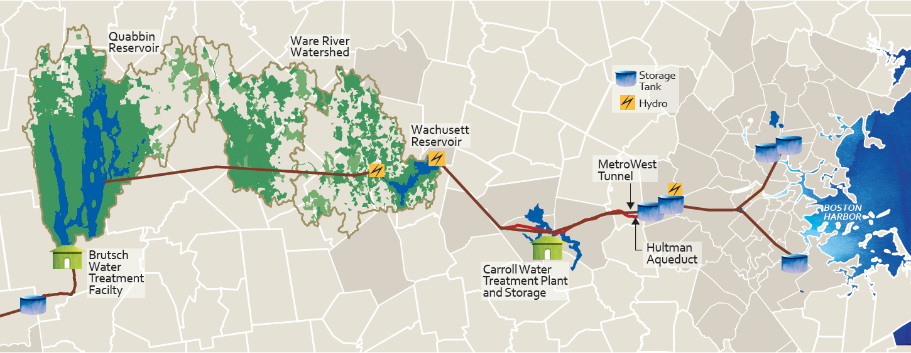

```{r loadpack, include=FALSE}
# Load Packages
library(rmarkdown)  
library(knitr)
library(tidyverse)
library(shiny)
library(kableExtra)
require(DiagrammeR)
require(DiagrammeRsvg)
require(rsvg)
```


\newpage

# Introduction

## Overview

A comprehensive watershed protection plan includes the collection of water quality, meteorological, and hydrological data. Large amounts of data can be difficult to manage if proper systems are not put in place for data management. Poor data management can be detrimental and may result in data loss, poor quality data, or underutilized data due to the lack of an efficient process of querying, visualizing, and analyzing data. Database software is a great solution to store and organize large datasets, yet database software often lack data visualization and analysis tools. Commonly, databases are paired with an outside application specialized for data querying, visualization, and analysis. In this work, two applications were developed with free and open source application development framework, Shiny, for facilitated water system data management by the Massachusetts Department of Conservation and Recreation (DCR). One application is designed for facilitated database data entry and the other for facilitated data visualization and analysis. This project is a product of the collaboration between UMass Amherst and the DCR.

## Objective

This project works to facilitate DCR data entry, querying, visualization, and analysis processes through an R-based application creation tool called Shiny. An application can automate many of the tedious day to day processes of managing water system as well as allow for powerful and expeditious visualization and analysis. Developing an application, rather than using proprietary software, allows for full customization by the developer to better target specific needs of the agency responsible for water system management and protection. A well fitting application can greatly increase the timeliness and ability to explain data and generate insights which can direct decision making for these agencies. Increased water quality data insight can also greatly influence an agency's sampling plan to better represent the watershed and focus on certain areas of high interest. The overall objective of this project is to maximize the efficiency of the DCR's ability to manage, visualize, and analyze data to inform decision making. The application developed in this project can be used as an example for other watershed management agencies.

## Scope of Work

Two applications were created to facilitate water system data management at the DCR. These applications will be used across the three watersheds, Quabbin, Ware River, and Wachusett, which have management staff in two separate DCR offices, one at the Quabbin Reservoir and the other at the Wachusett Reservoir. The applications are designed to meet the needs of both offices which require neccesary variations in the application features to address the differences between the needs of the two offices including differing sampling plans. Although some intrinsic differences are inevitable, efforts have been made to make the data management by the two offices more congruent. A large piece of this congruency has been in the form of database alterations to make the organization and formatting as similar as possible for the two offices. This effort has also included moving data that exists outside of a database into a common database where data observations all share a similar and tidy data regimen. Naming conventions were also examined and modified to simplify the application creation and decrease potential for mistakes.

Water System Data Import Tool (WIT) is the smaller of the two applications which is designed an interface for facilitated raw data import of water system field and laboratory data. Raw data from a number of predetermined sources can be imported through a simple user interface. WIT transforms raw data into the desired database format, provides quality control checks, and imports the data to the appropriate location in the database. WIT will help ensure in the future that all data remains stored in databases as this tool makes database storage timely and efficient.

Water System Data Analysis and Visualization Environment (WAVE) is the larger of the two applications and as its name suggests it is designed to facilitate data querying, visualization, and analysis of water quality and quantity data. The application opens in a web browser and allows the user to query data by user selected inputs including locations, parameters, and dates. More advanced filters for data querying are also offered including filtering data based on meteorological events and excluding flagged data. The corresponding queried dataset is presented in an interactive table which the user is able to output as a csv file. Discrepancies between water system datasets exist (and are desired) which are reflected in variations of query selections and filters in WAVE.

WAVE consists of numerous visualization and analysis tools to provide more insight on a queried dataset. Visualization tools for tributary and reservoir data include time-series plots, correlation plots, and distribution charts (histograms, density curves, and box-and-whisker plots) to visualize trends and patterns for selected water quality parameters. Geospatial data visualization and analysis allows one to spatially view data statistics on an interactive map. Heatmap and profile line plot tools are also available for reservoir profile data. Statistics can be quickly generated with WAVE including minimum, maximum, and average for user selected temporal and spatial groupings. More advanced statistical analysis includes Mann-Kendall statistics and Pearson correlation matrices. WAVE also makes information related to the sampling history of a specific site or a specific parameters easily accessible.

Both WAVE and WIT are shared openly through Github and are ran locally on a computer with minimal setup, although hosting the application online is also a possibility. The application is organized in a modular manner which eases future updates to the code as well as minimizes code repetition. Future additions to WAVE can be added as separate and independent modules. A developer manual was also created to help future developers of WAVE as well as user setup guides for WAVE and WIT. As the needs of the DCR change, both applications can dynamically change with it.


\newpage 
# Background

## Water System Overview

### Quabbin and Wachusett Reservoir

The metropolitan area of Boston, Massachusetts, receives its drinking water from the Massachusetts Water Resource Association (MWRA) water supply system. The sources of the water supply are the Quabbin Reservoir and the Wachusett Reservoir which are managed in partnership with the Massachusetts Department of Conservation and Recreation (DCR). Inflow to the Quabbin and Wachusett Reservoirs can be supplemented by diversions from the Ware River which has a watershed located between the watersheds of the two reservoirs (see figure 2.1). The system also has an emergency water supply source, the Sudbury and Foss Reservoirs [DCR, 2013]. 

The Massachusetts Department of Conservation and Recreation (DCR), Division of Water Supply Protection, Office of Watershed Management (DWSP) manages and protects the drinking water supply watersheds that provide water for approximately 2.5 million Massachusetts residents [DCR, 2013]. The total watershed area of the active Reservoirs is over 200,000 acres; the area of each watershed and reservoir are listed in table 2.1. The Quabbin and Wachusett Reservoirs are protected and over 85% of the watershed lands that surround the reservoirs are covered in forest and wetlands [MWRA]. Table 2.2 lists the land use for each watershed. The water supply system is rather unique in that the Quabbin Aqueduct, a 24.6 mile long tunnel, connects the Quabbin Reservoir to the Wachusett Reservoir. The MWRA transfers water from the Quabbin reservoir intermittently to the Wachusett Reservoir to maintain the water level and water quality of the Wachusett Reservoir [DCR, 2007] which on average over a long period of time makes up about half of the total inflow to the Wachusett Reservoir. As noted above, the MWRA can also divert water from the Ware River, located between the two reservoirs, to either the Quabbin Reservoir or the Wachusett Reservoir through the Quabbin Aqueduct, though it is DWSP and MWRA operating policy to divert only to Quabbin [DCR, 2013]. Quabbin transfers to Wachusett generally occur from June through November and can last for weeks at a time to meet higher water demands, maintain the water level, and mitigate water quality concerns in the Wachusett Reservoir [DCR, 2007]. The complex nature of the system allows for decision making in reservoir management that can alter water quality of source water for the MWRA Supply System. It is essential to monitor water quality in the whole watershed and all reservoirs to best understand reservoir processes which can allow for more informed actions when water quality issues occur.

\begin{table}
\centering
\caption{Watershed Acreage}
\label{table-paramvalues}
\begin{tabular}{p{2in} P{1.1in} P{1.1in} P{1.1in}}
\hline \\ [-1.5ex]
Watershed & Land area (acres) & Reservoir area (acres) & Total watershed area (acres)\\ [1ex]
\hline \\ [-1.5ex]
Quabbin Reservoir & 95,466 & 24,469 & 119,935 \\ [1ex]
Ware River & 61,737 & 0 & 61,737 \\ [1ex]
Wachusett Reservoir & 70,678 & 4,122 & 74,800 \\ [1ex]
\hline
\end{tabular}
\end{table}

\begin{table}
\centering
\caption{Watershed Land Use Percentage}
\label{table-paramvalues}
\begin{tabular}{ p{2in} p{0.7in} p{0.7in} p{0.7in} p{0.7in} p{0.7in}}
\hline \\ [-1.5ex]
Watershed & Forestry & Wetland & Agriculture & Residential & Other\\ [1ex]
\hline \\ [-1.5ex]
Quabbin Reservoir & 88.2 & 5.6 & 2.2 & 1.5 & 2.5\\ [1ex]
Ware River & 75.6 & 11.4 & 3.2 & 4.2 & 5.7 \\ [1ex]
Wachusett Reservoir & 67.3 & 7.7 & 5.7 & 10.8 & 8.4 \\ [1ex]
\hline
\end{tabular}
\end{table}

```{r MWRA System, echo=FALSE, out.width = "6.5in", fig.cap="MWRA Water Supply System"}
 #
```

### Water Quality Sampling Plan

DCR conducts extensive water quality monitoring of the surface waters (tributaries and reservoirs) in the water supply system. Monitoring data is used to assess current water quality conditions and to establish ranges of values for parameters considered normal or typical [DCR, 2013]. Data collected in routine sampling over several years are used to assess watershed trends while shorter term studies may be conducted to evaluate specific issues [DCR, 2013]. The task of water quality sampling and analysis in the three watersheds in the water supply system are divided between the Quabbin and Wachusett office of the DCR Water Supply Protection Division as well as the MWRA. The DCR Quabbin Office is responsible for the sampling of the tributaries in the Quabbin and Ware River watersheds and sampling in the Quabbin Reservoir while the DCR Wachusett Office is responsible for the sampling of the tributaries in the Wachusett watershed and the Wachusett Reservoir. Each office creates their own sampling plan for the reservoirs and tributaries in their respective watersheds which consists of a schedule of routine sampling and storm sampling at various sites. Each watershed is divided into sanitary districts [DCR, 2013]. Figure 2.2 shows all of the historical and active documented sampling locations of the DCR. More detailed sampling maps of each reservoir developed by the DCR are appended to this document.

```{r Watershed Sampling, echo=FALSE, out.width = "6.5in", fig.cap="Watershed Sampling Locations"}
knitr::include_graphics("images/background/Sampling_Map2.png")
```

The Quabbin Office's tributary water quality monitoring program has included as many as fourteen sampling stations in the Quabbin Reservoir watershed, and ten sampling stations in the Ware River watershed [DCR, 2013]. Core sites are long-term monitoring stations, while Environmental Quality Assessment (EQA) sites support ongoing evaluations of threats to water quality by sanitary district [DCR, 2013]. Tributary temperature, dissolved oxygen, pH, and specific conductance levels are measured biweekly with a multiprobe meter. Samples from core sites are collected by hand biweekly for turbidity, bacteria, and calcium analyses, while samples for nutrient analysis are collected quarterly. Samples from EQA Sites are collected biweekly for alkalinity, turbidity, bacteria, nutrients, calcium, and UV254 [DCR, 2013]. Water quality parameters measured in tributaries by the DCR Quabbin Office are shown in Table 2.3.

The Wachusett Office samples each tributary station weekly or biweekly throughout the entire year, except for during inadequate flow conditions. Temperature and specific conductance are measured in the field and samples are collected for analysis of E. coli and measurement of turbidity. Nutrient samples are collected monthly for total phosphorus, ammonia, nitrate-nitrogen, nitrite-nitrogen, total Kjeldahl nitrogen, total organic carbon, total suspended solids, and UV-254.  Reactive phosphorus (orthophosphate) samples were collected monthly and UV-254 samples were collected weekly from the Stillwater and Quinapoxet Rivers.  Depth was recorded manually or using automated depth sensors at seven of the nutrient stations and flow calculated using rating curves developed and updated by DWSP Environmental Quality staff. Water quality and quantity parameters measured in tributaries by the DCR Wachusett Office are also shown in Table 2.3.

Both the Quabbin and Wachusett Reservoirs are monitored monthly by boat during the months of April through December, weather-permitting. Reservoir water column profile data for temperature, specific conductance, chlorophyll a, dissolved oxygen concentration and percent saturation, are collected at several locations within both reservoirs. Nutrient samples are collected at three depths, the epilimnion, metalimnion, and hypolimnion, and analyzed for water quality parameters including nitrate-nitrogen, ammonia-nitrogen, total Kjeldahl nitrogen, total phosphorus, silica, UV-254, and alkalinity. Phytoplankton data are also collected at both Reservoirs. Surface grab samples are collected in the Wachusett Reservoir for E. coli and fecal coliform. Water quality parameters measured in each reservoir by the respective office are shown in Table 2.4.

DCR DWSP and MWRA cooperate with the U.S. Geological Survey to maintain continuous, real time recording gauges at a total of ten sites including sites at the Stillwater River, Quinapoxet River, West Branch Swift River, and East Branch Swift River [DCR, 2013]. Precipitation and other meteorological data is obtained from NOAA weather stations. Additional sampling related to forestry practices is also conducted to compare water quality between managed and unmanaged forests.

```{r res, echo=FALSE, out.width = "6.5in", fig.cap="Needs to be changed!! (incorrect data!)"}
knitr::include_graphics("images/background/sampling_frequencies.pdf")
```


### Previous Water System Studies

Many studies have been conducted as a result of the partnership of University of Massachusetts and the DCR. Data analysis and model calibration and validation in many of these studies have benefited from the vast amount of water quality and hydrological data that are collected in the Quabbin, Ware River, and Wachusett watersheds. The water quality impacts from extreme precipitation events have been examined through statistical analysis of potential loads coupled with a reservoir hydrodynamic and water quality model [Jeznach Hageman]. The fate of hypothetical contaminant spills in the Wachusett Reservoir have also been modeled [Jeznach, 2013; Devonis 2011; Sojkowski; Stauben?; Mathews?]. Other water quality modeling topics have included the effects of climate change on the Wachusett reservoir [Jeznach, ] and modeling the fate of natural organic matter and fecal pollution [ ]. Presumably, having a thorough sampling plan and well maintained data can allow for more informed and facilitated research studies.


## Water System Data Management

The process of managing watershed data can be simplified into three parts: data collection, data storage, and data utilization. Data collection includes the acts of field observations, sample collection, lab analysis, and data entry to a database. Data storage is the location in which the data lives and is ever-changing as more data is collected. Data utilization includes the querying, visualization, analysis, or any other process from which conclusions can be drawn from the data to benefit decision making.

Proprietary software exist that can greatly aid in the watershed data management process. AQUARIUS, created by Aquatic Informatics, is a collection of leading application software for water supply management. Two of the five AQUARIUS applications are AQUARIUS Samples and AQUARIUS Time-Series. AQUARIUS Samples streamlines the production and management of environmental lab and field sample data [aquaticinformatics]. Aquarius Time-Series is a powerful platform for managing water resources and is used by the United States Geological Survey (USGS) as well as many other agencies and is famous for building and maintaining rating curves [aquaticinformatics]. This study for the DCR focuses on water quality data management, thus AQUARIUS Samples better resembles the watershed data management system that this study describes. Later work for the DCR may focus on water quantity data which may resemble the data management tasks of AQUARIUS Time-Series. Proprietary software like AQUARIUS Samples attempt to supply a versatile product that can be widely used on any watershed. This can be a difficult task due to the differences between different agency's needs and processes. Proprietary software is often limited in data visualization and analysis and cannot be customized within the software. Proprietary software is also costly.

An alternative to proprietary software for watershed data management is to develop a customized agency-specific application using an open source application development framework paired with a database. With the advancement of programming languages and increased number of development frameworks, it is getting easier to build a custom dashboard or application. Creating an application, rather than using proprietary software, allows for more flexibility and customization. Developing an application is less costly than using proprietary software, yet it is likely to be much more timely. The Oregon Department of Environmental Quality has developed an application which provides an interactive means for users to query from multiple databases and evaluate status and trend at individual sampling stations [Bryant, 2016]. This application is built with the Shiny application development framework in the statistical programming language R.

### Data Storage

Due to the vast amount of water quality data collected by the DCR, it is essential to use a relational database for efficient data storage. Spreadsheet software is not an effective way to store large datasets. A relational database is a means of storing information in tables with rows and columns in such a way that information can be retrieved from it [oracle]. A table is referred to as a relation in the sense that it is a collection of objects of the same type (rows) [oracle]. In a database for watershed data, an object (row) can be a field observation, lab measurement, site location information, or another object. Data in a table can be related according to common keys or concepts to another table allowing for the ability to retrieve related data. A Relational Database Management System handles the way data are stored, maintained, and retrieved. Oracle, MYSQL, Microsoft SQL Server, PostgreSQL, and Microsoft Access are among the most popular relational database management systems [DB-engines]. Many of database management systems are free and open source. Applications can be designed to connect with a database to retrieve data from a database or write new data to a database.

### Application Development Frameworks

Application development frameworks assist with application creation and are essentially a reusable, "semi-complete" template application that can be specialized to produce custom applications [  ]. Selection of a proper application development framework can greatly decrease the amount of work one must do and knowledge one must possess to create an application. Most application development frameworks can be considered either a front-end framework or a back-end framework which create a front-end server and a back-end server, respectively. The front-end server and the back-end server communicate through a common API, usually JSON, which is considered the universal binary [  ]. A front-end server is responsible for the construction and layout of the user interface, which is what the user sees and interacts with (often in a web browser). The user does not see the back-end server but this does the bulk of the work. The separation of front-end server and back-end server can allow for increased customization as various front-end and back-end frameworks can be paired. Some frameworks serve as both a front-end and back-end framework which usually have a benefit of simplicity in the development process. This paper focuses on this latter type of framework that function as both front-end and back-end due to the simplicity of the desired application. Likely, a minimalistic user interface will suffice and most of the focus should be on the data science potential of the framework, which will likely be determined from the programming language that the framework uses. 

R and Python are common programming languages for data science and both have their own collection of data science application framework libraries. Python is more widely used than R [  ], though R specializes in statistics and data visualization [  ]. Shiny is a development framework package in R created by RStudio which allows a relatively inexperienced developer to build an application in the R language and is very well documented. Application framework libraries in Python tailored toward data science include Bokeh, Spyre, and Dash [  ]. All of these libraries are free to use for developing applications and dashboards. These application frameworks leverage JavaScript and HTML to render the user interface which can be opened in a web browser. Each framework has its differences and some may work better than others for a particular purpose. Familiarity of a particular programming language can also influence the decision of which application development framework to choose.


\newpage 
# System Architecture

## Overview

A system architecture is the conceptual model that defines the high level structure for the many working parts of an application [Wikipedia]. Generally in any application, the user (client) sends information to the server through interactions with the user interface and the server will make any neccesary updates to send back to the user. The server deos most of the work including making input and output objects, performing cumputations, and fetching data from a data source. 

WIT and WAVE have relatively similar system architectures which differ in a few ways from most application architectures. simple system architecture relative to other web applications. Most applications on the web have a seperate front-end server and a back-end server. Shiny is both a front-end and back-end framework which allows one unified server component. This means the Shiny server both builds the user interface through rendering javascript and HTML (front-end server) and also performs computations and fetches data (back-end server). The applications are also ran locally at the DCR which means that the client and the server are both ran on the same computer (the user's computer). Not hosting the application on the web avoids the additional process of sending user requests through a proxy to balance user traffic.

The system architecture of WIT and WAVE can be seen in Figures 3.2 and 3.3, respectively. The common components that both systems have include the Server, User (Client), Github Code Script, Configuration File, and a form of data storage. Prior to the start of a session in either WIT or WAVE, a configuration file with user settings is read and the latest application code is pulled from Github. After this step, the system processes of the two applications differ. The components of the system architecture are discussed in more detail in the following sections.

```{r dev WIT, echo=FALSE, out.width = "6.5in", fig.cap="WIT Architecture - update remove green from db"}
knitr::include_graphics("images/system dev/WIT_Arch.pdf")
```

```{r dev WAVE, echo=FALSE, out.width = "6.5in", fig.cap="WAVE Architecture"}
knitr::include_graphics("images/system dev/WAVE_Arch.pdf")
```

## Configuration File

Prior to the start of a session, a configuration file is read into R which gives information about the desired configuration settings like the location of the data, Github repository location, and other settings that are specific to a particular office or a particular user. The configuration file is used for the purpose of allowing variability in the application across users. A user at the Quabbin Office will have a different directory layout than a user at the Wachusett Office. This also facilitates a user outside of a DCR Office to be able to use these applications due to internal network and directory differences. UMass will benefit from the use of WAVE to gather data for research studies including data for model input and calibration of the CE-QUAL-W2. The MWRA also expressed interest in using WAVE.

There is one configuration file for both WIT and WAVE. Most of the information in the configuration file pertains to WIT only due to the neccesary information about each data source. This includes the name and file path of the process and import R scripts of each data source as well as the folder path of the raw and proccessed data files.

## Github

Github is used as the storages mechanism for the application code, the version control collaboration, and is integral in the launching (deply) method of the application. Github is a great tool for web development and code collaboration. GitHub has version control. [Get some cited info].

The configuration file tells the application which GitHub repository to fetch the application from. Currently there are two repositories of the application (a main repository and a forked repository). Although the application is mainly ran from the main repository, there has been sometimes when it has been useful to run the appliaction off of the forked repository. Fetching the application directly from GitHub ensures that the latest version of the application is being used by all users. There is no need for a user to ever have to install an update.

## Client

A user interacts with the client through the Google Chrome Browser. A client is a piece of computer hardware or software that accesses a service made available by a server [Sadoski, Darleen]. The server is often (but not always) on another computer system, in which case the client accesses the service by way of a network [Sadoski, Darleen]. In this case, the client receives and displays data to the user on the same local computer as the server. The application is opened in a Google Chrome Browser on the user's computer. Google Chrome interpretes the Javascript and HTML produced by the (front-end) server. This interpretation allows the user to visually see the applcition and interact with it. 

## Server

A server is a computer that provides and serves data [Techterms] during an application session. In this case, the computer refers to the local computer of a user in which the application script is executed. The main app script contains a line of code that launches the application in an R session. In WIT, the server listens to the user's requests and performs the data processing computations and data import services. In WAVE, the server listens to the user's requests and creates data visualizations and performs statistical analysis on the data.

The server can connect to a database or another type of data storage. The WIT server reads and writes data, while the WAVE server only reads data. There are commonly two schemes of reading data with an application. One scheme is to read all data in at the start of the session and the other is to read in only specific data each time the user asks for specific information. The second approach is more common with large data sets, becuase it can be timely to read in all data at the start. Although there is a substantial amount of data, WAVE actually reads in all the data at the start of the session, yet does so in a way that most of this work is already done before the user tries to open the application. This will in turn speed up the processes during the session. WIT uses the second approach and reads in data when it is needed. This results in a shorter launching time for WIT. The scheme of reading in data for WIT and WAVE are indicated in Figure 3.2 and 3.3 by the color of the arrow.

The server can connect to a database with an Open Database Connectivity (ODBC) application program interface. This is used to externally fetch data from a database and to write data to a database. WIT uses an ODBC to read and write data to the databases. 

A server can also read data from other data storage methods including flat files (e.g. csv and txt) and RDS files. RDS files preserve the R data structure and is the fastest way to save data from R and read data into R. RDS files are used to make the process of reading in data to WAVE very fast. Due to the comparitively longer time to read data from a database into an R session, the database is actually read after a user closes the WIT application and is saved to RDS files. A user closing WIT is a good indication that the database has been updated. The updating of RDS files happens automatically in the background of a user's computer. One can also trigger this update of RDS files manually as well. WAVE is designed to read data as RDS files that have already been transformed to the desired formatted dataframes of WAVE. Reading in data from RDS files upon starting a WAVE session takes about 2 seconds compared to 15-20 seconds of reading data from the database.

## Database

The DCR has collected water quality data for over fourty years. The data storage methods have changed greatly over the years of sampling. In the early years, paper records were used as the means of storing data. As computers became more prelevant a mix of spreadsheet storage and database storage slowly became the means of data storage. Today, an effort is being made to store all new data and move all existing data into relational database management systems (RDBMS), commonly reffered to as just databases. Databases are a more efficient method of storing large amounts of data than either paper records or spreadsheets. The DCR currently uses Microsoft Access as their database software. The Wachusett Office has three databases, one for water quality data, one for aquatic biology and profile data, and one for hydrological data. Each database of the Wachusett Office has a similar format. The Quabbin Office has one database for all of its water quality data. The needs and practices of the department determine whether it is appropriate to have one or multiple databases. This being said, directly related tables (i.e. have common keys that link them) should likely be stored within the same database.

There are many tables within a database, in which each contains different sets of information, where similar objects are contained in rows [Oracle]. Many tables contain sampling measurements, in which each row is a unique sampling observation from the field or laboratory. Each observation gets its own row and is unique in the combination of location, date, and parameter. Data formatted so each row is a unique observation is considered to be "tidy" [Hadley]. Storing data in a "tidy" fashion facilitates data science in the R programming language (and presumably most advanced programming languages). An example of "non-tidy" data and "tidy" data can be seen in Tables 3.1 and 3.2. In this case, columns named "Parameter"" and "Result" are used in the "tidy" data example rather than including a column for each parameter. The "tidy" data format in this example also allows for additional columns like "Units" and other information specific to that one observation to be recorded in the database. Many packages in R, like "ggplot2" and "dplyr" are designed for "tidy" data.

\begin{table}
\centering
\caption{non-Tidy Sample Data}
\label{table-paramvalues}
\begin{tabular}{| l | l | l | l | l | l |}
\hline \\ [-1.5ex]
Location & Date & Turbidity & Nitrate & Ammonium & Specific Conductance \\ [1ex]
\hline \\ [-1.5ex]
Riverbend & 01/01/2020 & 12 & 13 & 14 & 15\\ [1ex]
\hline \\ [-1.5ex]
\end{tabular}
\end{table}

\begin{table}
\centering
\caption{Tidy Sample Data}
\label{table-paramvalues}
\begin{tabular}{| l | l | l | l |}
\hline \\ [-1.5ex]
Location & Date & Parameter & Result\\ [1ex]
\hline \\ [-1.5ex]
Riverbend & 01/01/2020 & Turbidity & 12\\ [1ex]
Riverbend & 01/01/2020 & Nitrate & 13\\ [1ex]
Riverbend & 01/01/2020 & Ammonium & 14\\ [1ex]
Riverbend & 01/01/2020 & Spec. Cond & 15\\ [1ex]
\hline \\ [-1.5ex]
\end{tabular}
\end{table}

In this work, the majority of the data is from sampling measurements which is the main data of focus. Data other than sampling measurements are thus considered metadata. Metadata is a term used for a set of data that describes and gives information about other data [Google]. Metadata tables in the database include tables with information on parameters, locations, flags, sample flag index, and more. Location Tables store information related to sampling site loactions (e.g. site ID, lattitude, longitide, elevation). Parameter tables store information related to parameters (e.g. parameter abbreviation). Flag tables store information related to flags (e.g. flag code, flag description). Sample flag index tables sre used to relate the sample tables with the flag tables which is needed due to the many-to-many relationship of samples and flags. Because a sample measurement can have zero, one, or many flags associated with it, an intermediate table is used to relate a sample ID with a flag ID, which are both foreign keys.

In the future it may make sense to use a different database software due the outdating of Microsoft Access. This switch should be a smooth process since the all RDBMSs have a common API, Structured Query Language (SQL). There likely exists alternative RDBMSs which are faster at reading and writing data. As of now the DCR is familiar with Microsoft Access and there is no strong reason to move away from it at this point.

## RDS Files

In R, RDS files are the fastest format to be read and saved [ ]. As discussed, RDS files are used speed up the loading process of WAVE. Each dataframe is stored in its own RDS file with the same descriptive name that the WAVE App uses (e.g. df_trib_quab). The date that the RDS files are last updated are also recorded and displayed in WAVE. 

RDS files are updated after WIT is closed, due to this being the sole means of data entry to the databases. Every time the user closes a WIT session, a batch file will be triggered to run an R script behind the scenes which will update the RDS files. The RDS files can also be updated by directly clicking on and running this batch file, to ensure that the data in WAVE is the most up to date, although this will likely not be neccesary.

As of now, these RDS files are stored locally on the DCR internal network, though will likely be moved to GitHub cloud storage. Cloud storage will allow a user outside of the DCR network to have access to the most up-to-date data. As of now, GitHub is only used to manage the updates of appication code. It is possible to also "push" the lastest RDS files to the cloud storage. Likely, another GitHub account will be created which sole use will be to automatically "push" the RDS files to GitHub everytime that these RDS files are updated. This will benefit the user experience at UMass Amherst and at the MWRA who are interested to be able to use WAVE as well. 

The RDS files also act as a common storage location for all the data that WAVE uses. WAVE is not limited to the data that is collected by the DCR and plans to include data from outside organizations including the USGS and the National Oceanic and Atmospheric Administration (NOAA) National Climatic Data Center (NCDC). WAVE plans to utilize stream flow data from USGS and meteorology data from the NCDC. As of now, the USGS and NCDC data is also updated upon WIT closing. An independent schedule for updating this data may be more appropriate (e.g. daily RDS updates).

The MWRA also has reservoir water quality data that is desired to be incorporated into WAVE. This data for the most part is stored on the MWRA internal network. There is no efficient data sharing system in place in which WAVE could retrieve the most up-to-date data online. Thus, in the future, it is likely a good idea to store the internal MWRA data with the internal DCR data in RDS files on GitHub. These RDS files could be automatically updated and pushed to GitHub upon some trigger related to MWRA data entry.

```{r dev WIT Launch, echo=FALSE, out.width = "6.5in", fig.cap="WIT Launch"}
knitr::include_graphics("images/system dev/WIT_Launch.pdf")
```

```{r dev WAVE Launch, echo=FALSE, out.width = "4.5in", fig.align="center", fig.cap="WAVE Launch"}
knitr::include_graphics("images/system dev/WAVE_Launch.pdf")
```

## Application Package and Launching

All of the neccesary files needed to run both applications are packaged into a folder for easy distribution amongst users, wither at the DCR or outside of the DCR. This package includes the configuration file, the launch R scripts, desktop shortcuts, associated batch files, Portable R, and Portable Google Chrome. There is no actual installation required to run either of the applications. The user will not need R or Google Chrome directly installed on their desktop due to the portable versions included in the packaged folder. Further, using Portable Chrome allows the application to open in a fresh clean Google Chrome Browser without any user customization (e.g. Bookmarks).

There are several ways to launch a Shiny application, many of which are web hosted methods. The relatively small userbase of WIT and WAVE led to a local launch method to be chosen. Because this application is to be used primarily by the DCR internally, it was agreed upon that it was not neccesary to host the application on the internet. It is feasible to share a packaged application folder with all of the intended users of the application. Running an application locally is gnerally simpler than hosting an application online.

A desktop shortcut was created to allow the user to launch the application with a double click of the mouse. The desktop shortcut when clicked triggers a batch file that runs an R script to install/load all neccesary R libraries and then execute the "RunGitHub" function. "RunGitHub" is a built-in function in the Shiny Library which will fetch the most updated application code stored in a Github Repository and run the app locally in a Portable R session and open a new Google Chrome Browser.


\newpage
# Application Code

## Overview

Both WIT and WAVE are built in the R language with the Shiny development framework. Shiny is implemented in R, yet also allows the developer to incorporate direct CSS, HTML, and Javascript. RStudio is the leading (IDE) for the R language and is the creator of the "Shiny" library as well as many other popular R libraries (e.g. "ggplot2", "dplyr", "tidyr", "RMarkdown"). The application utilizes many libraries in R which can be seen in table 4.1. 

Dataframes are a data structure used in R (and also in the Pandas package in Python) that are built for efficient data science. A dataframe is technically a list of named vectors of equal length [R tutorial]. This differs from a matrix which is a common data structure in programming languages which is technically a two dimensional array. Dataframes are the data structures that these applications and RDS files use to hold data.

\begin{table}
\centering
\caption{R Libraries used in Applications}
\label{table-paramvalues}
\begin{tabular}{| l | l | l | l |}
\hline \\ [-1.5ex]
WIT & WAVE \\ [1ex]
\hline \\ [-1.5ex]
shiny & shiny \\ 
shinyjs & shinyjs \\ 
shinythemes & shinythemes \\
tidyverse & tidyverse \\
scales & scales \\
lubridate & lubridate \\
stringr & stringr \\
readxl & rmarkdown \\
RODBC & knitr \\
DBI & plotly \\
odbc & leaflet \\
DescTools & RColorBrewer \\
devtools & DT \\
data.table & akima \\
magrittr & cowplot \\
openxlsx & rgdal \\
V8 & reshape2 \\
sendmailR & corrplot \\
dataRetrieval & \\
\hline \\
\end{tabular}
\end{table}

A Shiny application code consists of two parts: code for the front-end server (referred to as the "user interface" component) and code for the back-end server (referred to as the "server" component). The Shiny "user interface" code is made up of input and output objects. Input objects consist of a variety of JavaScript widgets (e.g. "Checkbox Input" and "Select Input"). Output objects include plots, images, tables, and etc. In general, input objects are defined within the user interface code. Instructions of how output objects are made are defined within the server code. The "placeholders" of these output objects are defined in the user interface code. Shiny applies the concept of reactivity to automatically update output objects when a user changes input objects that they are dependent on. Reactive expressions can be used as intermediary functions between output and input objects which continue the reactive chain between these objects. More information on the Shiny Framework can be found online. 

In this work, a large effort has been made to keep the code well organized. The code scripts are all written in a similar style which follow guidelines put forward by Hadley Wickhem and Google [R or Data Science; Google's R Style Guide]. The application code is concisely commented. Naming conventions have been established to facilitate the readability of the code. Due to the large amounts of objects, a large effort was made to be descriptive and concise in the naming of objects so a developer can determine the purpose of an object by its name. Objects of the same class (or type) use the same naming style which are created from variations of lowercase, uppercase, underscores, and camel case formats.

## WIT

### Overview

Application Software can facilitate database entry of water system data. The manual labor for database entry can be extensive without specially designed software. Water system data are collected from a variety of sources in a variety of formats. It is a multiple step procedure to enter data into a database. First, raw data must be tranformed to the format of the data in the database. Secondly, measures must be taken to ensure raw data quality as well as that it was tranformed correctly. Other quality measures also can be taken. Thirdly, transformed data must be imported to the database. WIT helps a user perform these steps of data entry through the automation of much of this process.

WIT is rather flexible in that users can set preferences in a configuration file to alter the settings of the session. The configuration file consists of a table of user settings. The configuration file includes the neccesary information on all the data sources of a particular DCR Office. WIT also reads in basic Windows user account information to automatically set some additional settings.

### Development Process

WIT was developed in a collaborative effort between UMass Amherst and the DCR. During the beginning of the development process, UMass Amherst focused on the development of the Shiny Application code itself, while the DCR Wachusett Office focused on the scripts for data processing of raw data source files. The DCR also handled the organization of these data files and databases within the DCR's network. UMass proposed multiple test versions of the application which received feedback from the DCR. The main parts of the application were finalized and the DCR later expanded on the application to allow for the ability to manually flag data upon entry. Additional user preferences and setting were also added to the application for increased variability between offices or other groups.

The DCR Wachusett Office had previously largely relied on Visual Basic Macros for their data entry needs. R is a more efficient tool for data entry due to more timely and efficient data maniupulation. Developing an application with Shiny also allows for a more straight forward user experience yet while still providing advanced capabilities.

The R scripts that process and import data used by the WIT application can also be used independently, outside of WIT. This allowed for the DCR to use these R scripts for data entry while WIT was being developed. This also facilites the process of developing and testing a new R script for the data processing or data importing of a new data source. If an office adds a new data source, new scripts can be created and the new data source information can be recorded appropriately in the configuration file.

### Session Flow

WIT has a relatively simple user interface, and consists of much fewer inputs and outputs than WAVE. The main inputs of WIT are for data selection, data processing, and data importing. The data selection inputs include user selection of the type of data source and the raw data files to be read into the session. The data process input is a button to run the R script to transform the data and perform quality assurance and quality control measures. The data import input is a button to run the R script to import the data to the correct location in the database. In addition to these main user interface inputs, other inputs include those for manually adding flags and also inputs specific to certain data sources (e.g. "instrument used").

The main steps a user takes during a WIT Session are shown in Figure 4.1. The user first clicks on the WIT desktop shortcut which will open WIT in a Google Chrome Browser. The user thenselects a data source type and raw data file.  A process button will appear on the screen that the user can press to transform the data and perfrom quality tests. The user can also manually add flags to the data. If the data passes the quality tests, an import button will appear as well as a table of the processed data. After inspecting the data in the table the user may press the import button which will import the data to the database. The user can enter multiple data files to the database in a session by repeating the prior steps. When the user is finished, they will close out of the Google Chrome Browser which will end the session. This will trigger an R script to run that will update the RDS files.

Figure - Human

### Data Selection

The user is first prompted to select from a choice of data sources. The list of data sources is determined from the configuration file and is unique to each user's Office. Based on the selected data source, a corresponding file path from the configuration file is used to locate the folder on one's computer where they designtated to save the raw data files of that file source type. The user will be prompted to select a choice of the raw data files that are in the folder. Once the user selects a raw data file, a "process data" button will appear for the user to press when ready. If the user changes their mind, and would like to select a raw data file or change the data source type, they are free to do so. If the user does change the data source type, the "process data" button will go back to hiding. This ensures that the application does not accidentally process a raw data file that it believes to be of a different data source than it actually is. As will be discussed, once a file has been succesfully imported it will no longer be available for selection.

### Data Processing

In this work, data processing includes both data format transformation and data quality assurance and control. An R script is written for the processing of data from each each data source that is stored in the database and/or is used in the WAVE application. The configuration file is read by WIT which reads in the list of data processing R scripts that a particular DCR office uses. When the user presses the "process button" the corresponding data processing R script is ran.

Data format transformations take data in the raw data format (i.e the format in which they are uploaded to the computer), and transforms it to the desired format of the database to be effectively and correctly imported. These transformations include adding or removing columns, column name changes, data type changes, and data rearranging (e.g. spreading or gathering columns). The extent of which raw data has to be transformed varies greatly from each data source.

The processing scripts are also designed to give a descriptive error to the user when there is a suspected problem with the raw data that the user is trying to upload to the database. Each data source processing script has a number of quality control tests to minimize poor quality data from being uploaded. Some of these tests are common for all data sources, while most are specific to the individual data source. All new rata data files are checked to make sure no duplicate observations are within the file (i.e. all observations must be unique). The process script also will read in the data from the database to ensure that the data has not already been imported to the database by a similar method of checking for duplicates. The process scripts will also alert a user when their is an unusual data value. There are also additional quality control tests specific to each data source. When the user gets notified of an error, the user should try and address the problem outide of the WIT application, by altering the raw data file or seeking a solution to the cause of the error.

Ideally, all potential raw data errors will be caught by the processing scripts and a descriptive error message will be shown to the user. In reality, when developing these processing scripts, it is likely to only anticipate common raw data problems and write descriptive error messages for these problems. Unanticipated problems are likely not cuaght by one of our quality control tests, yet would likely draw an error within R. In this case, the defualt R error handling message will be shown to the user. This message will likely only be helpful to the user if they are familiar with the R script. In this case of an unanticipated problem, there is still a benefit that the processing data is haulted and that the user is given an error message, even if the description in the message itself is not helpful.

Some of the data is also flagged during the data processing process with the same data processing R scripts. A flag is used to indicate additional information about a data observation, some are which are added automatically (in the processing R scripts) and some are added manually by the user. An example of a flag is automatically added by the processing script is "below detection limit". In the case of the raw data from the MWRA lab, observations that fall below the detection limits are recorded with a "less than" symbol and than the value of the detection limit (e.g. "<5.0"). Thus, for this data source, the R script will look for the "less than" sign, and assign the corresponding flag code to that observation. The user can also manually add flags to the data with various input options to do so. These manual flags usually relate to observations of a DCR scientist during the sampling process (e.g. "ice cover" or "low flow conditions").

The process of assigning a flag code to a data observation is actually a bit more complicated due to the many to many relationship between data observations and flag codes (i.e. an observation can have more than one flag code). Thus, a column in the table of data observations for flag code columns is not adequate for the potential multiple flag code values. A solution is to make an intermediate table, in this case called "Sample Flag Index", to link a Sample ID foregn key with a Flag Code foreign key.

Once the data has been processed, an "import data" button will appear on the screen along with a table of the processed data. This data table serves as the final quality control measure as the user gets to view the transformed data and visually see if it looks adequate. When the user is ready to, they can press the "import data" button to import the data to the database.

A great benefit of WIT is that it allows the actual person who collected the data to also import it. This increases the ability of that user to add meaningful flags as well as perform a better visual quality control becuase they know better than anyone what they expect the data to look like. Previously this was not always possible due to the technical abilities of the some data collector

Figure

### Data Importing

In this work, data importing means the physical process of moving data which already in a desired format into the correct location in a database. WIT allows data is imported with a click of the "import data" button. An import R script is written for each of the data sources. When a user clicks the "import button" this tells the server to run the specific R script for the data source type. Each R script utilizes an open database connectivity (odbc) application program interface (api) to connect with a Microsoft Access database. The R script first makes a connection with the corresponding database and finds the corresponding Tabel and  reads in theID column. Reading in the ID column is necceasry for writing to a Microsoft Access database, to direct the database where to store the data. The maximum value of the ID column is calcualted and a column containing a sequence of ID values greater than the maximum existing values are added to the raw data. The raw data is then ready to be imported to the database and will naturally fall at the end of the Table (if the data is sorted by ID). This ID column has no use outside of the Microsoft Access database.

Once the data is imported, the raw data file will be moved from a folder of data that has not been impoted to a data that has been imported. This helps with the organization process of data and will make it so the user will not be able to select a raw data file that was previously imported with WIT. 

Figure

### Updated RDS files

As was discussed in teh RDS files section, when the user closes the WIT session this casues an R script to launch that will update the RDS files that are used by WAVE.

!!Should remove it from Server definition and put it here.

### Session Flow

The user will be able to upload multiple files suring user session. A flowchart of hte session flow can be seen in Figure 4.2. 


```{r dev WIT Session, echo=FALSE, out.width = "8.5in", fig.cap="WIT Session Flow", out.extra='angle=90'}
knitr::include_graphics("images/code dev/WIT_Session.pdf")
```

Raw Data File Lookup

WIT will provide an easy selection of the raw data files on ones computer. The user will first select the dataset category that he/she desires to import. Since WIT is configured to read from specified directories on ones computer, the user will then select a raw data file from a drop-down list. The file list in the application will consist of the raw data files that are saved in the appropriate directory on a users computer. After the user imports the data, the raw data file is moved from the ___ folder to the processed folder. 

Data Processing

The data is processed to convert raw data into the format of the same type of data in the database. Each raw data source varies in the format or data. The application will automatically process a raw data file into the desired format, by one of a number of processing script files for that specific raw dataset type. If the processing is successful, the data will appear in a table for the user to examine.

Quality Control


Data Importation


The Watershed data Importer Tool (WIT) facilitates importing raw data from multiple sources into the database. Each Data Type has a formatting function script that is written in R to format the data.  The user is prompted to select dataset type and the user will be shown a list of raw data files in the appropriate dataset type location on their computer. The user then selects a file from their computer and then press a button to format the data. A Warning message will be sent to the user if their was a problem with the data or if the data already exists in the database. After a successful formatting, the user will be able to see the formatted data in a table on the screen and an import button will appear that the user can press to import the data if they are satisfied with how the data looks.  Once the data is imported, the raw data file is moved from the unprocessed folder on their computer to the processed folder.


## WAVE

### Overview 

WAVE is a large application that has many features on its many tabs. All of the files related to the WAVE code are stored on GitHub in a public repository. It is seperated into many R script files containing pieces of the application code, each generally for a particualr feature. These features are special R functions called modules. WAVE also uses a number of functions that defined in separate files. WAVE uses GIS files and images whichi are stored with the application code on GitHub. The code and associated files have an MIT License agreement.

### Development Process

WAVE has transformed many times to get to the product that it is today. It was not possible to foresee the specific direction that WAVE was going take when the idea was first proposed for many reasons. The first reason is that the developers of the application had little to none application development experience. The second is that the Office was not sure of the capabilities of Shiny and overall not too familiar with application software so it was difficult to receive direct ideas and suggestions of the features that WAVE would have. The third is that, WAVE is a unique product and there is no product that it tries to mimic. The DCR sampling and needs are unique and no similar application was found that was able to fit the needs of visualization and analysis of tributary water quality and water quantity data. Justifiably, WAVE meets the water system data visualization and analysis needs of the DCR better than any other software, as it should because it was built specifically for the DCR.

The model for the original Shiny Application was a Macro VBA code for querying.  This Macro served to facilitate the DCR searching for data. This Macro was a much better method than searching through the database manually. It also facilitated grouping and statistics. The Macro also utilized Microsoft Excel plots for data visualization. The Microsoft Access Macros are limited in user friendliness and speed. The Shiny App is much more powerful method to create an application that is user friendly and fast. The visualization and statistical power is much more advanced.

The Application was developed in multiple iterations. The first Application was developed to show the potential of the Application to the DCR to gain interest on the project. This was a quick Application creation which tried to develop a wide range of features that were not really fine-tuned. After this process, feedback was received and the application was directed toward . The application process was a series of application and user feedback. The Application has been activated and used at the DCR offices to allow for this feedback.

### Tab Layout

The many features WAVE offers results in a large code (base?) (there is roughly 10,000 lines of code with minimal repetition). Thus, organization of the code is crucial for efficient updates and additions. The application as a whole can be viewed as a collection of individual dashboards organized in various tabs in the user interface. The user only ever sees one tab at a time and thus one dashboard at a time. The highest level tabs of the App takes form in a navigation bar, also commonly known as the "ribbon". A snapshot of the navigation bar is shown in figure 4.2 which consists of the following tabs: Home, Tributary, Reservoir, Met Hydro, Forestry, Reports.

```{r code App navbar, echo=FALSE, out.width = "4in", fig.align="center", fig.cap="App Navigation Bar"}
knitr::include_graphics("images/code dev/app_navbar.png")
```

```{r code App, echo=FALSE, out.width = "4in", fig.align="center", fig.cap="App High Level Tab Layout Flowchart of the Top Navigation Bar"}
knitr::include_graphics("images/code dev/app_tabs.pdf")
```

The organization structure beneath the top level navigation bar can be seen in figures 4.4, 4.5, 4.6. Some tabs like the Tributary and Reservoir tabs have many additional lower level tabs under these first-level navigation bar tabs.As of now the "Home", "Met / Hydro", "Forestry", and "Report" tabs are relatively simple and have only a few or no lower level tabs as shown in Figure 4.4. The "Home" tab is the default tab that the application opens too. This is chosen as the "Home" Page because it gives a nice visual of the overall watershed and the sampling locations. The "Met / Hydro" navigation bar (first-level) tab is currently a place holder for the soon-to-come meteorology and hydrology tab. This tab is being currently under work and will include the selection, visualization, and analysis tools for NOAA, USGS, and in-house meteorology data. The "Forestry" tab is a placeholder for a future forestry tab that will attempt to help users better understand the water quality effects of forestry practices. The Report tab is currently under construction with a goal of facilitating the process of report creation. This includes facilitated predetermined reports like the annual and monthly water quality reports and also the ability to make custom reports.

```{r code other 1, echo=FALSE, out.width = "5in", fig.align="center", fig.cap="Tab Layout Structure for Home, Met / Hydro, Forestry, and Report Tabs"}
knitr::include_graphics("images/code dev/other_main_tabs.pdf")
```

The "Tributary" and "Reservoir" tabs are by far the most substantial tabs in the navigation bar, and the upper portion of their organization are shown in Figures 4.5 and 4.6. Both of these tabs have a set of second-level tabs which contains the options of the watersheds or reservoirs (e.g. "Quabbin" and "Wachusett"). This allows the application features to be separated by watershed, to allow for differences between each Offices needs. Having this option at an upper level (second-level) is ideal so the user will only have to select the desired watershed or reservoir one or two times during a session. The third-level tabs are relatively consistent for each water quality data type, and consist of the tabs "Select / Filter Data", "Plots", "Statistics", "Geospatial", and "Metadata". A Snapshot of the Tributary-Wachusett tablist is shown in Figure 4.5. The "Geospatial" tab is only available for tributary water quality and reservoir bacteria grab samples due to the difficulty of representing the depth component of multi-depth sampling in the reservoir. Also, the Reservoir - Wachusett tab has more third-level tabs than the Reservoir - Quabbin Tab due to the additional bacteria and phytoplankton data.

```{r code App navlist, echo=FALSE, out.width = "4in", fig.align="center", fig.cap="Tributary second-level and third-level tabs"}
knitr::include_graphics("images/code dev/trib_navlist.png")
```

```{r code trib, echo=FALSE, out.width = "5.5in", fig.align="center", fig.cap="Tab Layout Structure of Tributary Tab. To be continued in Figure 4.6 and Figure 4.7"}
knitr::include_graphics("images/code dev/trib_tabs.pdf")
```

```{r code res, echo=FALSE, out.width = "6.5in", fig.cap="Tab Layout Structure of Reservior Tab. To be continued in Figure 4.6 and Figure 4.7"}
knitr::include_graphics("images/code dev/res_tabs.pdf")
```
 
The "Tributary" and "Reservoir" tab organization trees are actually larger than Figures 4.5 and 4.6 depict. Figures 4.7 and 4.8 show how the "Select / Filter Data", "Plots", "Statistics", and "Metadata" are further divided into more tabs. "Select/ Filter" tabs is separated further, one for the data selection and filers and the other to view and output the resulting data table which can be seen in Figure 4.7. The "Plots" tabs are separated into further tabs for each type of plot which is shown in Figure 4.8. These plots can differ depending on the type of water quality data being visualized. The "Phytoplankton" tabs is further separated into three plot tabs and one filter and export data tab seen in figure 4.7. The "Statistics" tabs is further separated into a "Summary Statistics" and "Pearson Correlation Matrix" which is seen in Figure 4.7. The Metadata tabs are further separated into "Locations", "Parameters", "Flags", and "Flag Sample Index" in figure 4.7.

```{r code other 2, echo=FALSE, out.width = "6.5in", fig.cap="Tab Layout and Module Structure of Select / Filter, Phytoplankton, Geospatial, Statistics, and Metadata Tabs"}
knitr::include_graphics("images/code dev/other_tabs_mods.pdf")
```

```{r code plot, echo=FALSE, out.width = "6.5in", fig.cap="Tab Layout and Module Structure of Plots Tab. The Plots Tab appears in multiple locations in the Tributary and Reservoir Tabs. Plots for Reservoir Profile data differ compared with the Plots for Tributary and other Reservoir data, and this is reflected in a difference in layout"}
knitr::include_graphics("images/code dev/plot_tabs.pdf")
```

### Modules

The previous section discussed the overall tab layout of WAVE, yet did not discuss how each tab is programmed. Each tab that contains a dashboard-like feature essentially can be thought of as it's own smaller application as it contains its own user interface components (inputs and outputs) as well as a server script which describes how each output is created. It makes sense to define these self-containing dashboards in separate files. In the Shiny framework, modules are a way of defining these independent, self-containing pieces of Shiny code, separate from the main application user interface or server code. A module consists of a user interface function and a server function. The utilization of modules in WAVE reduce code repetition in the same way as functions reduce code repetition. A module can be defined once, yet used in multiple instances. This is very beneficial because many tabs in the application that execute a module script are used for all three watersheds or both reservoirs. Just like functions, modules can take arguments which allow for variations in their use. For organization purposes, the code for each modules user interface and server function are stored together in a separate script file which is named similar to the module name. In general, isolating related specific code pieces can increase code readability. 

Modules used in WAVE are shown throughout figures 4.4, 4.5, 4.6, 4.7, and 4.8. The majority of modules are used under the Tributary and Reservoir navigation bar (first-level) tabs, at some lower level. A module connected to the right of another module indicates that the module on the right is used within the module on the left. The breaking down modules into more modules is done for similar reasons as why the application is broken down into modules. Modules in WAVE are grouped in different categories and stored in folders accordingly. These categories includes Filter, Plots, Statistics, Metadata, and Other which can be seen in table __ . When a new unique feature is added to WAVE it will likely be added as a module, and the list of modules will grow as WAVE grows.

\begin{table}
\centering
\caption{WAVE Modules}
\label{table-paramvalues}
\begin{tabular}{| l | l | l | l | l | l |}
\hline \\ [-1.5ex]
Filter & Plots & Plot Options & Statistics & Metadata & Other\\ [1ex]
\hline \\ [-1.5ex]
Filter WQ & Plot Time WQ & Plot Save & Summary Stats & Location & Home\\ [1ex]
Parameter Select & Plot Corr WQ & Plot Hline & Pearson Corr & Parameter & Phytoplankton\\ [1ex]
Date Select Select & Distribution & Plot Vline &   & Flags & Map Plot\\ [1ex]
Checkbox Select All & Profile Heatmap & Plot Text &   & Flag Sample Index & Report Custom\\ [1ex]
Select Select All & Profile Line Plot &  &   &   &  \\ [1ex]
\end{tabular}
\end{table}

#### Filter

Modules that are used in the "select / filter data" tab are grouped into the filter category. Together, these modules allow the user to selecting and filter data. The largest filter module is the main water quality filter, "Filter WQ" which is used for both tributary and all reservoirs selecting and filtering data. Arguments are used to create variations of the filter tab for different data types (e.g. depth select range for profile data selection). The selected/filtered data that the user selects in the filter tab will be used in the plot and statistics tabs. Sending the filtered dataframe to the plot and statistics tabs is preferred rather than each of the plot and statistics tabs having there own data filters for code repetition reasons. The filter tab produces a list of three reactive dataframes that can be passed to these other modules. The first reactive dataframe is the data in the unaltered long format which will be passed to the majority of the other modules. The second dataframe in the list is in the wide format which will be passed to any module involving correlation (e.g. the correlation plot and  Pearson correlation matrix). The wide format facilitates comparing results across different parameter in the same location and same date. The third dataframe is a dataframe of the data in the long format with the additional columns: Year, Month, and Season, for use in modules which incorporate temporal groupings (e.g. Summary Stats and Distribution).

In addition to "Filer WQ" (the main filter module), there are additional smaller modules used inside of "Filter WQ" as can be seen in figure 4.8. These modules include "Parameter Select", "Date Select", "Checkbox Select All", and "Select Select All". These four modules are essentially more advanced customized versions of the available shiny widgets. "Parameter Select" widget uses the select input widget of Shiny that is designed to place "historical" parameters (parameters that have not been collected in the last 5 years) at the bottom of the list. The "Parameter Selection" module will only show the parameters that have been collected for the selected sites, thus if no site is selected, than no parameters should be allowed to be selected. The "Date" selection module will only show the available selected. MEMORY LOOK TAT

The "Checkbox Select All" module combines the group checkbox input widget with two action buttons which when pressed updates the Group Checkbox Input to have all or none of the choices selected. This is used in the Month Selection The "Select Select All" module combines the select input widget with two action button which when pressed updates the select input to have all or none of the choices selected which is used in the flag selection. Both the "Checkbox Input" and "Select Select All" are built to be used elsewhere in WAVE seamlessly.

#### Plots

Modules that produce a plot are grouped into the plot category. These modules include the "Time-Series Plot", "Correlation Plot", "Distribution", "Profile Heatmap", and "Profile Line Plot". These plot modules use the data that the user selects in the "Select / Filter Data" tab. Depending on the desired data that each plot uses, the user is given additional selections/filters to narrow down the selected data for the specific plot. For example, the Time-Series plot module is built to plot either one or two parameters at a time (on  primary y-axis and secondary y-axis), so the user is thus given an additional parameter selection which will narrow down the list of selected parameters to just one or two. The plots in the application are generated with ggplot (the ggplot2 package in R) which is Hadley or RStudio?. Ggplot allows for easy grouping by aesthetics (e.g. x, y, color, shape, size, facets) which is used widely throughout the plots. In many cases, the user is given the ability to adjust the groupings of the plots for various plot layout schemes. Many other options are given to the user, like the ability to adjust the theme, titles, and labels of the plot and add horizontal and vertical lines as well as text to the plot. Many of these options are built as separate smaller modules to be able to be applied to more than one plot module. These will be discussed further in the next section.

The application uses Plotly to create interactive plots from static ggplot plots. Plotly is a Javascript library, which is a leader in interactive web plots. Plotly is implemented in R and plotly interactive plots can be written directly or a ggplot can be transformed into a plotly plot. The latter is chosen due to the desire to export static plots from WAVE and also due to previous familiarity with ggplot. Ggvis is a young data visualization package in R for creating rich interactive graphics similar in spirit to ggplot [GGVIS]. Once Ggvis is more developed and there is more documentation on implementation within Shiny applications, it is likely a good alternative for interactive plotting.

#### Plot Options

As previously discussed, modules that serve as additional user options for plots are grouped into the plot options category. Separating some plot options from plots allows for these modules to be used within more than one of the plot modules in WAVE. Also, separation also reduces the amount of code in the main plots which can be quite cumbersome with all the user options. These plot option modules include "Plot Title and Labels", "Plot Save", "Plot Hline", and "Plot Vline", and "Plot Text". These modules are called within a Plot Module and serve to make adjustments to the plot via user inputs. For the most part, these modules will take an intermediate plot object as its input argument, make modifications to the plot object based on user input, and return a new adjusted intermediate plot object. The "Plot Save" module is a bit different than previously described, as the save options do not modify the plot seen on the screen yet they affect the plot that is saved and output from WAVE. The "Plot Save" module also contains the action button and corresponding server code to save the plot to one's computer. The features that these options provide the user will be talked about in more detail in the Application Features Chapter.

#### Statistics

Modules that produce statistics either in a table or a graphic are grouped into the statistic category. R was built for statistical programming and is thus a very powerful tool for statistical analysis. The statistic modules in WAVE include "Summary Statistics" and "Pearson Correlation Matrix". The Dyplyr package is used in "Summary Statistics" module for the grouping feature. A combination of dplyr's "group_by" and "summarize" function allows for an easy way to generate statistics from a dataframe grouped by various user selected inputs (e.g. temporal and spatial groupings). The "Correlation Matrix" is calculated using the "cor" function in the "stats" package and the plot is created with the "corrplot" package. The "Kendall" package is also used to calculate the Mann-Kendall statistic of time-series data.

#### Metadata Modules

Modules that are used to view Metadata information are grouped into the Metadata category. The Metadata modules include "Location", "Parameter", "Flags", and "Flag Sample Index". These modules leverage the DT package which is a JavaScript package for creating interactive data tables. DT data tables allow a user to search through data with a search bar and also order the table in ascending and descending order based on a column. Another beneficial feature of DT tables is that Shiny can be programmed to register a click on the data table as a user input. In these modules, a user selected row in the data table is used as an import to query the water quality data related to the selection to obtain additional up-to-date information on the selection. For example, in the "Location" module, the user first sees a data table with metadata basic information, and can click on the row of a specific location which will generate an additional table with computed up-to-date information including the total number of sample collected at each site, first date of sampling, most recent date of sampling, and also this same information for each parameter that has been collected at the location.

### Other Modules

Modules that do not fit in the previously mentioned categories are grouped into the Other category. These Modules include "Home", "Map Plot", . talk about leaflet.

### Functions

### GIS

### Images

### License

MIT license

### Developer Manual


\newpage 
# WAVE Features


## Data Query and Export

It is advantageous, if not essential, to have fast access to water quality and other watershed data. It is beneficial for any scientist or engineer to be able to access this data with ease. In practice, this is often not the case due to all data not being stored in a location known by all scientists and engineers. Lack of experience with certain technologies can also inhibit a person from being able to access timely data. Although spreadsheets are commonplace among most workplace settings, being able to query this data for the exact data that a person is looking for can be timely and troublesome. Queries in a relational database is a better approach to this common task. 

The application queries the data based on the user selected input. The user is prompted to first select one or more Site Locations with a map that indicates which sites are selected. The user is then prompted to select the parameters and date range in which data is available for the selected sites. Additional filters can also be applied to the data which include selection of seasons, months, years, flags, storm event, and other eventually meteorological and hydrological conditions. Queried data can be exported to a csv file with the click of a button.

The filter module also has the option to select all data, which if the user selects this preference, none of the filters will be used and the whole dataframe will be selected. 


## Data Visualization

This application allows for water quality visualization of temporal trends and temporal statistical analysis. 

### Time Series Scatter Plot

A scatter plot is available to see a water quality parameters trends over a specified duration of time. The data is queried in a similar manner as discussed previously and a user is able to plot data from multiple Locations and one or two parameters. The user can choose to group or facet by Location or Flags. A Facet creates multiple plots, all with similar mapping techniques, to allow for easy comparison across plots.

The user is given many options to customize how the plot displays the data. the user can choose a log-scale for the Y-axis as well as to start at zero. These options are not applicable for the x-axis because the X-axis in date. The user can adjust point size and point color (if the user has not already specified that the group by color). The user can choose form many display themes that are offered in ggplot2. The user can add a horizontal line, vertical line, or floating text anywhere on the plot. The plot automatically creates logical axis labels and a descriptive plot title, which the user can override with custom text or choose to have no labels or title. The user can save a plot with in multiple formats to a specified plot width and plot height. Figures " " are examples of these saved plots. The user can choose to turn on the interactive plot features that are allowed by Plotly which allows the user to hover over a data point for info an also toggle the plot in various ways like zooming in and out.

Temporal Trend lines can be added to the plots to help visualize if there are any temporal trends, if it is not clear when just looking at data points. The trendlines will automatically group in a fashion identical to the points. If the data points on the scatter plots are grouped by Locations as indicated by colors, than the trendlines will also appear grouped by these same colors. Grouping by shape and faceting works similarly.

Three methods for trendlines are available in this application. The first method is a linear trendline which is the linear line that minimizes the residuals of the fit. The second method is the Loess method which is a . The third method is a Generalized Additive method which . The user can choose to show a confidence ribbon with choices of confidence intervals of 0.90, 0.95, and 0.99. If the user selects a confidence ribbon with 90% confidence, a shaded region will appear on the plot where the data is 95% likely to . This should be used with caution because the linear confidence interval does not take into account the seasonal variation, and assumes that all variation is " ".

The user can choose to add a secondary parameter to the plot by introducing a secondary y-axis. This feature allows the user to compare temporal trends of two water quality parameters. A plot comparing of two parameters, on the x-axis and y-axis can usually display a clearer picture of the relationship between two parameters which will be discussed in the Correlation Section. A benefit of the two parameter temporal plot is to keep more of the temporal information and can allow one to visually see a more complex trend like a delayed response trend. (Is there a scientific word for this?)

"Plot Title and Labels" are used to allow the user to have full control of the plot title and axis labels of a plot. 

### Correlation Scatter Plot

The application has a scatter plot feature designed for a scatter plot between two water quality variables. Water Quality data of two parameters are paired based on location and day of sampling. The two water quality observations are thus converted into one data point on the plot with the x location determined by the value of the first water quality parameter and the y location determined by the value of the second water quality parameter.

Trendlines can be added to. similar to the time-series plots, the methods for the trendlines are linear, Loess, and Generative Additive.

This analysis will be extended for water quality parameters to be correlated with meteorological data and hydrological data.


### Distribution

The distribution of Results of a particular water quality parameter can be visualized in the application. Based on the user selected Locations, Parameter, and Date Range, the user can create a histogram, Density Plot, or box plots. 


### Heatmap (Interpolated Color Profile Plot)

The 

### Profile Line Plot

### Phytoplankton

## Statistics

### Spatial and Temporal Statistics

Temporal Statistics can be computed with minimal effort in the application. Based on the user selected query of Locations, Parameters, and Date Range, the following statistics will be calculated for each parameter: number of samples, average result, minimum result, maximum result, 1st quartile (25 percentile), median, 3rd quartile (75 percentile), variance, standard deviation, geometric mean, and Mann-Kendall statistic. Any blank data (represented by NA in R) is ignored for these statistic calculations. The geometric mean is " ". The Mann-Kendall statistic 

Before Statistical calculation, the data can be grouped by Location as well as various types of temporal schemes. The data can be grouped by year, season (independent of year), month (independent of year), season and year, and month and year.


### Pearson Correlation Matrix

A Pearson correlation matrix can be created in this application. Based on the user selected query information, a correlation matrix is generated to show the correlation of parameters across all of the parameters that the user has selected (the user must select more than one parameter). Positive correlation statistics, R values, are shown in red and negative R values are shown in blue. 

Confidence intervals are calculated to determine the significance of the Pearson correlation coefficient. This is crucial in case the user was to falsely interpret the correlation matrix as significant, when not. 

"Find more out about significance. Add to App"


## Geospatial Data Mapping


Spatial trend analysis is incorporated in many locations in the app but primarily lives on the map plot tab. Geospatial plots allows the user to easily compare a parameter statistic across all sites in a visual of plots on their choice of map. Spatial analysis also exists in any tab when multiple sites are chosen for analysis.

### Home Tab

### Map Plots

### Site Maps

## MetaData

### Site Locations

### Parameters

### Flag

### Sample Flag Index Table

## Hydrology

### Hydrographs

### Rating Curves

### Loadings


\newpage 
# Discussion and Reccomendations

WIT

A great benefit of WIT is that it allows the actual person who collected the data to also import it. This increases the ability of that user to add meaningful flags as well as perform a better visual quality control becuase they know better than anyone what they expect the data to look like. Previously this was not always possible due to the technical abilities of the some data collector

WAVE

Through the insight that this application brings, future data collection needs can be better assessed which will direct changes to the current watershed monitoring program. Automation is a useful, yet underutilized tool that can save an organization much time day to day on decreasing the number of repeated tasks that come along with searching, displaying, and analyzing water quality data. A custom application with dashboard to allow a user to easily perform data science with the power of R, with little knowledge of R programming language is highly desired. This application should include but not limited to facilitated data entry, querying, visualization, and analysis of water quality data and other related watershed data. Save time an money , increase quality control

Visualization dashboards were created to view data in a specific customized fashion based on a user selected inputs. Statistical Analysis of parameters is useful to understand watershed and reservoir water quality in regards to temporal and spatial trends of water quality parameters and also correlations between water quality parameters.

Temporal Analysis and spatial analysis (do more (some) reading)

Questions should be asked  the sampling plan to make informed decisions to update the sampling plan on a continuous basis. The reservoir and watershed is always changing, as well should the strategies to maintain adequate water quality. It is likely that as more information is discovered about the reservoir, more questions can be asked. Are there locations that we should be sampling more? Is the sampling frequent enough to see trends? Is the sampling more frequent than necessary to see trends? Are there parameters that should be added to the sampling plan? Are there any parameters that should be removed from the sampling plan? This Application will give insight to data collection needs 

A Reservoirs water quality effects the type and extent of necessary treatment process of the water supply prior to distribution. Generally, less treatment is required for a water utility who's source is a remote, healthy reservoir than a reservoir which has been degraded by anthropological or other means. It is often unfeasible to obtain water from completely pristine areas, especially for water utilities who supply water to urban areas. Watershed management can help ensure the water quality of a reservoir and as well as predict, lessen, or prevent reservoir water quality degradation. from occurring. (Quantity as well.)


## Pros and Cons of Application

Customization

Upkeep


## Future Work

### Meteorological and Hydrological Data

### Forestry

### Reports


\newpage 
# Appendix

## WAVE Developer Manual

## WIT Developer Manual

# Extras and Trash Bin (Not a real Section)


Shiny is web application framework for R data projects. A user can create an application in the form of a website, an html document, or a dashboard. Shiny offers hosting services which cost some money in which a user can easily launch an application without the knowledge or hassle of hosting their own application as well as receive customer support. Shiny is designed for people with people who have experience with R but do not have nay application development experience.  No web development skills are required. Shiny is well documented including many tutorial documents and videos as well as extra webinars and Github and Stack Overflow help. 

Bokeh is a web application framework for Python Projects and is similar to Shiny. Bokeh seems to offer more in depth interactive ability of plots and other graphics, yet Shiny does offer basic interactive graphic features as well. "Bokeh is a Python interactive visualization package for large datasets that natively uses the latest web technologies. Its goal is to provide elegant, concise construction of novel graphics in the style of Protovis/D3, while delivering high-performance interactivity over large data to thin clients." - Bokeh. A benefit of Bokeh is that the visualizations can be connected to almost any web tool, widget, or framework, outside of Bokeh itself (Bokeh). Python frameworks like Django, Pyramid, or Flask have greater customobility than Shiny and can be used for things outside of data science.

Spyre is another web application framework for providing a simple user interface for Python data projects. Dash created by Plotly is another alternative to build dashboards using Python which utilizes plotly.js, a leading web chart package, without the use of Javascript. Pyxley python package makes it easier to deploy Flask-powered dashboards using a collection of common JavaScript charting libraries. UI components are powered by PyxleyJS. Bowtie is also an interactive dashboard toolkit in python which can be used to create web applications for data science. D3 is a javascript package which combines powerful visualization and interaction techniques.

For the reson of simplicity, documentation, and previous familiarity in R, decided that Shiny is the best option. 

Aquarius Time-Series and Aquarius Sample have a data import feature. Aquarius has the ablility to import data from common more main stream instruments which basically has an internally built code to correctly transform this data into the neccesary format for the database. A user can also import their create custom transformation "  " to transform a particular dataset. Auquarius has the ability to perform queries and see basic plots of data including scatter plots and box plots.


\newpage 
# References


