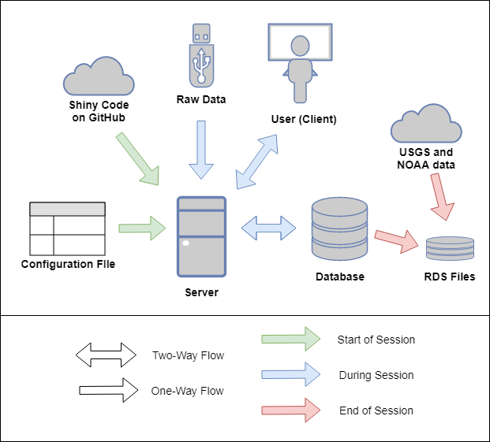

```{r loadpack, include=FALSE}
# Load Packages
library(rmarkdown)  
library(knitr)
library(tidyverse)
library(shiny)
library(kableExtra)
require(DiagrammeR)
require(DiagrammeRsvg)
require(rsvg)
```


\newpage

# Introduction

## Overview

A comprehensive watershed protection plan includes the collection of water quality, meteorological, and hydrological data. Large amounts of data can be difficult to manage if proper systems are not put in place for data management. Poor data management can be detrimental and may result in data loss, poor quality data, or underutilized data due to the lack of an efficient process of querying, visualizing, and analyzing data. Database software is a great solution to store and organize large datasets, yet database software often lack data visualization and analysis tools. Commonly, databases are paired with an outside application specialized for data querying, visualization, and analysis. In this work, two applications were developed with free and open source application development framework, Shiny, for facilitated water system data management by the Massachusetts Department of Conservation and Recreation (DCR). One application is designed for facilitated database data entry and the other for facilitated data visualization and analysis. This project is a product of the collaboration between UMass Amherst and the DCR.

## Objective

This project works to facilitate DCR data entry, querying, visualization, and analysis processes through an R-based application creation tool called Shiny. An application can automate many of the tedious day to day processes of managing water system as well as allow for powerful and expeditious visualization and analysis. Developing an application, rather than using proprietary software, allows for full customization by the developer to better target specific needs of the agency responsible for water system management and protection. A well fitting application can greatly increase the timeliness and ability to explain data and generate insights which can direct decision making for these agencies. Increased water quality data insight can also greatly influence an agency's sampling plan to better represent the watershed and focus on certain areas of high interest. The overall objective of this project is to maximize the efficiency of the DCR's ability to manage, visualize, and analyze data to inform decision making. The application developed in this project can be used as an example for other watershed management agencies.

## Scope of Work

Two applications were created to facilitate water system data management at the DCR. These applications will be used across the three watersheds, Quabbin, Ware River, and Wachusett, which have management staff in two separate DCR offices, one at the Quabbin Reservoir and the other at the Wachusett Reservoir. The applications are designed to meet the needs of both offices which require neccesary variations in the application features to address the differences between the needs of the two offices including differing sampling plans. Although some intrinsic differences are inevitable, efforts have been made to make the data management by the two offices more congruent. A large piece of this congruency has been in the form of database alterations to make the organization and formatting as similar as possible for the two offices. This effort has also included moving data that exists outside of a database into a common database where data observations all share a similar and tidy data regimen. Naming conventions were also examined and modified to simplify the application creation and decrease potential for mistakes.

Water System Data Import Tool (WIT) is the smaller of the two applications which is designed an interface for facilitated raw data import of water system field and laboratory data. Raw data from a number of predetermined sources can be imported through a simple user interface. WIT transforms raw data into the desired database format, provides quality control checks, and imports the data to the appropriate location in the database. WIT will help ensure in the future that all data remains stored in databases as this tool makes database storage timely and efficient.

Water System Data Analysis and Visualization Environment (WAVE) is the larger of the two applications and as its name suggests it is designed to facilitate data querying, visualization, and analysis of water quality and quantity data. The application opens in a web browser and allows the user to query data by user selected inputs including locations, parameters, and dates. More advanced filters for data querying are also offered including filtering data based on meteorological events and excluding flagged data. The corresponding queried dataset is presented in an interactive table which the user is able to output as a csv file. Discrepancies between water system datasets exist (and are desired) which are reflected in variations of query selections and filters in WAVE.

WAVE consists of numerous visualization and analysis tools to provide more insight on a queried dataset. Visualization tools for tributary and reservoir data include time-series plots, correlation plots, and distribution charts (histograms, density curves, and box-and-whisker plots) to visualize trends and patterns for selected water quality parameters. Geospatial data visualization and analysis allows one to spatially view data statistics on an interactive map. Heatmap and profile line plot tools are also available for reservoir profile data. Statistics can be quickly generated with WAVE including minimum, maximum, and average for user selected temporal and spatial groupings. More advanced statistical analysis includes Mann-Kendall statistics and Pearson correlation matrices. WAVE also makes information related to the sampling history of a specific site or a specific parameters easily accessible.

Both WAVE and WIT are shared openly through GitHub and are ran locally on a computer with minimal setup, although hosting the application online is also a possibility. The application is organized in a modular manner which eases future updates to the code as well as minimizes code repetition. Future additions to WAVE can be added as separate and independent modules. A developer manual was also created to help future developers of WAVE as well as user setup guides for WAVE and WIT. As the needs of the DCR change, both applications can dynamically change with it.


\newpage 
# Background

## Water System Overview

### Quabbin and Wachusett Reservoir

The metropolitan area of Boston, Massachusetts, receives its drinking water from the Massachusetts Water Resource Association (MWRA) water supply system. The sources of the water supply are the Quabbin Reservoir and the Wachusett Reservoir which are managed in partnership with the Massachusetts Department of Conservation and Recreation (DCR). Inflow to the Quabbin and Wachusett Reservoirs can be supplemented by diversions from the Ware River which has a watershed located between the watersheds of the two reservoirs (see figure 2.1). The system also has an emergency water supply source, the Sudbury and Foss Reservoirs [@dcr_watershed_2013]. 

The Massachusetts Department of Conservation and Recreation (DCR), Division of Water Supply Protection, Office of Watershed Management (DWSP) manages and protects the drinking water supply watersheds that provide water for approximately 2.5 million Massachusetts residents [@dcr_watershed_2013]. The total watershed area of the active Reservoirs is over 200,000 acres; the area of each watershed and reservoir are listed in table 2.1. The Quabbin and Wachusett Reservoirs are protected and over 85% of the watershed lands that surround the reservoirs are covered in forest and wetlands [@mwra_metropolitan_2006]. Table 2.2 lists the land use for each watershed. The water supply system is rather unique in that the Quabbin Aqueduct, a 24.6 mile long tunnel, connects the Quabbin Reservoir to the Wachusett Reservoir. The MWRA transfers water from the Quabbin reservoir intermittently to the Wachusett Reservoir to maintain the water level and water quality of the Wachusett Reservoir [@dcr_quabbin_2007] which on average over a long period of time makes up about half of the total inflow to the Wachusett Reservoir. As noted above, the MWRA can also divert water from the Ware River, located between the two reservoirs, to either the Quabbin Reservoir or the Wachusett Reservoir through the Quabbin Aqueduct, though it is DWSP and MWRA operating policy to divert only to Quabbin [@dcr_watershed_2013]. Quabbin transfers to Wachusett generally occur from June through November and can last for weeks at a time to meet higher water demands, maintain the water level, and mitigate water quality concerns in the Wachusett Reservoir [@dcr_quabbin_2007]. The complex nature of the system allows for decision making in reservoir management that can alter water quality of source water for the MWRA Supply System. It is essential to monitor water quality in the whole watershed and all reservoirs to best understand reservoir processes which can allow for more informed actions when water quality issues occur.

\begin{table}
\centering
\caption{Watershed and reservoir acreage}
\label{table-paramvalues}
\begin{tabular}{p{2in} P{1.1in} P{1.1in} P{1.1in}} \\ [-1ex]
\hline \\ [-1.5ex]
Watershed & Land area (acres) & Reservoir area (acres) & Total watershed area (acres)\\ [1ex]
\hline \\ [-1.5ex]
Quabbin Reservoir & 95,466 & 24,469 & 119,935 \\ [1ex]
Ware River & 61,737 & 0 & 61,737 \\ [1ex]
Wachusett Reservoir & 70,678 & 4,122 & 74,800 \\ [1ex]
\hline
\end{tabular}
\end{table}

\begin{table}
\centering
\caption{Watershed land use percentage}
\label{table-paramvalues}
\begin{tabular}{ p{2in} p{0.7in} p{0.7in} p{0.7in} p{0.7in} p{0.7in}} \\ [-1ex]
\hline \\ [-1.5ex]
Watershed & Forestry & Wetland & Agriculture & Residential & Other\\ [1ex]
\hline \\ [-1.5ex]
Quabbin Reservoir & 88.2 & 5.6 & 2.2 & 1.5 & 2.5\\ [1ex]
Ware River & 75.6 & 11.4 & 3.2 & 4.2 & 5.7 \\ [1ex]
Wachusett Reservoir & 67.3 & 7.7 & 5.7 & 10.8 & 8.4 \\ [1ex]
\hline
\end{tabular}
\end{table}

```{r MWRA System, echo=FALSE, out.width = "6.5in", fig.cap="MWRA water supply system showing the two active reservoirs (Quabbin and Wachusett), three watersheds (QUabbin, Ware River, and Wachusett), water treatment facilities (Brutsch and Carroll), and aquaduct system."}
knitr::include_graphics("images/background/MWRAsystem.png") #
```

### Water Quality Sampling Plan

DCR conducts extensive water quality monitoring of the surface waters (tributaries and reservoirs) in the water supply system. Monitoring data is used to assess current water quality conditions and to establish ranges of values for parameters considered normal or typical [@dcr_watershed_2013]. Data collected in routine sampling over several years are used to assess watershed trends while shorter term studies may be conducted to evaluate specific issues [@dcr_watershed_2013]. The task of water quality sampling and analysis in the three watersheds in the water supply system are divided between the Quabbin and Wachusett office of the DCR Water Supply Protection Division as well as the MWRA. The DCR Quabbin Office is responsible for the sampling of the tributaries in the Quabbin and Ware River watersheds and sampling in the Quabbin Reservoir while the DCR Wachusett Office is responsible for the sampling of the tributaries in the Wachusett watershed and the Wachusett Reservoir. Each office creates their own sampling plan for the reservoirs and tributaries in their respective watersheds which consists of a schedule of routine sampling and storm sampling at various sites. Each watershed is divided into sanitary districts [@dcr_watershed_2013]. Figure 2.2 shows all of the historical and active documented sampling locations of the DCR. More detailed sampling maps of each reservoir developed by the DCR are appended to this document.

```{r Watershed Sampling, echo=FALSE, out.width = "6.5in", fig.cap="Watershed sampling locations of the DCR that have been documented throughout the history of water quality and water quantity sampling. An orange circle depicts a reservoir sampling location and red circle depicts a tributary sampling location. The three watershed boundaries are shown: Quabbin (left), Ware River (center), Wachusett (right)."}
knitr::include_graphics("images/background/Sampling_Map2.png")
```

The Quabbin Office's tributary water quality monitoring program has included as many as fourteen sampling stations in the Quabbin Reservoir watershed, and ten sampling stations in the Ware River watershed [@dcr_watershed_2013]. Core sites are long-term monitoring stations, while Environmental Quality Assessment (EQA) sites support ongoing evaluations of threats to water quality by sanitary district [@dcr_watershed_2013]. Tributary temperature, dissolved oxygen, pH, and specific conductance levels are measured biweekly with a multiprobe meter. Samples from core sites are collected by hand biweekly for turbidity, bacteria, and calcium analyses, while samples for nutrient analysis are collected quarterly. Samples from EQA Sites are collected biweekly for alkalinity, turbidity, bacteria, nutrients, calcium, and UV254 [@dcr_watershed_2013]. Water quality parameters measured in tributaries by the DCR Quabbin Office are shown in Figure 2.3.

```{r res, echo=FALSE, out.width = "6.5in", fig.align="center", fig.cap="Water quality parameters sampled within tributaries and reservoirs by the DCR in 2016. Red indicates that either one sample was collected or one measurement was made at each station. Green indicates that three samples or measurements, each at a different depth, were collected or made at each reservoir station. Blue indicates that profile measurements were made at a continuous sequence of depths at each reservoir station."}
knitr::include_graphics("images/background/sampling_frequencies.png")
```

The Wachusett Office samples each tributary station weekly or biweekly throughout the entire year, except for during inadequate flow conditions. Temperature and specific conductance are measured in the field and samples are collected for analysis of E. coli and measurement of turbidity. Nutrient samples are collected monthly for total phosphorus, ammonia, nitrate-nitrogen, nitrite-nitrogen, total Kjeldahl nitrogen, total organic carbon, total suspended solids, and UV-254.  Reactive phosphorus (orthophosphate) samples were collected monthly and UV-254 samples were collected weekly from the Stillwater and Quinapoxet Rivers.  Depth was recorded manually or using automated depth sensors at seven of the nutrient stations and flow calculated using rating curves developed and updated by DWSP Environmental Quality staff. Water quality parameters measured in tributaries by the DCR Wachusett Office are also shown in Figure 2.3.

Both the Quabbin and Wachusett Reservoirs are monitored monthly by boat during the months of April through December, weather-permitting. Reservoir water column profile data for temperature, specific conductance, chlorophyll a, dissolved oxygen concentration and percent saturation, are collected at several locations within both reservoirs. Nutrient samples are collected at three depths, the epilimnion, metalimnion, and hypolimnion, and analyzed for water quality parameters including nitrate-nitrogen, ammonia-nitrogen, total Kjeldahl nitrogen, total phosphorus, silica, UV-254, and alkalinity. Phytoplankton data are also collected at both Reservoirs. Surface grab samples are collected in the Wachusett Reservoir for E. coli and fecal coliform. Water quality parameters measured in each reservoir by the respective office are shown in Figure 2.3.

DCR DWSP and MWRA cooperate with the U.S. Geological Survey to maintain continuous, real time recording gauges at a total of ten sites including sites at the Stillwater River, Quinapoxet River, West Branch Swift River, and East Branch Swift River [@dcr_watershed_2013]. Precipitation and other meteorological data is obtained from NOAA weather stations. Additional sampling related to forestry practices is also conducted to compare water quality between managed and unmanaged forests.


### Previous Water System Studies

Many studies have been conducted as a result of the partnership of University of Massachusetts and the DCR. Data analysis and model calibration and validation in many of these studies have benefited from the vast amount of water quality and hydrological data that are collected in the Quabbin, Ware River, and Wachusett watersheds. The water quality impacts from extreme precipitation events have been examined through statistical analysis of potential loads coupled with a reservoir hydrodynamic and water quality model [@jeznach_proactive_2017]. The fate of hypothetical contaminant spills in the Wachusett Reservoir have also been modeled [@clark_proactive_2016; @devonis_c._s_wachusett_2011; @sojkowski_2d_2011; @stauber_contaminant_2009]. Other water quality modeling topics have included the effects of climate change on the Wachusett reservoir [@clark_proactive_2016] and modeling the fate of natural organic matter and fecal pollution [@matthews_modeling_2007; @buttrick_modeling_2005]. Presumably, having a thorough sampling plan and well maintained data can allow for more informed and facilitated research studies.


## Water System Data Management

The process of managing watershed data can be simplified into three parts: data collection, data storage, and data utilization. Data collection includes the acts of field observations, sample collection, lab analysis, and data entry to a database. Data storage is the location in which the data lives and is ever-changing as more data is collected. Data utilization includes the querying, visualization, analysis, or any other process from which conclusions can be drawn from the data to benefit decision making.

Proprietary software exist that can greatly aid in the watershed data management process. AQUARIUS, created by Aquatic Informatics, is a collection of leading application software for water supply management. Two of the five AQUARIUS applications are AQUARIUS Samples and AQUARIUS Time-Series. AQUARIUS Samples streamlines the production and management of environmental lab and field sample data [@aquatic_informatics_aquarius_2018]. Aquarius Time-Series is a powerful platform for managing water resources and is used by the United States Geological Survey (USGS) as well as many other agencies and is famous for building and maintaining rating curves [@aquatic_informatics_aquarius_2018]. This study for the DCR focuses on water quality data management, thus AQUARIUS Samples better resembles the watershed data management system that this study describes. Later work for the DCR may focus on water quantity data which may resemble the data management tasks of AQUARIUS Time-Series. Proprietary software like AQUARIUS Samples attempt to supply a versatile product that can be widely used on any watershed. This can be a difficult task due to the differences between different agency's needs and processes. Proprietary software is often limited in data visualization and analysis and cannot be customized within the software. Proprietary software is also costly.

An alternative to proprietary software for watershed data management is to develop a customized agency-specific application using an open source application development framework paired with a database. With the advancement of programming languages and increased number of development frameworks, it is getting easier to build a custom dashboard or application. Creating an application, rather than using proprietary software, allows for more flexibility and customization. Developing an application is less costly than using proprietary software, yet it is likely to be much more timely. The Oregon Department of Environmental Quality has developed an application which provides an interactive means for users to query from multiple databases and evaluate status and trend at individual sampling stations [Bryant, 2016]. This application is built with the Shiny application development framework in the statistical programming language R.

### Data Storage

Due to the vast amount of water quality data collected by the DCR, it is essential to use a relational database for efficient data storage. Spreadsheet software is not an effective way to store large datasets. A relational database is a means of storing information in tables with rows and columns in such a way that information can be retrieved from it [@oracle_relational_2017]. A table is referred to as a relation in the sense that it is a collection of objects of the same type (rows) [@oracle_relational_2017]. In a database for watershed data, an object (row) can be a field observation, lab measurement, site location information, or another object. Data in a table can be related according to common keys or concepts to another table allowing for the ability to retrieve related data. A Relational Database Management System handles the way data are stored, maintained, and retrieved. Oracle, MYSQL, Microsoft SQL Server, PostgreSQL, and Microsoft Access are among the most popular relational database management systems [DB-engines]. Many of database management systems are free and open source. Applications can be designed to connect with a database to retrieve data from a database or write new data to a database.

### Application Development Frameworks

Application development frameworks assist with application creation and are essentially a reusable, "semi-complete" template application that can be specialized to produce custom applications [@fayad_object-oriented_1997]. Selection of a proper application development framework can greatly decrease the amount of work one must do and knowledge one must possess to create an application. Most application development frameworks can be considered either a front-end framework or a back-end framework which create a front-end server and a back-end server, respectively. The front-end server and the back-end server communicate through a common API, usually JSON, which is considered the universal binary [@universal_binary_json_specification_universal_2018]. A front-end server is responsible for the construction and layout of the user interface, which is what the user sees and interacts with (often in a web browser). The user does not see the back-end server but this does the bulk of the work. The separation of front-end server and back-end server can allow for increased customization as various front-end and back-end frameworks can be paired. Some frameworks serve as both a front-end and back-end framework which usually have a benefit of simplicity in the development process. This paper focuses on this latter type of framework that function as both front-end and back-end due to the simplicity of the desired application. Likely, a minimalistic user interface will suffice and most of the focus should be on the data science potential of the framework, which will likely be determined from the programming language that the framework uses. 

R and Python are common programming languages for data science and both have their own collection of data science application framework packages. Python is more widely used than R [@kim_10_2017], though R specializes in statistics and data visualization [@r_foundation_r:_nodate]. Shiny is a development framework package in R created by RStudio which allows a relatively inexperienced developer to build an application in the R language and is very well documented. Application framework packages in Python tailored toward data science include Bokeh, Spyre, and Dash [@parmer_is_2017; @hautbois_bokeh_2018]. All of these packages are free to use for developing applications and dashboards. These application frameworks leverage JavaScript and HTML to render the user interface which can be opened in a web browser. Each framework has its differences and some may work better than others for a particular purpose. Familiarity of a particular programming language can also influence the decision of which application development framework to choose.


\newpage 
# System Architecture (Methods)

## Overview

A system architecture is the conceptual model that defines the high level structure for the many working parts of an application [@jaakkola_architecture-driven_2011]. Generally in any application, the user (client) sends information to the server through interactions with the user interface and the server will make any necessary updates to send back to the user. The server does most of the work including making input and output objects, performing computations, and fetching data from a data source. 

WIT and WAVE have relatively similar system architectures which differ in a few ways from most application architectures. simple system architecture relative to other web applications. Most applications on the web have a separate front-end server and a back-end server. Shiny is both a front-end and back-end framework which allows one unified server component. This means the Shiny server both builds the user interface through rendering JavaScript and HTML (front-end server) and also performs computations and fetches data (back-end server). The applications are also ran locally at the DCR which means that the client and the server are both ran on the same computer (the user's computer). Not hosting the application on the web avoids the additional process of sending user requests through a proxy to balance user traffic.

The system architecture of WIT and WAVE can be seen in Figures 3.2 and 3.3, respectively. The common components that both systems have include the Server, User (Client), GitHub Code Script, Configuration File, and a form of data storage. Prior to the start of a session in either WIT or WAVE, a configuration file with user settings is read and the latest application code is pulled from GitHub. After this step, the system processes of the two applications differ. The components of the system architecture are discussed in more detail in the following sections.

```{r dev WIT, echo=FALSE, out.width = "6.5in", fig.cap="WIT system architecture showing the conceptual model that defines the structure and behavior of the WIT application. Green Arrows indicate processes that occur before an application session is actually started. Blue indicates processes that occur during a session which are controlled by the user. Red indicates processes that occur after a user ends a session by closing the application."}

```

```{r dev WAVE, echo=FALSE, out.width = "5.5in", fig.align="center", fig.cap="WAVE system architecture showing the conceptual model that defines the structure and behavior of the WAVE application. Green Arrows indicate processes that occur before an application session is actually started. Blue indicates processes that occur during a session which are controlled by the user."}
knitr::include_graphics("images/system dev/WAVE_Arch.pdf")
```

## Configuration File

Prior to the start of a session, a configuration file is read into R which gives information about the desired configuration settings like the location of the data, GitHub repository location, and other settings that are specific to a particular office or a particular user. The configuration file is used for the purpose of allowing variability in the application across users. A user at the Quabbin Office will have a different directory layout than a user at the Wachusett Office. This also facilitates a user outside of a DCR Office to be able to use these applications due to internal network and directory differences. UMass will benefit from the use of WAVE to gather data for research studies including data for model input and calibration of the CE-QUAL-W2. The MWRA also expressed interest in using WAVE.

There is one configuration file for both WIT and WAVE. Most of the information in the configuration file pertains to WIT only due to the necessary information about each data source. This includes the name and file path of the process and import R scripts of each data source as well as the folder path of the raw and processed data files.

## Github

GitHub is used for many purposes related to WIT and WAVE development and system processes. The application code is stored on GitHub which offers advanced version control and collaboration features during development. GitHub is also integral in the launching method of the application. GitHub is a web-based hosting service for version control using Git. It offers all of the distributed version control and source code management functionality of Git as well as adding its own features. It provides access control and several collaboration features such as bug tracking, feature requests, task management, and wikis for every project. [@TechCrunch_github_2012]

The configuration file tells the application which GitHub repository to fetch the application from. Currently there are two repositories of the application (a main repository and a forked repository). Although the application is mainly ran from the main repository, there has been sometimes when it has been useful to run the application off of the forked repository. Fetching the application directly from GitHub ensures that the latest version of the application is being used by all users. There is no need for a user to ever have to install an update.

## Client

A user interacts with the client through the Google Chrome Browser. A client is a piece of computer hardware or software that accesses a service made available by a server [@sadoski_client/server_1997]. The server is often [yet not always] on another computer system, in which case the client accesses the service by way of a network [@sadoski_client/server_1997]. In this case, the client receives and displays data to the user on the same local computer as the server. The application is opened in a Google Chrome Browser on the user's computer. Google Chrome interpretes the JavaScript and HTML produced by the (front-end) server. This interpretation allows the user to visually see the application and interact with it. 

## Server

A server is a computer that provides and serves data [@techterms_server_2014] during an application session. In this case, the computer refers to the local computer of a user in which the application script is executed. The main app script contains a line of code that launches the application in an R session. In WIT, the server listens to the user's requests and performs the data processing computations and data import services. In WAVE, the server listens to the user's requests and creates data visualizations and performs statistical analysis on the data.

The behavior of the server for WIT and WAVE is defined by the Shiny Development Framework. Shiny is implemented in the R programming language, yet also allows the developer to incorporate direct CSS, HTML, and JavaScript. RStudio is the leading (IDE) for the R language and is the creator of the "Shiny" package as well as many other popular R packages (e.g. "ggplot2", "dplyr", "tidyr", "RMarkdown"). The applications utilize many packages in R which can be seen in table 4.1. 

Dataframes are a data structure used in R (and also in the Pandas package in Python) that are built for efficient data science. A dataframe is technically a list of named vectors of equal length [@kabacoff_quick-r:_2017]. This differs from a matrix which is a common data structure in programming languages which is technically a two dimensional array. Dataframes are the data structures that these applications and RDS files use to hold data.

\begin{table}
\centering
\caption{List of R packages utilized in WIT and WAVE applications. This list is likely to grow.}
\label{table-paramvalues}
\begin{tabular}{p{1.5in} P{1.5in}} \\ [-1ex]
\hline \\ [-1.5ex]
WIT & WAVE \\ [1ex]
\hline \\ [-1.5ex]
shiny & shiny \\ 
shinyjs & shinyjs \\ 
shinythemes & shinythemes \\
tidyverse & tidyverse \\
scales & scales \\
lubridate & lubridate \\
stringr & stringr \\
readxl & rmarkdown \\
RODBC & knitr \\
DBI & plotly \\
odbc & leaflet \\
DescTools & RColorBrewer \\
devtools & DT \\
data.table & akima \\
magrittr & cowplot \\
openxlsx & rgdal \\
V8 & reshape2 \\
sendmailR & corrplot \\
dataRetrieval & \\ [1ex]
\hline \\
\end{tabular}
\end{table}

A Shiny application code consists of two parts: code for the front-end server (referred to as the "user interface" component) and code for the back-end server (referred to as the "server" component). The Shiny "user interface" code is made up of input and output objects. Input objects consist of a variety of JavaScript widgets (e.g. "Checkbox Input" and "Select Input"). Output objects include plots, images, tables, and etc. In general, input objects are defined within the user interface code. Instructions of how output objects are made are defined within the server code. The "placeholders" of these output objects are defined in the user interface code. Shiny applies the concept of reactivity to automatically update output objects when a user changes input objects that they are dependent on. Reactive expressions can be used as intermediary functions between output and input objects which continue the reactive chain between these objects. More information on the Shiny Framework can be found online. 

The server can connect to a database or another type of data storage. The WIT server reads and writes data, while the WAVE server only reads data. There are commonly two schemes of reading data with an application. One scheme is to read all data in at the start of the session and the other is to read in only specific data each time the user asks for specific information. The second approach is more common with large data sets, because it can be timely to read in all data at the start. Although there is a substantial amount of data, WAVE actually reads in all the data at the start of the session, yet does so in a way that most of this work is already done before the user tries to open the application. This will in turn speed up the processes during the session. WIT uses the second approach and reads in data when it is needed. This results in a shorter launching time for WIT. The scheme of reading in data for WIT and WAVE are indicated in Figure 3.2 and 3.3 by the color of the arrow.

The server can connect to a database with an Open Database Connectivity (ODBC) application program interface. This is used to externally fetch data from a database and to write data to a database. WIT uses an ODBC to read and write data to the databases. A server can also read data from other data storage methods including flat files (e.g. csv and txt) and RDS files. RDS files preserve the R data structure and is the fastest way to save data from R and read data into R. WAVE reads in data from RDS files which makes the process of reading in data to WAVE very fast. 


## Database

The DCR has collected water quality data for over forty years. The data storage methods have changed greatly over the years of sampling. In the early years, paper records were used as the means of storing data. As computers became more relevant a mix of spreadsheet storage and database storage slowly became the means of data storage. Today, an effort is being made to store all new data and move all existing data into relational database management systems (RDBMS), commonly referred to as just databases. Databases are a more efficient method of storing large amounts of data than either paper records or spreadsheets. The DCR currently uses Microsoft Access as their database software. The Wachusett Office has three databases, one for water quality data, one for aquatic biology and profile data, and one for hydrological data. Each database of the Wachusett Office has a similar format. The Quabbin Office has one database for all of its water quality data. The needs and practices of the department determine whether it is appropriate to have one or multiple databases. This being said, directly related tables (i.e. have common keys that link them) should likely be stored within the same database.

There are many tables within a database, in which each contains different sets of information, where similar objects are contained in rows [@oracle_relational_2017]. Many tables contain sampling measurements, in which each row is a unique sampling observation from the field or laboratory. Each observation gets its own row and is unique in the combination of location, date, and parameter. Data formatted so each row is a unique observation is considered to be "tidy". Tidy datasets have a specific structure: each variable is a column, each observation is a row, and each type of observational unit is a table [Hadley]. Tidy datasets are easy to manipulate, model and visualize [Hadley]. Storing data in a "tidy" fashion facilitates data science in the R programming language (and presumably most advanced programming languages). An example of "non-tidy" data and "tidy" data can be seen in Tables 3.1 and 3.2. In this case, columns named "Parameter" and "Result" are used in the "tidy" data example rather than including a column for each parameter. The "tidy" data format in this example also allows for additional columns like "Units" and other information specific to that one observation to be recorded in the database. Many packages in R, like "ggplot2" and "dplyr" are designed for "tidy" data.

\begin{table}
\centering
\caption{An example of non-tidy water quality sampling data}
\label{table-paramvalues}
\begin{tabular}{p{1.0in} P{1.0in} p{0.8in} P{0.8in} p{0.8in} P{0.8in}} \\ [-1ex]
\hline \\ [-1.5ex]
Location & Date & Turbidity & Nitrate & Ammonium & Specific Conductance \\ [1ex]
\hline \\ [-1.5ex]
Station 1 & 01/01/2020 & 12 & 13 & 14 & 15\\ [1ex]
\hline \\ [-1.5ex]
\end{tabular}
\end{table}

\begin{table}
\centering
\caption{An example of tidy water quality sampling data}
\label{table-paramvalues}
\begin{tabular}{p{1.0in} P{1.0in} p{1.0in} P{1.0in}} \\ [-1ex]
\hline \\ [-1.5ex]
Location & Date & Parameter & Result\\ [1ex]
\hline \\ [-1.5ex]
Station 1 & 01/01/2020 & Turbidity & 12\\ [1ex]
Station 1 & 01/01/2020 & Nitrate & 13\\ [1ex]
Station 1 & 01/01/2020 & Ammonium & 14\\ [1ex]
Station 1 & 01/01/2020 & Spec. Cond & 15\\ [1ex]
\hline \\ [-1.5ex]
\end{tabular}
\end{table}

In this work, the majority of the data is from sampling measurements which is the main data of focus. Data other than sampling measurements are thus considered metadata. Metadata is a term used for a set of data that describes and gives information about other data [@google_metatdata_2018]. Metadata tables in the database include tables with information on parameters, locations, flags, sample flag index, and more. Location Tables store information related to sampling site locations (e.g. site ID, latitude, longitude, elevation). Parameter tables store information related to parameters (e.g. parameter abbreviation). Flag tables store information related to flags (e.g. flag code, flag description). Sample flag index tables are used to relate the sample tables with the flag tables which is needed due to the many-to-many relationship of samples and flags. Because a sample measurement can have zero, one, or many flags associated with it, an intermediate table is used to relate a sample ID with a flag ID, which are both foreign keys.

In the future it may make sense to use a different database software due the outdating of Microsoft Access. This switch should be a smooth process since all RDBMSs have a common API, Structured Query Language (SQL). There likely exists alternative RDBMSs which are faster at reading and writing data. As of now the DCR is familiar with Microsoft Access and there is no strong reason to move away from it at this point.

## RDS Files

In R, storing data in RDS files and using the readRDS function to read in this data is a fast method of saving and reading data into R [@mierzwa-sulima_fast_2017] . Feather files and readFeather function are supposedly an even faster method which to save and read dataframes [@mierzwa-sulima_fast_2017]. A transition to feather will be examined in the near future. The RDS files also act as a common storage location for all the data that WAVE uses including internal DCR data and data from outside organizations including the USGS and the National Oceanic and Atmospheric Administration (NOAA) National Climatic Data Center (NCDC). RDS files make the process of reading data into WAVE very fast. Each dataframe is stored in its own RDS file with the same descriptive name that the WAVE App uses (e.g. df_trib_wach). The date that the RDS files are last updated are also recorded and displayed in WAVE. RDS files are updated after the WIT is closed, which will be explained later in more detail

## Application Package and Launching

All of the necessary files needed to run both applications are packaged into a folder for easy distribution among users, wither at the DCR or outside of the DCR. This package includes the configuration file, the launch R scripts, desktop shortcuts, associated batch files, Portable R, and Portable Google Chrome. There is no actual installation required to run either of the applications. The user will not need R or Google Chrome directly installed on their desktop due to the portable versions included in the packaged folder. WAVE not requiring an installation avoids any potential difficulties with an IT department. Further, using Portable Chrome allows the application to open in a fresh clean Google Chrome Browser without any user customization (e.g. Bookmarks).

There are several ways to launch a Shiny application, many of which are web hosted methods. The relatively small userbase of WIT and WAVE led to a local launch method to be chosen. Because this application is to be used primarily by the DCR internally, it was agreed upon that it was not neccesary to host the application on the internet. It is feasible to share a packaged application folder with all of the intended users of the application. Running an application locally is generally simpler than hosting an application online.

A desktop shortcut was created to allow the user to launch the application with a double click of the mouse. The desktop shortcut when clicked triggers a batch file that runs an R script to install/load all neccesary R packages and then execute the "RunGitHub" function. "RunGitHub" is a built-in function in the Shiny package which will fetch the most updated application code stored in a GitHub Repository and run the app locally in a Portable R session and open a new Google Chrome Browser.


\newpage
# WIT Development and Features

## Overview

Application Software can facilitate database entry of water system data. The manual labor for database entry can be extensive without specially designed software. Water system data are collected from a variety of sources in a variety of formats. It is a multiple step procedure to enter data into a database. First, raw data must be transformed to the format of the data in the database. Secondly, measures must be taken to ensure raw data quality as well as that it was transformed correctly. Other quality measures also can be taken. Thirdly, transformed data must be imported to the database. WIT helps a user perform these steps of data entry through the automation of much of this process. WIT facilitates database entry of water quality and water quantity sampling data from various sources.

WIT is rather flexible in that users can set preferences in a configuration file to alter the settings of the session. The configuration file consists of a table of user settings. The configuration file includes the neccesary information on all the data sources of a particular DCR Office. WIT also reads in basic Windows user account information to automatically set some additional settings.

## Development Process

WIT was developed in a collaborative effort between UMass Amherst and the DCR. During the beginning of the development process, UMass Amherst focused on the development of the Shiny Application code itself, while the DCR Wachusett Office focused on the scripts for data processing of raw data source files. The DCR also handled the organization of these data files and databases within the DCR's network. UMass proposed multiple test versions of the application which received feedback from the DCR. The main parts of the application were finalized and the DCR later expanded on the application to allow for the ability to manually flag data upon entry. Additional user preferences and setting were also added to the application for increased variability between offices or other groups.

The DCR Wachusett Office had previously largely relied on Visual Basic Macros for their data entry needs. R is a more efficient tool for data entry due to more timely and efficient data manipulation. Developing an application with Shiny also allows for a more straight forward user experience yet while still providing advanced capabilities.

The R scripts that process and import data used by the WIT application can also be used independently, outside of WIT. This allowed for the DCR to use these R scripts for data entry while WIT was being developed. This also facilities the process of developing and testing a new R script for the data processing or data importing of a new data source. If an office adds a new data source, new scripts can be created and the new data source information can be recorded appropriately in the configuration file.

## Session Flow

WIT has a relatively simple user interface, and consists of much fewer inputs and outputs than WAVE. The main inputs of WIT are for data selection, data processing, and data importing. The data selection inputs include user selection of the type of data source and the raw data files to be read into the session. The data process input is a button to run the R script to transform the data and perform quality assurance and quality control measures. The data import input is a button to run the R script to import the data to the correct location in the database. In addition to these main user interface inputs, other inputs include those for manually adding flags and also inputs specific to certain data sources (e.g. "instrument used").

The main steps a user takes during a WIT Session are shown in Figure 4.1. The user first clicks on the WIT desktop shortcut which will open WIT in a Google Chrome Browser. The user then selects a data source type and raw data file.  A process button will appear on the screen that the user can press to transform the data and perform quality tests. The user can also manually add flags to the data. If the data passes the quality tests, an import button will appear as well as a table of the processed data. After inspecting the data in the table the user may press the import button which will import the data to the database. The user can enter multiple data files to the database in a session by repeating the prior steps. When the user is finished, they will close out of the Google Chrome Browser which will end the session. This will trigger an R script to run which will update the RDS files.

```{r WIT Session user, echo=FALSE, out.width = "6.5in", fig.cap="Flow of a WIT user session from clicking on the desktop icon to closing the application. The reverse arrow from 'data processing' to 'data selected' represents the user deciding to not import the processed data. The reverse arrow from 'data importing' to 'data selection' represents the user importing multiple data files per session. Although not shown, the user can exit the application at any time."}
knitr::include_graphics("images/WIT/WIT_user_session.pdf")
```

## Launching

The user first double clicks the icon located on the desktop which triggers two batch files. The first batch file notifies the user that the App will open shortly. The second batch file will read the information from the Configuration File. Included in this information is the GitHub Repository for which to fetch the Application code from. Once the code is fetched the code is read in a local R session in the background and the application is started. A fresh Google Chrome Browser with the application user interface will appear. Figure 4.2 illustrates the WIT starting process.

```{r WIT Session start, echo=FALSE, out.width = "6.5in", fig.cap="Flow of events that occur when a user wants to launch WIT."}
knitr::include_graphics("images/WIT/WIT_session_start.pdf")
```

## Data Selection

The user is first prompted to select from a choice of data sources. The list of data sources is determined from the configuration file and is unique to each user's Office. Based on the selected data source, a corresponding file path from the configuration file is used to locate the folder on one's computer where they designated to save the raw data files of that file source type. The user will be prompted to select a choice of the raw data files that are in the folder. Once the user selects a raw data file, a "process data" button will appear for the user to press when ready. If the user changes their mind, and would like to select a raw data file or change the data source type, they are free to do so. If the user does change the data source type, the "process data" button will go back to hiding. This ensures that the application does not accidentally process a raw data file that it believes to be of a different data source than it actually is. As will be discussed, once a file has been successfully imported it will no longer be available for selection.

## Data Processing

In this work, data processing includes both data format transformation and data quality assurance and control. An R script is written for the processing of data from each each data source that is stored in the database and/or is used in the WAVE application. The configuration file is read by WIT which reads in the list of data processing R scripts that a particular DCR office uses. When the user presses the "process button" the corresponding data processing R script is ran.

Data format transformations take data in the raw data format (i.e the format in which they are uploaded to the computer), and transforms it to the desired format of the database to be effectively and correctly imported. These transformations include adding or removing columns, column name changes, data type changes, and data rearranging (e.g. spreading or gathering columns). The extent of which raw data has to be transformed varies greatly from each data source.

The processing scripts are also designed to give a descriptive error to the user when there is a suspected problem with the raw data that the user is trying to upload to the database. Each data source processing script has a number of quality control tests to minimize poor quality data from being uploaded. Some of these tests are common for all data sources, while most are specific to the individual data source. All new raw data files are checked to make sure no duplicate observations are within the file (i.e. all observations must be unique). The process script also will read in the data from the database to ensure that the data has not already been imported to the database by a similar method of checking for duplicates. The process scripts will also alert a user when their is an unusual data value. There are also additional quality control tests specific to each data source. When the user gets notified of an error, the user should try and address the problem outside of the WIT application, by altering the raw data file or seeking a solution to the cause of the error. Figures 4.4 and 4.5 illustrate the flow of events that occur when WIT processes data for the cases of when the quality control tests are successful and unsuccessful, respectively. 

Ideally, all potential raw data errors will be caught by the processing scripts and a descriptive error message will be shown to the user. In reality, when developing these processing scripts, it is likely to only anticipate common raw data problems and write descriptive error messages for these problems. Unanticipated problems are likely not caught by one of our quality control tests, yet would likely draw an error within R. In this case, the default R error handling message will be shown to the user. This message will likely only be helpful to the user if they are familiar with the R script. In this case of an unanticipated problem, there is still a benefit that the processing data is hauled and that the user is given an error message, even if the description in the message itself is not helpful.

Some of the data is also flagged during the data processing process with the same data processing R scripts. A flag is used to indicate additional information about a data observation, some are which are added automatically (in the processing R scripts) and some are added manually by the user. An example of a flag is automatically added by the processing script is "below detection limit". In the case of the raw data from the MWRA lab, observations that fall below the detection limits are recorded with a "less than" symbol and than the value of the detection limit (e.g. "<5.0"). Thus, for this data source, the R script will look for the "less than" sign, and assign the corresponding flag code to that observation. The user can also manually add flags to the data with various input options to do so. These manual flags usually relate to observations of a DCR scientist during the sampling process (e.g. "ice cover" or "low flow conditions").

```{r WIT Session proc suc, echo=FALSE, out.width = "6.5in", fig.cap="Flow of events that occur during a WIT session for the task of succesfully processing data"}
knitr::include_graphics("images/WIT/WIT_session_proc_suc.pdf")
```

```{r WIT Session proc fail, echo=FALSE, out.width = "6.5in", fig.cap="Flow of events that occur during a WIT session for the task of unsuccesfully processing data"}
knitr::include_graphics("images/WIT/WIT_session_proc_fail.pdf")
```

The process of assigning a flag code to a data observation is actually a bit more complicated due to the many to many relationship between data observations and flag codes (i.e. an observation can have more than one flag code). Thus, a column in the table of data observations for flag code columns is not adequate for the potential multiple flag code values. A solution is to make an intermediate table, in this case called "Sample Flag Index", to link a Sample ID foreign key with a Flag Code foreign key.

Once the data has been processed, an "import data" button will appear on the screen along with a table of the processed data. This data table serves as the final quality control measure as the user gets to view the transformed data and visually see if it looks adequate. When the user is ready to, they can press the "import data" button to import the data to the database.

A great benefit of WIT is that it allows the actual person who collected the data to also import it. This increases the ability of that user to add meaningful flags as well as perform a better visual quality control because they know better than anyone what they expect the data to look like. Previously this was not always possible due to the technical abilities of the some data collector

## Data Importing

In this work, data importing means the physical process of moving data which already in a desired format into the correct location in a database. WIT allows data is imported with a click of the "import data" button. An import R script is written for each of the data sources. When a user clicks the "import button" this tells the server to run the specific R script for the data source type. Each R script utilizes an open database connectivity (odbc) application program interface (API) to connect with a Microsoft Access database. The R script first makes a connection with the corresponding database and finds the corresponding Table and reads in the ID column. Reading in the ID column is necessary for writing to a Microsoft Access database, to direct the database where to store the data. The maximum value of the ID column is calculated and a column containing a sequence of ID values greater than the maximum existing values are added to the raw data. The raw data is then ready to be imported to the database and will naturally fall at the end of the Table (if the data is sorted by ID). This ID column has no use outside of the Microsoft Access database.

```{r WIT Session import, echo=FALSE, out.width = "6.5in", fig.cap="Flow of events that occur during a WIT session for the  task of importing data"}
knitr::include_graphics("images/WIT/WIT_session_import.pdf")
```

Once the data is imported, the raw data file will be moved from a folder of data that has not been imported to a data that has been imported. This helps with the organization process of data and will make it so the user will not be able to select a raw data file that was previously imported with WIT. The flow of events during WIT importing data is illustrated in Figure 4.5.

## Exiting and Updating RDS Files

When the user ends the WIT session by closing the app, an R script will be automatically launched which will update the RDS files that are used by WAVE. Due to the comparatively longer time to read data from a database into an R session, this method expedites the launching of WAVE because updated data from the database will already be in the desired data format of (RDS files). A user closing WIT is a good indication that the database has been updated, since this is the sole means of data entry to the databases. The updating of RDS files happens automatically in the background of a user's computer. One can also trigger the update of RDS files manually as well. Reading in data from RDS files upon starting a WAVE session takes about 2 seconds compared to 15-20 seconds of reading data from the database. The flow of events after a user exits WIT can be seen in Figure 4.6.

```{r WIT Session exit, echo=FALSE, out.width = "6.5in", fig.cap="Flow of events that occur after a user exits a WIT session"}
knitr::include_graphics("images/WIT/WIT_session_exit.pdf")
```

As of now, these RDS files are stored locally on the DCR internal network, though will likely be moved to GitHub cloud storage. Cloud storage will allow a user outside of the DCR network to have access to the most up-to-date data. As of now, GitHub is only used to manage the updates of application code. It is possible to also "push" the latest RDS files to the cloud storage. Likely, another GitHub account will be created which sole use will be to automatically "push" the RDS files to GitHub every time that these RDS files are updated. This will benefit the user experience at UMass Amherst and at the MWRA who are interested to be able to use WAVE as well. 

The RDS files contain all the internal DCR data that is used in WAVE and also includes data from outside organizations including the USGS and the NOAA NCDC. As of now, the USGS and NCDC data is also updated upon WIT closing. An independent schedule for updating this data may be more appropriate (e.g. daily RDS updates). The MWRA also has reservoir water quality data that is desired to be incorporated into WAVE and thus into the RDS files. This data for the most part is stored on the MWRA internal network. There is no efficient data sharing system in place in which the most up-to-date data can be retrieved online. Thus, in the future, it is likely a good idea to store the internal MWRA data in RDS files on GitHub. These RDS files could be automatically updated and pushed to GitHub upon some trigger related to MWRA data entry.


\newpage
# WAVE Development

## Overview 

WAVE is a large application consisting of many tabs with many features. All of the files that contain WAVE code or are related to the WAVE code are stored on GitHub in a public repository. The application code is separated into many R script files containing pieces of the application code, each generally for a particular feature. These pieces of code are special R functions created specifically for the Shiny Framework and are called modules. In addition to modules, WAVE also uses a number of functions that are used throughout the app which are defined in a separate file stored on GitHub. WAVE uses GIS and image files which are stored with the application code on GitHub. The application code is public so therefor can be viewed by anyone with internet access. The application has an MIT License which is expressed in the GitHub repository which states that the application is free of charge for use without restriction.

In this work, a large effort has been made to keep the code well organized. The code scripts are all written in a similar style which follow guidelines put forward by Hadley Wickham and Google [@wickham_r_nodate; @google_googles_nodate]. The application code is concisely commented. Naming conventions have been established to facilitate the readability of the code. Due to the large amounts of objects, a large effort was made to be descriptive and concise in the naming of objects so a developer can determine the purpose of an object by its name. Objects of the same class (or type) use the same naming style which are created from variations of lowercase, uppercase, underscores, and camel case formats.

## Development Process

A precedent model for WAVE was a Visual Basic Macro application for data querying and analysis built at the DCR. This Macro served to facilitate searching for data at the DCR and was a better method than searching through the database manually. It also facilitated grouping and statistics. The Macro also utilized Microsoft Excel plots for data visualization. Visual Basic Macros are limited in user friendliness and speed. The Shiny App is much more powerful method to create an application that is user friendly and fast. The visualization and statistical power of R is much more advanced than Visual Basic.

WAVE has gone through many transformation and updates to get to the product that it is today. It was not possible to foresee the exact direction that WAVE was going take when the idea was first proposed for a few reasons. The developers of WAVE had little to no application development experience. Also, most DCR staff were unfamiliar with Shiny and application software in general, so it was difficult to receive ideas and suggestions. WAVE is also a relatively unique product. The needs of the DCR are unique to this organization, and WAVE tries to meet these specific needs. The DCR sampling and needs are unique and no similar application was found that was able to fit the needs of visualization and analysis of tributary water quality and water quantity data. Justifiably, WAVE meets the water system data visualization and analysis needs of the DCR better than any other software, as it should because it was built specifically for the DCR.

The Application was developed in multiple iterations. The first Application was developed to show the potential of the Application to the DCR to gain interest on the project. This was a quick Application creation which tried to develop a wide range of features that were not really fine-tuned. After this process, feedback was received and the path of the application was narrowed. The cycle continued and a series of applications were suggested and user feedback was received. The Application has been accessible and used at the DCR starting mid-late 2017 to allow for sufficient feedback.

## Reading Data

WAVE is designed to read data as RDS files that have already been transformed to the desired formatted dataframes of WAVE. The data that WAVE reads in includes water quality and water quantity data of the DCR that are stored in a total of four Microsoft Access databases across the two DCR offices. WAVE also reads data from the USGS and NOAA for hydrology and meteorology data. WAVE will soon read data from the MWRA as well. The list of data that WAVE reads will likely grow as new needs are realized.

## Tab Layout

The many features WAVE offers results in a lot of code (roughly 10,000 lines of code with minimal repetition). Organization of the code is crucial for efficient updates and additions. WAVE as a whole can be viewed as a collection of individual dashboards organized in various tabs in the user interface. The user only ever sees one tab at a time and thus one dashboard at a time. The highest level tabs of WAVE form the navigation bar, also commonly known as the "ribbon". The top-level navigation bar consists of the following tabs: Home, Tributary, Reservoir, Met Hydro, Forestry, Reports which can be seen in Figure 5.1.

```{r code App navbar, echo=FALSE, out.width = "4in", fig.align="center", fig.cap="WAVE navigation bar for the top-level tabs."}
knitr::include_graphics("images/code dev/app_navbar.png")
```

```{r code App, echo=FALSE, out.width = "4in", fig.align="center", fig.cap="WAVE top-level tab structure (navigation bar)."}
knitr::include_graphics("images/code dev/app_tabs.pdf")
```

The organization structure beneath the top level navigation bar can be seen in figures 5.3, 5.5, and 5.6. As of now, the "Home", "Met / Hydro", "Forestry", and "Report" tabs are relatively simple and have only a few or no lower level tabs as shown in Figure 4.4. The "Home" tab is the default tab that the application opens too. This is chosen as the "Home" Page because it gives a nice visual of the overall watershed and the sampling locations. The "Met / Hydro" navigation bar (first-level) tab is currently a place holder for the soon-to-come meteorology and hydrology tab. This tab is being currently under work and will include the selection, visualization, and analysis tools for NOAA, USGS, and in-house meteorology data. The "Forestry" tab is a placeholder for a future forestry tab that will attempt to help users better understand the water quality effects of forestry practices. The Report tab is currently under construction with a goal of facilitating the process of report creation. This includes facilitated predetermined reports like the annual and monthly water quality reports and also the ability to make custom reports.

```{r code other 1, echo=FALSE, out.width = "5in", fig.align="center", fig.cap="WAVE tab structure for 'Home', 'Met / Hydro', 'Forestry', and 'Report' (top-level) tabs."}
knitr::include_graphics("images/code dev/other_main_tabs.pdf")
```

The "Tributary" and "Reservoir" tabs are by far the most substantial tabs in the navigation bar, and the upper portion of their organization are shown in Figures 5.5 and 5.6. The Tributary and Reservoir tabs have many additional lower level tabs under these top-level navigation bar tabs. Both of these tabs have a set of second-level tabs which contains the options of the watersheds or reservoirs (e.g. "Quabbin" and "Wachusett"). This allows the application features to be separated by watershed or reservoir, to allow for differences between each Offices needs. Having this option at an upper level (second-level) is ideal because the user is usually only concerned with only one watershed or reservoir during a session. This makes it so the user will only have to select the desired watershed or reservoir one or two times during a session. The third-level tabs are relatively consistent for each water quality data type (e.g. tributary or reservoir chemical), and consist of the tabs "Select / Filter Data", "Plots", "Statistics", "Metadata", and sometimes "Geospatial". A Snapshot of the "Tributary-Wachusett" tablist is shown in Figure 5.4. The "Geospatial" tab is only available for tributary water quality and reservoir bacteria grab samples due to the difficulty of representing the depth component of multi-depth sampling in the reservoir. Also, the "Reservoir-Wachusett" tab has more third-level tabs than the "Reservoir-Quabbin" Tab due to the additional bacteria and phytoplankton data.

```{r code App navlist, echo=FALSE, out.width = "4in", fig.align="center", fig.cap="WAVE second-level and third-level tabs within the 'Tributary' (top-level) tab."}
knitr::include_graphics("images/code dev/trib_navlist.png")
```

```{r code trib, echo=FALSE, out.width = "5.5in", fig.align="center", fig.cap="WAVE second-level and third-level tab structure for the 'Tributary' (top-level) tab. To be continued in Figure 5.7 and Figure 5.8."}
knitr::include_graphics("images/code dev/trib_tabs.pdf")
```

```{r code res, echo=FALSE, out.width = "6.5in", fig.cap="WAVE second-level and third-level tab structure for the 'Reservoir' (top-level) tab. To be continued in Figure 5.7 and Figure 5.8."}
knitr::include_graphics("images/code dev/res_tabs.pdf")
```
 
The "Tributary" and "Reservoir" tab organization trees are actually larger than Figures 5.5 and 5.6 depict. Figures 5.7 and 5.8 show how the "Select / Filter Data", "Plots", "Statistics", and "Metadata" are further divided into more tabs. "Select/ Filter" tabs is separated further, one for the data selection and filter widgets and the other to view and output the resulting data table which can be seen in Figure 5.7. The "Plots" tabs are separated into further tabs for each type of plot which is shown in Figure 5.8. These plots can differ depending on the type of water quality data being visualized. The "Phytoplankton" tabs is further separated into three plot tabs and one filter and export data tab seen in figure 5.7. The "Statistics" tabs is further separated into a "Summary Statistics" and "Pearson Correlation Matrix" which is seen in Figure 5.7. The Metadata tabs are further separated into "Locations", "Parameters", "Flags", and "Flag Sample Index" in figure 5.7.

```{r code other 2, echo=FALSE, out.width = "6.5in", fig.cap="WAVE tab and module structure of 'Select / Filter Data', 'Phytoplankton', 'Geospatial', 'Statistics', and 'Metadata' (third-level) Tabs. These tabs appear in multiple locations in the 'Tributary' and 'Reservoir' (first-level) tabs."}
knitr::include_graphics("images/code dev/other_tabs_mods.pdf")
```

```{r code plot, echo=FALSE, out.width = "6.5in", fig.cap="WAVE tab and module structure of the 'Plots' (third-level) tab. The 'Plots' tab appears in multiple locations in the 'Tributary' and 'Reservoir' (first-level) tabs. Plots for reservoir profile data differ compared with the plots for tributary and other reservoir data which is reflected in the tab and module structure shown in the figure."}
knitr::include_graphics("images/code dev/plot_tabs.pdf")
```

## Modules

The previous section discussed the overall tab layout of WAVE; this section will discuss how each tab is programmed. Each tab that contains a dashboard-like feature essentially can be thought of as it's own smaller application as it contains its own user interface components (inputs and outputs) as well as a server script which describes how each output is created. It makes sense to define these self-containing dashboards in separate files. In the Shiny framework, modules are a way of defining these independent, self-containing pieces of Shiny code, separate from the main application user interface or server code. A module consists of a user interface function (front-end server) and a server function (back-end server). The utilization of modules in WAVE reduce code repetition in the same way as functions reduce code repetition. A module can be defined once, yet used in multiple instances. This is very beneficial because many tabs in the application that execute a module script are used for all three watersheds or both reservoirs. Just like functions, modules can take arguments which allow for variations in their use. The code for each module's user interface and server function are stored together in a separate script file which is named similar to the module name. In general, isolating related code pieces can increase code readability. 

The majority of modules are used within the Tributary and Reservoir navigation bar (top-level) tabs. Modules used in WAVE are shown throughout figures 5.3, 5.7, and 5.8. A module connected to the right of another module indicates that the module on the right is used within the module on the left. The breaking down modules into more modules is done for similar reasons as why the application is broken down into modules. 

Modules in WAVE are grouped into different categories and stored in folders accordingly. These categories includes Filter, Plots, Plot Options, Statistics, Metadata, Maps, and Reports which can be seen in table 5.1. The list of modules will grow as the WAVE application grows. When a new unique feature is added to WAVE it will likely be added as a new module. More categories of Modules can also be created as need be.


\begin{sidewaystable}
\centering
\caption{List of modules that WAVE is comprised of which are used for a specific feature within WAVE.}
\label{table-paramvalues}
\begin{tabular}{P{1.2in} P{1.2in} P{1.2in} P{1.2in} P{1.0in} P{1.0in} P{1.2in}} \\ [-1ex]
\hline \\ [-1.5ex]
Filter & Plots & Plot Options & Stats & Metadata & Maps & Reports\\ [1ex]
\hline \\ [-1.5ex]
Filter WQ & Plot Time WQ & Plot Save & Stats Summary & Location & Home & Report Custom\\ [2ex]
Site Checkbox & Plot Corr WQ & Plot Hline & Pearson Corr & Parameter & Geospatial Plot & \\ [2ex]
Station Level Checkbox & Distribution & Plot Vline &  & Flags & Site Map & \\ [2ex]
Param Select & Profile Heatmap & Plot Text &  & Flag Sample Index & Site Map Single &  \\ [2ex]
Date Select & Profile Line Plot & Plot Title and Labels &   &   &  \\ [2ex]
Checkbox Select All & Phytoplankton & Plot Theme &  &  &  &  \\ [2ex]
Select Select All & & & & & & \\ [1ex]
\hline \\ [-1.5ex]
\end{tabular}
\end{sidewaystable}


### Filter

Modules that are used in the "Select / Filter Data" tab are grouped into the filter category. Together, these modules allow the user to select and filter data. The largest filter module is the main water quality filter, "Filter WQ" which is used to select and filter tributary and reservoir water quality data. Arguments are used to create variations of the filter tab for different data types, like the addition of a depth range filter widget for profile data. The selected/filtered data that the user selects in the filter tab will be used in the plot and statistics tabs. Sending the filtered dataframe to the plot and statistics tabs is preferred rather than each of the plot and statistics tabs having there own data filters to minimize code repetition. The filter tab produces a list of three reactive dataframes that can be passed to these other modules. The first reactive dataframe is the data in the unaltered long format which will be passed to the majority of the other modules. The second dataframe in the list is in the wide format which will be passed to modules involving correlation (e.g. the correlation plot and  Pearson correlation matrix). The wide format facilitates comparing results across different parameter in the same location and same date. The third dataframe in the list is in the long format with the additional columns: Year, Month, and Season, for use in modules which incorporate temporal groupings (e.g. Summary Stats and Distribution).

In addition to "Filter WQ" (the main filter module), there are additional smaller modules used inside of "Filter WQ" as can be seen in figure 5.7. These modules include "Parameter Select", "Date Select", "Checkbox Select All", and "Select Select All". These four modules are essentially more advanced customized versions of the available Shiny widgets. "Parameter Select" widget uses the select input widget of Shiny and is designed to place "historical" parameters (parameters that have not been collected in the last 5 years) at the bottom of the list. The "Parameter Selection" module will only show the parameters that have been collected for the selected sites, thus if no site is selected, then no parameters will show. The "Date" selection module will only show the dates available of the selected sites.

The "Checkbox Select All" module combines the group checkbox input widget with two action buttons which when pressed updates the Group Checkbox Input to have all or none of the choices selected. This is used in the month selection widget. The "Select Select All" module combines the select input widget with two action buttons which when pressed updates the select input to have all or none of the choices selected. This is used in the flag filter widget. Both the "Checkbox Input" and "Select Select All" are built to be used elsewhere in WAVE seamlessly.

### Plots

Modules that produce a plot are grouped into the plot category. These modules include the "Time-Series Plot", "Correlation Plot", "Distribution", "Profile Heatmap", and "Profile Line Plot". These plot modules use the data that the user selects in the "Select / Filter Data" tab. Depending on the desired data that each plot uses, the user is given additional selections/filters to narrow down the selected data for the specific plot. For example, the Time-Series plot module is built to plot either one or two parameters at a time (on  primary y-axis and secondary y-axis), so the user is thus given an additional parameter selection which will narrow down the list of selected parameters to just one or two. The plots in the application are generated with ggplot (the ggplot2 package in R) which is Hadley or RStudio?. Ggplot allows for easy grouping by aesthetics (e.g. x, y, color, shape, size, facets).

The application uses Plotly to create interactive plots from static ggplot plots. Plotly is a JavaScript package, which is a leader in interactive web plots. Plotly is implemented in R and plotly interactive plots can either be written directly or an existing ggplot object can be transformed into a plotly plot. The latter is chosen due to the desire to export static plots from WAVE and also familiarity with ggplot. Ggvis is a young data visualization package in R for creating rich interactive graphics similar in spirit to ggplot [@chang_ggvis:_nodate]. Once ggvis is more developed and there is more documentation on implementation within Shiny applications, it is likely a good alternative for interactive plotting.

### Plot Options

As previously discussed, modules that serve as additional user options for plots are grouped into the plot options category. Separating some plot options from plots allows for these modules to be used within more than one of the plot modules in WAVE. Also, separation also reduces the amount of code in the main plots which can be quite cumbersome with all the user options. These plot option modules include "Plot Title and Labels", "Plot Save", "Plot Hline", and "Plot Vline", and "Plot Text". These modules are called within a Plot Module and serve to make adjustments to the plot via user inputs. For the most part, these modules will take an intermediate plot object as its input argument, make modifications to the plot object based on user input, and return a new adjusted intermediate plot object. The "Plot Save" module is a bit different than previously described, as the save options do not modify the plot seen on the screen yet they affect the plot that is to be saved to one's computer. The "Plot Save" module also contains the action button and corresponding server code to save the plot to one's computer.

In many cases, the user is given the ability to adjust the groupings of the plots for various plot layout schemes. Many other options are given to the user, like the ability to adjust the theme, titles, and labels of a plot. The user can also add horizontal and vertical lines as well as text to the plot. Many of these options are built as separate smaller modules to be able to be applied to more than one plot module.

### Statistics

Modules that produce statistics either in a table or a graphic are grouped into the statistic category. R was built for statistical programming and is thus a very powerful tool for statistical analysis. The statistic modules in WAVE include "Summary Statistics" and "Pearson Correlation Matrix". The dplyr package is used in "Summary Statistics" module for the grouping feature. A combination of dplyr's "group_by" and "summarize" function allows for an easy way to generate statistics from a dataframe grouped by various user selected inputs (e.g. temporal and spatial groupings). The "Correlation Matrix" is calculated using the "cor" function in the "stats" package and the plot is created with the "corrplot" package. The "Kendall" package will also be used to calculate the Mann-Kendall statistic of time-series data.

### Metadata Modules

Modules that are used to view metadata information are grouped into the Metadata category. The Metadata modules include "Location", "Parameter", "Flags", and "Flag Sample Index". These modules leverage the DT package which is a JavaScript package for creating interactive data tables. DT data tables allow a user to search through data with a search bar and also order the table in ascending and descending order based on a column. Another beneficial feature of DT tables is that Shiny can be programmed to accept a click on the data table as a user input. In these modules, a user selected row in the data table is used as an input to query the water quality data related to the selection to obtain additional up-to-date information on the selection. For example, in the "Location" module, the user first sees a data table with basic location information, and can click on the row of a specific row of the table for a specific sampling location. This will generate an additional table with computed up-to-date information including the total number of sample collected at each site, first date of sampling, and most recent date of sampling. This same information will also be computed and shown for each parameter that has been collected at the location.

### Map Modules

Map modules are categorized as those in which use maps generated with Leaflet, a JavaScript Library for web mapping applications. These modules include "Home", "Geospatial Plot", "Site Map", and "Site Map Single". Leaflet can bring in satellite imagery and other maps from sources like OpenStreetMap and ESRI. Leaflet can help transform a static data table of geographic location information to an interactive web map. One can add shape files and other GIS related objects to a leaflet map.

### Report Modules

Report modules are those used for the generation of documents and reports which will utilize the RMarkdown package. This category includes the Report Custom module which is used to create custom documents and reports. Although not complete, one will be able to create a document with custom text sections and be able to add images of plots and tables that they create throughout WAVE. Standardized reports can also be added to this section for facilitated report generation of common reports of the DCR including the monthly and annual water quality reports.


\newpage 
# WAVE Features

## Data Query and Export

It is very advantageous for all DCR staff to have fast and easy access to water system data. This is not always the reality in many organizations due to data not being stored in a common location known by all staff members. Lack of experience with certain technologies can also inhibit a staff member from timely access data, even if they know where to find the data. WAVE helps make it possible for all DCR staff to get easy access to the data they want and need.

WAVE queries the data based on the user-selected input widgets. The input widgets are divided into two sections, "Main Selections" and "Advanced Filters". In general, widgets in "Main Selections" are for main data queries (e.g. Site, Parameters, Date). If any of the widgets in the "Main Selection" section are empty, no data will be selected. In general, widgets in the "Advanced Filters" section refine the data, removing specified groups of data from the previously selected data (e.g. Flags and Storm Samples). A user will not have to adjust any advanced filters in order for data to be selected.

The user is prompted to first select one or more Site Locations with a map that indicates which sites are selected. A site map will show the available sites and indicate which sites on the map have been selected. The user is then prompted to select the parameters and date range for the selected sites. The user has several date widget options: a calendar date range widget, a year selection widget, and a month selection widget. The user can then choose to apply the additional advanced filters if desired. These include the exclusion of data with specified flags, the option to choose only storm events or only non-storm events, and eventually filter for other meteorological and hydrological conditions. 

Queried data can be viewed in an interactive table and exported to a csv file with the click of a button. The user also has the option to select all data which will let the user view and export the whole dataset. Queried data will be able to be visualized and analyzed in the various plots and stastics features that WAVE offers.

## Data Visualization

WAVE allows a user to visualize water quality and quantity data to better see trends and draw conclusions from the data. As humans are visual creatures, it is often hard for us to draw detailed conclusions about data by just looking at it in a table. The user is offered multiple types of visualizations for different types of data. These visualizations include temporal, correlation, and distribution plots. Most of the plots created in WAVE have interactive features on the plot image itself in which the user can hover over a data point to display pop-up information.

The user is given many options to customize how each plot displays the data. The user is given axis preferences where applicable, including an option for linear or logarithmic scales and whether to force an axis to begin at zero. In general, the user can adjust the size of points, lines, and other shapes that represent data or data trends. The user is given options to adjust the point color or color scale of the data in plots. The user can choose from many display themes. The plot automatically creates axis labels and a descriptive plot title, which the user can override with custom text or choose to have no labels or title. Where applicable, the user can add a horizontal lines, vertical lines, or floating text to a plot anywhere they specify.

The user can use powerful grouping methods to display a lot of data within one plot (or set of faceted plots). If the user desires to show data for multiple Locations, they can choose to have distinct colors or shapes to represent these Locations as well as choose to facet the one plot into a set of multiple aligned plots, each for that Site. Grouping methods are used throughout the various visualization features in WAVE and are implemented in various ways which best fit each plot. Groupings are a great method of comparing data across multiples groups of a particular variable (e.g. Site and Parameter).

Where applicable, trend lines can be added to the plots to assist in visualizing any temporal or correlation trends. The trendlines will automatically group in a fashion identical to the data points. For example, if the data points on a scatter plot are grouped by Location represented by colors, than the trendlines will also appear grouped by these same colors. A user can choose from multiple methods of trendlines and also choose to add a confidence ribbon with various choices of confidence intervals.

The user can save a plot from WAVE for varius outside uses (e.g. sharing among peers or add to a report). The file can be saved in multiple formats (e.g. pdf, jpg, or pdf) with a user specified plot width and height. The plots shown in this chapter are examples of plots that were created in WAVE.

### Time Series Scatter Plot

WAVE contains a time-series scatter plot feature to visualize temporal trends of water quality parameters. The user can choose to wither plot one or two parameters on the primary y-axis or both primary and secondary y-axes. Plots can be created to see temporal trends for one water quality parameter or to compare temporal trends in water quality parameters. Many of the plot options, grouping functionalities, and trendline features previously discussed are available for this plot. A time-series scatter plot created in WAVE to compare discharge and specific conductance in the main tributaries of the Wachusett Reservoir is shown in Figure 6.1.

```{r WAVE plot time, echo=FALSE, out.width = "6.5in", fig.cap="Time-series scatter plot generated with WAVE showing the discharge and specific conductance for three major tributaries (Stillwater River, Quinapoxet River, and Gates Brook) of the Wachusett Reservoir for the years 2015 and 2016."}
knitr::include_graphics("F:/Nick Zinck/Shiny Apps/GitHub/Thesis/Thesis/images/WAVE features/plots/Time.png")
```

### Correlation Scatter Plot

WAVE contains a correlation scatter plot feature to visualize trends and determine the relationship between two water quality parameters. Water quality data of two parameters are paired based on the same day and location. The two parameters for a particular day and location are then displayed as one data point on the plot with the x location determined by the measurement result of the first parameter and the y location determined by the measurement result of the second parameter. Many of the plot options, grouping functionalities, and trendline features previously discussed are available for this plot. A correlation scatter plot created in WAVE that shows the relationship between specific conductance and discharge is shown in Figure 6.2. In this example, linear trendlines are used with a confidence ribbon of 0.95 and logarithmic scales for both axes were chosen to better see the relationship between discharge.

```{r WAVE plot corr, echo=FALSE, out.width = "6.5in", fig.cap="Correlation scatter plot generated with WAVE showing the relationship of discharge and specific conductance for three major tributaries (Stillwater River, Quinapoxet River, and Gates Brook) of the Wachusett Reservoir for the years 2015 and 2016. Linear trendlines are shown with a confidence ribbon representing a 0.95 confidence interval. Logarithmic scales are used for both the x-axis and y-axis."}
knitr::include_graphics("F:/Nick Zinck/Shiny Apps/GitHub/Thesis/Thesis/images/WAVE features/plots/Corr.png")
```

### Distribution

WAVE contains a distribution plot feature which includes a series of distribution chart types. The user can create histograms, density plots, and box plots to visualize the distribution of measurement results of a particular water quality parameter. The user has many grouping options in which they can choose to "color" or "facet" by "None", "Site", "Year", "Month", or "Season" with the click of a button. Distribution charts generated in WAVE are shown in Figures 6.3 to 6.6. These plots illustrate how the same data can be viewed in various ways by changing the grouping options. A particular grouping option may highlight a specific trend and give insights that would not of else have been apparent.

```{r WAVE plot dist 1, echo=FALSE, out.width = "6.5in", fig.cap="Density curve chart generated with WAVE showing the distribution of specific conductance for three major tributaries of the Wachusett Reservoir (Stillwater River, Quinapoxet River, and Gates Brook) for the years 2015 and 2016. Colors are used to represent each location and facets are used to represent each year."}
knitr::include_graphics("F:/Nick Zinck/Shiny Apps/GitHub/Thesis/Thesis/images/WAVE features/plots/Dist-1.png")
```

```{r WAVE plot dist 2, echo=FALSE, out.width = "6.5in", fig.cap="Density curve chart generated with WAVE showing the distribution of specific conductance for three major tributaries of the Wachusett Reservoir (Stillwater River, Quinapoxet River, and Gates Brook) for the years 2015 and 2016. Colors are used to represent each year and facets are used to represent each month."}
knitr::include_graphics("F:/Nick Zinck/Shiny Apps/GitHub/Thesis/Thesis/images/WAVE features/plots/Dist-2.png")
```

```{r WAVE plot dist 3, echo=FALSE, out.width = "6.5in", fig.cap="Histogram chart generated with WAVE showing the distribution of specific conductance for three major tributaries of the Wachusett Reservoir (Stillwater River, Quinapoxet River, and Gates Brook) for the years 2015 and 2016. Colors are used to represent each location and facets are used to represent each month."}
knitr::include_graphics("F:/Nick Zinck/Shiny Apps/GitHub/Thesis/Thesis/images/WAVE features/plots/Dist-3.png")
```

```{r WAVE plot dist 4, echo=FALSE, out.width = "6.5in", fig.cap="Box Plot generated with WAVE showing the distribution of specific conductance for three major tributaries of the Wachusett Reservoir (Stillwater River, Quinapoxet River, and Gates Brook) for the years 2015 and 2016. Colors are used to represent each location and facets are used to represent each season"}
knitr::include_graphics("F:/Nick Zinck/Shiny Apps/GitHub/Thesis/Thesis/images/WAVE features/plots/Dist-4.png")
```

### Heatmap (Interpolated Color Profile Plot)

A heatmap is useful to visualize profile reservoir data at a specific location throughout the year. A heatmap is an interpolated color matrix plot which will interpolate the values between matrix points to create a smooth color map. WAVE contains a heatmap feature to visually represent profile data of a water quality parameter for a particular year. The heatmap is configured so depth is on the y-axis, date is on the x-axis, and the values of a particular parameter are indicated by a color range. Heatmaps generated with WAVE to show specific conductance and temperature data for 2015 are shown in Figures 6.7 and 6.8, respectively.

```{r WAVE plot heatmap sc, echo=FALSE, out.width = "6.5in", fig.cap="Heatmap generated with WAVE showing the specific conductance (uS/cm) in the Wachusett Reservoir at the Basin North Station for the year 2015. Specific conductance profile data is collected approximately every week and was interpoloted to create this heatmap."}
knitr::include_graphics("F:/Nick Zinck/Shiny Apps/GitHub/Thesis/Thesis/images/WAVE features/plots/Heatmap-sc.png")
```

```{r WAVE plot heatmap temp, echo=FALSE, out.width = "6.5in", fig.cap="Heatmap generated with WAVE showing the temperature (Celsius) in the Wachusett Reservoir at the Basin North Station for the year 2015. Temperature profile data is collected approximately every week and was interpoloted to create this heatmap."}
knitr::include_graphics("F:/Nick Zinck/Shiny Apps/GitHub/Thesis/Thesis/images/WAVE features/plots/Heatmap-temp.png")
```

### Profile Line Plot

WAVE contains a profile line plot feature used to visualize profile data. The user can create line plots in which lines are used to represent data points of sampling measurements for a particular parameter, day, and location. Overall, line plots better maintain the integrity of the data better than heatmaps since there is less interpolation, yet may less visually attractive and more difficult to interpret temporal changes. Profile Line plots generated with WAVE to show specific conductance and temperature data for the end of 2016 are shown in Figures 6.9 and 6.10, respectively.

```{r WAVE plot line-sc, echo=FALSE, out.width = "6.5in", fig.cap="Line plot generated with WAVE showing the specific conductance (uS/cm) in the Wachusett Reservoir at the Basin North Station for September through December of 2016."}
knitr::include_graphics("F:/Nick Zinck/Shiny Apps/GitHub/Thesis/Thesis/images/WAVE features/plots/Lineplot-sc.png")
```

```{r WAVE plot line-temp, echo=FALSE, out.width = "6.5in", fig.cap="Line plot generated with WAVE showing the temperature (Celsius) in the Wachusett Reservoir at the Basin North Station for September through December of 2016."}
knitr::include_graphics("F:/Nick Zinck/Shiny Apps/GitHub/Thesis/Thesis/images/WAVE features/plots/Lineplot-sc.png")
```

### Three Dimensional Profile Plots

WAVE contains three-dimensional plot features used to create three-dimensional surface plots and three-dimensional scatter plots. These three-dimensional plots can be toggled and rotated by the user and may increase the ability to see trends compared to a two-dimensional heatmap or line plot. Three dimensional plots generated with WAVE to show specific conductance data are shown in Figures 6.11 and 6.12

```{r WAVE plot heatmap 3d, echo=FALSE, out.width = "6.5in", fig.cap="Three-dimensional surface plot generated with WAVE showing the specific conductance (uS/cm) in the Wachusett Reservoir at the Basin North Station for the year 2015. Specific conductance profile data is collected approximately every week and was interpoloted to create this surface plot."}
knitr::include_graphics("F:/Nick Zinck/Shiny Apps/GitHub/Thesis/Thesis/images/WAVE features/plots/Heatmap-3d.png")
```

```{r WAVE plot scatter 3d, echo=FALSE, out.width = "6.5in", fig.cap="Three-dimensional scatter plot generated with WAVE showing the specific conductance (uS/cm) in the Wachusett Reservoir at the Basin North Station for the year 2015."}
knitr::include_graphics("F:/Nick Zinck/Shiny Apps/GitHub/Thesis/Thesis/images/WAVE features/plots/Scatterplot-3d.png")
```


### Phytoplankton

WAVE contains features for visualizing phytoplankton data which include the phytoplankton overview plot, taxa plots, and historical comparison plots. The phytoplankton overview shows phytoplankton density data for user selected depth ranges as well as secchi transparency data. A phytoplankton plot generated in WAVE for 2017 can be seen in Figure 6.13. Taxa plots show the density of phytoplankton for a particular taxonomic group with the corresponding early monitoring threshold and treatment consideration threshold. There are fourteen phytoplankton taxa groups in which plots can be created for. A taxa plot generated in WAVE of the Uroglenopsis taxa group in 2017 can be seen Figures 6.14. Historical comparison plots allow the user to compare current levels of a particular phytoplankton taxa group with historical levels. The user can choose to view minimum, average, and maximum levels and can see a variety of date ranges of historical data. A historical comparison plot of the Uroglenopsis taxa group, comparing 2017 data to historical data, can be seen in figure 6.15.

```{r WAVE plot phyto over, echo=FALSE, out.width = "6.5in", fig.cap="Phytoplankton Overview Plot generated with WAVE showing phytoplankton density and secchi transparency depth at two Wachusett Reservoir Stations, Basin North and Cosgrove Intake, for 2017."}
knitr::include_graphics("F:/Nick Zinck/Shiny Apps/GitHub/Thesis/Thesis/images/WAVE features/plots/Phyto-over.png")
```

```{r WAVE plot phyto ura taxa, echo=FALSE, out.width = "6.5in", fig.cap="Phytoplankton taxa plot generated with WAVE showing phytoplankton density of the Uroglenopsis taxa group in 2017 at two Wachusett Reservoir Stations, Basin North and Cosgrove Intake. The early monitoring threshold and treatment consideration threshold for Uroglenopsis is indicated."}
knitr::include_graphics("F:/Nick Zinck/Shiny Apps/GitHub/Thesis/Thesis/images/WAVE features/plots/Phyto-ura-taxa.png")
```

```{r WAVE plot phyto ura hist, echo=FALSE, out.width = "6.5in", fig.cap="Phytoplankton historical comparison plot generated with WAVE showing phytoplankton density of the Uroglenopsis taxa group in 2017 compared with historical records at two Wachusett Reservoir Stations, Basin North and Cosgrove Intake, for 2017. The early monitoring threshold and treatment consideration threshold for Uroglenopsis is indicated."}
knitr::include_graphics("F:/Nick Zinck/Shiny Apps/GitHub/Thesis/Thesis/images/WAVE features/plots/Phyto-ura-hist.png")
```

## Statistics

WAVE contains features that perform statistical analysis. These features include summary statistics, pearson correlation statistics, and eventually Mann-Kendall statistics. Statistical analysis can be performed on a set of data to gain additional insight about the set of data.

### Summary Statistics

WAVE contains a summary statistics feature which will generate a table of statistics for the user-selected data. The table includes the following statistics: number of samples, average, standard deviation, minimum , 1st quartile, median, 3rd quartile, maximum, and geometric mean. The data is automatically grouped by water quality or quantity parameter, so the statistics will represent only one parameter. Spatial and temporal groupings can also be applied to the data. Spatial groupings consist of grouping by location. Temporal groupings consist of grouping by either year, season (independent of year), month (independent of year), season and year, and month and year. A summary statistics table generated in WAVE for discharge and specific conductance data for the three major tributaries of the Wachusett reservoir for the years of 2015 and 2016 can be seen in Figures 6.16 and 6.17. The table in Figure 6.16 is grouped by Parameter and Location with no temporal grouping. The table in figure 6.17 is grouped by Parameter, Location, and Year.

```{r WAVE sumstat 1, echo=FALSE, out.width = "6.5in", fig.cap="Summary Stats generated in WAVE showing grouped statistics of discharge and specific Conductance for the three major tributaries of the Wachusett Reservoir (Stillwater River, Quinapoxet River, and Gates Brook) for the years 2015 and 2016. Summary statistics are grouped by Parameter and Site"}
knitr::include_graphics("F:/Nick Zinck/Shiny Apps/GitHub/Thesis/Thesis/images/WAVE features/stats/SummaryStats-1.png")
```

```{r WAVE sumstat 2, echo=FALSE, out.width = "6.5in", fig.cap="Summary Stats generated in WAVE showing grouped statistics of discharge and specific Conductance for the three major tributaries of the Wachusett Reservoir (Stillwater River, Quinapoxet River, and Gates Brook) for the years 2015 and 2016. Summary statistics are grouped by Parameter, Site, and Year."}
knitr::include_graphics("F:/Nick Zinck/Shiny Apps/GitHub/Thesis/Thesis/images/WAVE features/stats/SummaryStats-2.png")
```

### Pearson Correlation Matrix

WAVE contains a Pearson correlation matrix feature which will generate a matrix-like graphic representing the Pearson correlation coefficients between water quality and quantity parameters. The pearson correlation coefficeinets will be calcualted across all combinations of the parameters in the selected dataset and will be represented in a color scale on a matrix. Confidence intervals are also calculated to determine the significance of the Pearson correlation coefficient.

## Maps

WAVE utilizes interactive maps for various features in the application. These features include displaying sampling location information as well as plotting data to a geospatial map.

### Home Tab

The "Home" tab in WAVE consists of an interactive map that shows the watershed boundaries as well as the sampling locations. The sampling locations markers are generated by the location information in the database. Sampling locations added to the Location Table in the database will show up in WAVE the next time it is open. A user can click on a sampling location marker display pop-up information about that location including location name, Site ID, latitude, longitude, and elevation. The user can zoom in and out of the map and the map images will regenerate appropriately.

```{r WAVE Home, echo=FALSE, out.width = "6.5in", fig.cap="Interactive map generated in WAVE that makes up the 'Home' tab of the application to display sampling locations and provide pop-up information on locations."}
knitr::include_graphics("F:/Nick Zinck/Shiny Apps/GitHub/Thesis/Thesis/images/WAVE features/maps/Home.png")
```

### Geospatial Data Mapping

Needs work. 

WAVE contains geospatial plots compare a parameter statistic across all sites in a visual of plots on their choice of map. the statistics include  number of samples, average, standard deviation, minimum , 1st quartile, median, 3rd quartile, maximum, and geometric mean


```{r WAVE geospatial 1, echo=FALSE, out.width = "6.5in", fig.cap="Geospatial plot generated in WAVE the showing the average specific conductance at all the tributary sampling locations in the Wachusett Reservoir watershed during 2016. The average values are represented with a color scale on top of the Stamen TonerLite base map."}
knitr::include_graphics("F:/Nick Zinck/Shiny Apps/GitHub/Thesis/Thesis/images/WAVE features/maps/Geospatial-1.png")
```

```{r WAVE geospatial 2, echo=FALSE, out.width = "6.5in", fig.cap="Geospatial plot generated in WAVE the showing the average specific conductance at all the tributary sampling locations in the Wachusett Reservoir watershed during 2016. The average values are represented with a size scale (by circle area) on top of the Esri worldImagery base map"}
knitr::include_graphics("F:/Nick Zinck/Shiny Apps/GitHub/Thesis/Thesis/images/WAVE features/maps/Geospatial-2.png")
```

## MetaData

WAVE consists of features to explore metadata further than the information that is contained within the database. The Locations, Parameters, Flag, Sample Flag Index Table

```{r WAVE meta loc, echo=FALSE, out.width = "6.5in", fig.cap="Location Statistics generated in WAVE showing up-to-date sampling information for the user-selected Stillwater River sampling site."}
knitr::include_graphics("F:/Nick Zinck/Shiny Apps/GitHub/Thesis/Thesis/images/WAVE features/other/Meta-Location.png")
```

## Hydrology

 WAVE is not limited to the data that is collected by the DCR and plans to include data from outside organizations including the USGS and the NOAA NCDC. WAVE plans to utilize stream flow data from USGS and meteorology data from the NCDC. 

Hydrographs

Rating Curves

Loadings


\newpage 
# Conclusion

Data science technologies are advancing rapidly which means more efficient methods of dealing with data are available. Much of this technology is available for free and is open source. Companies and industries adopt these technologies at different rates presumably due largely to economic incentives. Organizations that utilize the latest data science technologies will likely be more productive and efficient at dealing with their data than those that do not. It is important to adopt new technologies and develop a system to encourage future growth by adopting even newer technologies when timing is ideal. Not all new technology is better, but as more options become available, there will likely be tools that are developed which may fit ones needs better than the previous one that they are using.

It seems like WIT and WAVE will be integral at the DCR for data entry, query, visualization, and analysis in the foreseeable future. Debatably more important that the current application today, is the data organization and thought about data more.  that this work has . Much unseen effort was put into building (and rebuilding) the application into a well structured organized application built in a way to allow for efficient updates.  The tabular layouts allow for an independent module to be attached to the existing application.  One can work on an independent module, not attached to the larger application and the. Shiny is beneficial because it is a relatively easy to learn and has a finite amount of learning associated with it. Python is another Language that could be considered if one was to undergo another application, though it seems like R and Shiny were the best choice for this project. Hopefully in the future, several people are knowledgeable on how the application works and is . Collaboration is very easy with an application like this and should be taken advantage of.

This project has really set the foundation for the WIT and WAVE application, yet there is growth to come for these applications. There is already a long list of potential new features to add to WAVE. Some of these features are currently in the development including Hydrology and Meteorology tabs which involve stage, rating curves, loading, and precipitation. Other features that may come in the foreseeable future include report generation, more advanced statistical analysis (e.g Mann-Kendall statistic), and and the inclusion of forestry data and MWRA data. 
A system 


This also includes having a system in place for sufficient growth in the future. Data needs to be in the appropriate accessible format to be utilized with these programs. A proper system should be set in place to allow for. less time on day to day and more time on analyzing and visualizing data. This new data can also lead to smarter data gathering methods and further improved efficiency which thus frees up more time for studies. The 


It is important that a system is put in place to allow for data science to occur efficiently and to allow for the growth in the future. The development of a dynamic application that can adapt to changing technologies is a great feature to have. Moving away from daily spreadsheet storage and computations and through automation is a huge step that many organizations should take in making their activities more productive.

This work has attempted to provide a next step in the data work of the DCR. WAVE and WIT are not finished projects and they never intend to be so. 


The insights that WAVE will bring will hopefully modify the direction of WIT and WAVE. new insights could lead to further investigation and more specific visualization and analysis techniques which will be incorporated into WAVE. New insights could alter sampling routine or procedures which will have an effect on how WIT operates. 

Will help with emerging Water quality concerns.


WIT

A great benefit of WIT is that it allows the actual person who collected the data to also import it. This increases the ability of that user to add meaningful flags as well as perform a better visual quality control because they know better than anyone what they expect the data to look like. Previously this was not always possible due to the technical abilities of the some data collector.

overall enhance data quality

WAVE

Through the insight that this application brings, future data collection needs can be better assessed which will direct changes to the current watershed monitoring program. Automation is a useful, yet underutilized tool that can save an organization much time day to day on decreasing the number of repeated tasks that come along with searching, displaying, and analyzing water quality data. A custom application with dashboard to allow a user to easily perform data science with the power of R, with little knowledge of R programming language is highly desired. This application should include but not limited to facilitated data entry, querying, visualization, and analysis of water quality data and other related watershed data. Save time an money , increase quality control

Visualization dashboards were created to view data in a specific customized fashion based on a user selected inputs. Statistical Analysis of parameters is useful to understand watershed and reservoir water quality in regards to temporal and spatial trends of water quality parameters and also correlations between water quality parameters.

Temporal Analysis and spatial analysis (do more (some) reading)

Questions should be asked  the sampling plan to make informed decisions to update the sampling plan on a continuous basis. The reservoir and watershed is always changing, as well should the strategies to maintain adequate water quality. It is likely that as more information is discovered about the reservoir, more questions can be asked. Are there locations that we should be sampling more? Is the sampling frequent enough to see trends? Is the sampling more frequent than necessary to see trends? Are there parameters that should be added to the sampling plan? Are there any parameters that should be removed from the sampling plan? This Application will give insight to data collection needs 

A Reservoirs water quality effects the type and extent of necessary treatment process of the water supply prior to distribution. Generally, less treatment is required for a water utility who's source is a remote, healthy reservoir than a reservoir which has been degraded by anthropological or other means. It is often unfeasible to obtain water from completely pristine areas, especially for water utilities who supply water to urban areas. Watershed management can help ensure the water quality of a reservoir and as well as predict, lessen, or prevent reservoir water quality degradation. from occurring. (Quantity as well.)


\newpage 
# Appendix

## Supplemental WAVE Development notes


\newpage 
# References


