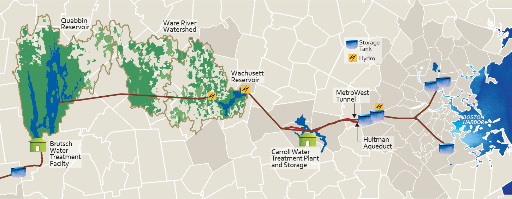

```{r loadpack, include=FALSE}
# Load Packages
library(rmarkdown)  
library(knitr)
library(tidyverse)
library(shiny)
library(kableExtra)
require(DiagrammeR)
require(DiagrammeRsvg)
require(rsvg)
```


\newpage

# Introduction

A comprehensive watershed protection plan involves the collection of water quality, meteorological, and hydrological data. Large amounts of data can be strenous to manage if proper systems are not put in place for data management. Poor data management can be detrimental and may result in data loss, poor quality data, or underutilizion of data due to the timely process of querying, visualizing, and analyzing poorly-managed data. Database software is a great solution to store and organize large datasets, yet database software often lack data visualization and analysis tools. Commonly, databases are paired with an outside application specialized for data querying, visualization, and analysis. Two applications were developed with the free and open source application development framework, Shiny, for facilitated watershed data management by the the Massachusetts Department of Conservation and Recreation (DCR). One application is designed for facilitated watershed data visualization and analysis and the other for facilitated watershed database data entry. This project is a product of the collaboration between UMass Amherst and the DCR.

## Objective

This project works to facilitate the DCR's data entry, querying, visualization, and analysis process through an R-based application creation tool called Shiny. An application can automate many of the tedious day to day processes of managing a watershed as well as allow for powerful and expeditious visualization and analysis. Developing an application, rather than using propritery software, allows for full customization by the developer to better target specific needs of the agenecy responsible for watershed management and protection. A well fitting application can greatly increase the timeliness and ability to explain data and generate insights which can direct decision making for these agencies. Increased water quality data insight can also greatly influence an agency's sampling plan to better represent the watershed and focus on certain areas of high interest. The overall objective of this project is to maximize the efficiency of the DCR's ability to manage, visualize, and analyize data to inform decision making. The application developed in this project can be used as an example for other watershed management agencies.

## Scope of Work

Two applications were created to facilitate with watershed data management at the DCR. These applications will be used across the three watersheds: Quabbin, Ware River, and Wachusett, which are under the management of two seperate DCR offices, the Quabbin and Wachusett Offices. The applications are designed to meet the needs of both offices which require neccesary variations in the application features to address the variation between the two offices needs including differing sampling plans. Although some variations are inevitable, efforts have been made to make the data management of the two offices more congruent. A large piece of this congruency has been in the form of database alterations to make the organizization and formatting as similiar as possible between the two offices. This effort has also included moving data that exists outisde of a database into a common database where data observations all share a similiar tidy data regimen. Naming conventions were also examined and modified to simplify the application creation and decrease potential for mistakes.

Watershed data Importer Tool (WIT) is the smaller of the two applications which is designed an interface for facilitated raw data import of watershed field and laboratory data. Raw data from a number of predetermined sources can be imported through a simple user interface. WIT transforms raw data into the desired database format, provides quality control checks, and imports the data to the right location in the database. WIT will help ensure in the future that all data remains stored in databases as this tool makes database storage timely and efficient.

Watershed data Analysis and Visualization Environment (WAVE) is the larger of the two applications and as its name suggests it is designed to facilitate data querying, visualization, and analysis of water quality. The application opens in a web browser and allows the user to query data by user selection inputs including locations, parameters, and dates. More advanced filters for data querying are also offered including filtering data based on meteoroligical events and excluding flagged data. The corresponding queried dataset will be presented in an interactive table which the user will be able to output as a csv file. Discrepencies between watersheds and datasets exist (and are desired) which are reflected in variations of query selections and filters in WAVE.

WAVE consists of numerous visualization and analysis tools to give more insight on a queried dataset. Visualization tools for tributary and reservoir data include time-series plots, correlation plots, and distribution charts (histograms, density curves, and box-and-whisker plots) to visualize trends and patterns on selected water quality parameters. Geospatial data visualization and analysis allows one to spatitally view data statistics on an interactive map. Heatmap and profile line plot tools are also available for reservoir profile data. Statistics can be quickly generated with WAVE including min, max, average for user selected temporal and spatial groupings. More advanced statistical analysis includes Mann-kendall statistics and pearson correlation matrixes. WAVE also makes information related to the sampling history of a specific site or a specific parameters easily accesible.

Both WAVE and WIT are shared openly through Github and are ran locally on a computer with minimal setup, although hosting the application online is also a possibility. The application is organized in a modular manner which eases future updates to the code as well as minimizes code repitition. Future additions to WAVE can be added as a seperate and independent module. A developer manual was also created to help future developers of WAVE as well as user setup guides for WAVE and WIT. As the needs of the DCR changes, both applications can dynamically change with it.


\newpage 
# Background

## Watershed Overview

### Quabbin and Wachusett Reservoir

The metropolitan area of Boston, Massachusetts, recieves its drinking water from the Massachusetts Water Resource Association (MWRA) water supply system. The sources of the water supply are the Quabbin Reservoir and the Wachusett Reservoir which are managed in partnership with the Department of Conservation and Recreation (DCR). The system also has an
emergency water supply source, the Sudbury and Foss Reservoirs [DCR, 2013]. The Massachusetts Department of Conservation and Recreation (DCR), Division of Water Supply Protection, Office of Watershed Management (DWSP) manages and protects the drinking water supply watersheds that provide water for approximately 2.5 million Massachusetts residents [DCR, 2013].the total watershed area of the active Reservoirs is over 200,000 acres the area of each watershed and reservoir can be seen in table 2.1. The Quabbin and Wachusett Reservoirs are protected and over 85% of the watershed lands that surround the reservoirs are covered in forest and wetlands [MWRA]. Table 2.2 shows the land use break down of each watershed. The water supply system is rather unique in that the Quabbin Aqueduct, a 24.6 mile long tunnel, connects the Quabbin Reservoir to the Wachusett Reservoir. The MWRA transfers water from the Quabbin reservoir intermittingly to the Wachusett Reservoir to maintain the water level and water quality of the Wachusett Reservoir [DCR, 2007] which most always makes up the majority of the total inflow to the Wachusett Reservoir. The MWRA can also divert water from the Ware River, located between the two reservoirs, to either the Quabbin Reservoir or the Wachusett Reservoir through the Quabbin Aqueduct, though it is DWSP and MWRA operating policy to divert only to Quabbin [DCR, 2013]. Transfers generally occurs from June through November and can last for weeks at a time to meet higher water demands, maintain the water level, and mitigate water quality concerns in the Wachusett Reservoir [DCR, 2007]. The complex nature of the system allows for decision making in reservoir management that can alter water quality of source water for the MWRA Supply System. It is essential to monitor the water quality in the whole watershed to best understand reservoir processes which can allow for more informed actions when water quality issues occur.

\begin{table}
\centering
\caption{Watershed Acreage}
\label{table-paramvalues}
\begin{tabular}{p{2in} P{1.1in} P{1.1in} P{1.1in}}
\hline \\ [-1.5ex]
Watershed & Land area (acres) & Reservoir area (acres) & Total watershed area (acres)\\ [1ex]
\hline \\ [-1.5ex]
Quabbin Reservoir & 95,466 & 24,469 & 119,935 \\ [1ex]
Ware River & 61,737 & 0 & 61,737 \\ [1ex]
Wachusett Reservoir & 70,678 & 4,122 & 74,800 \\ [1ex]
\hline
\end{tabular}
\end{table}

\begin{table}
\centering
\caption{Watershed Land Use Percentage}
\label{table-paramvalues}
\begin{tabular}{ p{2in} p{0.7in} p{0.7in} p{0.7in} p{0.7in} p{0.7in}}
\hline \\ [-1.5ex]
Watershed & Forestry & Wetland & Agriculture & Residential & Other\\ [1ex]
\hline \\ [-1.5ex]
Quabbin Reservoir & 88.2 & 5.6 & 2.2 & 1.5 & 2.5\\ [1ex]
Ware River & 75.6 & 11.4 & 3.2 & 4.2 & 5.7 \\ [1ex]
Wachusett Reservoir & 67.3 & 7.7 & 5.7 & 10.8 & 8.4 \\ [1ex]
\hline
\end{tabular}
\end{table}

```{r MWRA System, echo=FALSE, out.width = "6.5in", fig.cap="MWRA Water Supply System"}
 #
```

### Water Quality Sampling Plan

DCR conducts extensive water quality monitoring of the surface waters (tributaries and reservoirs) in the water supply watersheds that are used to assess current water quality conditions and to establish ranges of values for parameters considered normal or typical [DCR, 2013]. Data collected in routine sampling over several years are used to assess watershed trends while shorter term studies may be conducted to evaluate specific issues [DCR, 2013]. The task of water quality sampling of the three watersheds in the water supply system are divided between the Quabbin and Wachusett office of the DCR Water Supply Protection Division. The Quabbin Office is responsible for the sampling of the tributaries in the Quabbin and Ware River watersheds and sampling in the Quabbin Reservoir while the Wachuchesett Office is responsible for the sampling of the tributaries in the Wachusett watershed and the Wachusett Reservoir. Each office creates their own sampling plan for the reservoirs and tributaries in their respective watersheds which consists of a schedule of routine sampling and storm sampling at various sites. Each watershed is divided into sanitary districts [DCR, 2013]. Figure 2.1 shows all of the historical and active documented sampling locations of the DCR. More detailed sampling maps of each reservoir developed by the DCR are appended to this document.

```{r Watershed Sampling, echo=FALSE, out.width = "6.5in", fig.cap="Watershed Sampling Locations"}
knitr::include_graphics("images/background/Sampling_Map2.png")
```

The Quabbin Office's tributary water quality monitoring program of has included up to 14 sampling stations in the Quabbin Reservoir watershed, up to 10 sampling stations in the Ware River watershed [DCR, 2013]. Core sites are long-term monitoring stations, while EQA sites support ongoing evaluations of threats to water quality by sanitary district [DCR, 2013]. Reservoir and are monitored monthly by boat during the months of April through December, weather-permitting, with samples collected from several depths at each location. Tributary temperature, dissolved oxygen, pH, and specific conductance levels are measured biweekly with a multiprobe meter. Samples from core sites are collected by hand biweekly for turbidity, bacteria, and calcium analyses, while samples for nutrient analysis are collected quarterly. Samples from EQA Sites are collected biweekly for alkalinity, turbidity, bacteria, nutrients, calcium, and UV254 [DCR, 2013]. Water quality parameters that are measaured in tributaries are shown in figure 2.2.

The Wachusett Office samples each tributary station weekly or biweekly throughout the entire year, except for during inadequate flow conditions. Temperature and specific conductance are measured in the field and samples are collected for analysis of E. coli and measurement of turbidity. Nutrient samples are collected monthly for total phosphorus, ammonia, nitrate-nitrogen, nitrite-nitrogen, total Kjeldahl nitrogen, total organic carbon, total suspended solids, and UV-254.  Reactive phosphorus (orthophosphate) samples were collected monthly and UV-254 samples were collected weekly from the Stillwater and Quinapoxet Rivers.  Depth was recorded manually or using automated depth sensors at seven of the nutrient stations and flow calculated using rating curves developed and updated by DWSP Environmental Quality staff. Water quality parameters that are measaured in tributaries are shown in figure 2.2.

Reservoir Water column profile data for temperature, specific conductance, chlorophyll a, dissolved oxygen concentration and percent saturation, are collected in both the Quabbin and Wachusett Reservoirs. Nutrient samples are collected  at three depths from the epilimnion, metalimnion, and hypolimnion and analyzed for water quality parameters including nitrate-nitrogen, ammonia-nitrogen, total Kjeldahl nitrogen, total phosphorus, silica, UV-254, and alkalinity. Phytoplankton data is also collected at both Reservoirs. Surface grab samples are collected in the Wachusett Reservoir for E. coli and fecal coliform. Water quality parameters that are measaured in both reservoirs are shown in figure 2.2.

DCR DWSP and MWRA cooperate with U.S. Geological Survey to maintain continuous, real time recording gages at a total of ten sites nicluding sites at the Stillwater River, Quinapoxet River, West Branch Swift River, and East Branch Swift River [DCR, 2013]. Precipitation and other metereological data is obtained from NOAA weather stations. Additional sampling related to forestry practices is also conducted to compare water quality parameters between managed and unmanaged forests.

```{r res, echo=FALSE, out.width = "6.5in", fig.cap="Needs to be changed!! (incorrect data!)"}
knitr::include_graphics("images/background/sampling_frequencies.pdf")
```


### Previous Watershed Studies

Many studies have been conducted under the partnership of University of Massachusetts and the DCR. Data analysis and model calibration and validation in many of these studies have benefitted from the vast amount of water quality and hydrological data that is collected in the Quabbin, Ware River, and Wachusett watersheds. The water quality impacts from extreme precipitation events have been examined through statistical analysis of potential loads coupled with a reservoir hydraluic and water quality model [Jeznach Hageman]. The fate of a contaminant spill in the Wachusett Reservoirs have also been modeled [Jeznach, 2013; Devonis 2011; Sojkowski]. Other water quality modeling topics have included the effects of climate change on the Wachusett reservoir [Jeznach, ] and modeling the fate of Natural Organic Matter and fecal pollution [ ]. Presumably, having a thorough sampling plan and well maintained data can allow for more informed and facilitated research studies.


## Watershed Data Management

The process of managing watershed data can be simplified into three parts: data collection, data storage, and data utilization. Data collection includes the act measuring data observations in the field or a lab as well as importing data measurements into a database. Data storage is the location in which the data lives and is ever changing as more data is collected. Data utilization includes the querying, visualization, analysis, or any other process from which conclusions can be drawn from the data to benefit decision making.

Proprietary software exist that can greatly aid in the watershed data management process. AQUARIUS, created by Aquatic Informatics, is a collection of leading application software for water supply management. Two of the five AQUARIUS applications are AQUARIUS Samples and AQUARIUS Time-Series. AQUARIUS Samples streamlines the production and management of environmental lab and field sample data [aquaticinformatics]. Aquarius Time-Series is a powerful platform for managing water resources and is used by the USGS as well as many other agencies and is notorious for building and maintaining rating curves [aquaticinformatics]. This paper will focus on water quality data management, thus AQUARIUS Samples better resembles the watershed data management system that this paper describes. Proprietary software like AQUARIUS Samples attempt to supply a versatile product that can be widely used on any watershed. This can be a difficult task due to the variations between different agency's needs and processes. Proprietary software is often limited in data visualization and analysisand cannot be customized within the software. Propietary software is also costly.

An alternative to proprietary software for watershed data management is to develope a personalized application using an open source application development framework paired with a database. With the advancement of programming languages and increased number of development frameworks, it is getting easier to build a custom dashboard or application. Creating an application, rather than using a proprietary software allows for more flexibility and customization. Developing an application is less costly than using a proprietary software, yet it is likely much more timely. Oregon Department of Environmental Quality has develpped an application which provides an interactive means for users to query from multipe databases and evaluate status and trend at individual sampling stations [Byant, 2016]. This application is built with the Shiny application development framework in the statistical programming language R.

### Data Storage

Due to the vast amount of water quality data collected by the DCR, it is essential to use a relational database for efficient data storage. Spreadsheet software is not an effective way to store large datasets. A relational database is a means of storing information in tables with rows and columns in such a way that information can be retrieved from it [oracle]. A table is referred to as a relation in the sense that it is a collection of objects of the same type (rows) [oracle]. In a database for watershed data, an object (row) can be a field observation, lab measurement, site location information, or another object. Data in a table can be related according to common keys or concepts to another table allowing for the ability to retrieve related data. A Relational Database Management System handles the way data is stored, maintained, and retrieved. Oracle, MYSQL, Microsoft SQL Server, PostgreSQL Microsoft Access are among the most popular relational database management systems [DB-engines]. Many of database management systems are free and open source. Applications can be designed to connect with a database to retrieve data from a database or write new data to a database.

### Application development Frameworks

Application development frameworks assist with application creation and are essentially a reusable, "semi-complete" template  application that can be specialized to produce custom applications [  ]. Selection of a proper application development framework can greatly decrease the amount of work one must do and knowledge one must possess to create an application. Most application development frameworks can be considered either a front-end framework or a back-end framework which create a front-end server and a back-end server, respectively. The front-end server and the back-end server communicate through a common API, usually JSON, which is considered the universal binary [  ]. A front-end server is responsible for the construction and layout of the user interface, which is what the user sees and interacts with (often in a web browser). The user does not see the back-end server but this does the bulk of the work. The seperation of front-end server and back-end server can allow for increased customization as various front-end and back-end frameworks can be paired. Some frameworks serve as both a front-end and back-end framework which usually have a benefit of simplicity in the development process. This paper focuses on this latter type of framework that function as both a front-end and back-end due to the simplicity of the desired application. Likely, a mimimilistic user interface will suffice and most of the focus should be on the data science potential of the framework, which will likely be determined from the programming language that the framework uses. 

R and Python are common programming languages for data science and both have their own collection of data science application framework libraries. Python is more widely used than R [  ], though R specializes in statistics and data visualization [  ]. Shiny is a development framework package in R created by RStudio which allows a relatively unexperienced developer to build an application in the R language and is very well documented. Application framework libraries in Python tailored toward data science include Bokeh, Spyre, and Dash [  ]. All of these libraries are free to use for developing applications and dashboards. These application frameworks leverage JavaScript and HTML to render the user interface which can be opened in a web browser. Each framework has its differences and some may work better than others for a particular purpose. Familiarity of a particular programming language can also influence the decision of which application development framwork to choose.


\newpage 
# System Architecture

## Overview

A system architecture is the conceptual model that defines the high level structure for the many working parts of an application (wikipedia). WAVE and WIT have a relatively simple system architecture relative to other web applications. Shiny is both a front-end and back-end framework which allows one unified server component, rather than a seperate front-end server and a back-end server. The Shiny server executes R code for data computations and creates the user interface through rendering javascript and HTML. The application is also ran locally at the DCR which means that the client and server are both being ran on a users computer. An application that is hosted on the web has an additional process of sending the requests of a user through a proxy to help balance the amount of traffic that each server takes on.  The user (client) sends information to the server through interactions with the user interface and the server will update the user interface accordingly. The server can fetch and retrieve data from the database (or intermediary data storage).

The WIT and WAVE system architecture can be seen in Figure 3.2 and figure 3.3, respectively. The common components that both systems have include the Server, User (Client), Github Code Script, Configuration File, and stored data (either in a database or RDS files). Prior to the start of a session for either WAVE and WIT, a configuration file with user settings is read and the latest application code is pulled from Github. After this step, the application system process differs as is seen in Figures 3.2 and 3.3.  Each component of the system architecture are discussed in more detail in the following sections.

```{r dev WIT, echo=FALSE, out.width = "6.5in", fig.cap="WIT Architecture - update remove green from db"}
knitr::include_graphics("images/system dev/WIT_Arch.pdf")
```

```{r dev WAVE, echo=FALSE, out.width = "6.5in", fig.cap="WAVE Architecture"}
knitr::include_graphics("images/system dev/WAVE_Arch.pdf")
```

## Configuration File

Prior to the start of a session, a configuration file is read into R which gives information about the desired configuration settings like the location of the data, Github repository location, and other settings that are specific to a particular ofice or a particular user. The configuration file is used for the purpose of allowing variability in the application across users. A user at the Quabbin location will have a different directory layout than a user at the Wachusett Office. This also facilitates a user outside these offices to be able to use the applications (mainly WAVE). For example, UMass will benefit from the use of WAVE to gather data for research studies including for the use of model input and calibration data. The configuration file differs for WIT and WAVE, where the configuration for WIT is more elaborate due to all the differences in data sources and the number of raw data directories that the application needs to handle. The configuration file is the place for any future user options or settings to be including. 

## Github and Portable R and Chrome

Once the configuration file is read, the application files are fetched from the specified GitHub repository. This will ensure that the latest version of the application is being used by all users. Github not only serves as a mechanism for launching the application, but also serves as a cloud storage and code development collaboration platform. Github is a great tool for web developement and code collobaration. GitHub has version control. [Get some cited info]

## Server

The application files are executed in a Portable R session which is ran on the local computer (behind the scenes?).  The main app script contains a line of code that runs the app and starts the session which will be explained more in Section 4 - Code Development. Portable R is included in the packaged application that is shared with DCR employees. The user will thus not need R directly installed on their desktop.

## User (client)

The application is opened in a Portable Google Chrome Browser on the users computer. Portable Chrome are included in the packaged application that is shared with DCR employees. The user will thus not need Google Chrome directly installed on their desktop. Further, using Portable Chrome, allows the application to open in a fresh clean Google Chrome Browser without any user customizations like Bookmarks.

## Database

The DCR has collected water quality data since as early as 1984(8)?. At the start, computer data storage was not yet prevalent, and paper records were used as the means of storing data. As computers became more relevant a mix of spreadsheet storage and database storage slowly became the ideal means of data storage. Today, an effort is being made to move all data into databases which is a more efficient method of storing large amounts of data than either paper records or spreadsheets. The DCR currently uses the Microsoft Access relational database management system for their data storage needs. The Wachusett Office has three databases, one for water quality data, one for aquatic biology and profile data, and one for hydrological data. Each database at the Wachusett has a similiar format. The Quabbin Office has one database for all of its water quality data. Having either one or many databases are both appropriate and each method can be beneficial depending on the needs and practices of tehe department. As a database can be seen as a collections of tables, it is not very important if all tables are stored in one database, though directly related tables (i.e. have common keys that link them) should be stored in the same database.

There are many tables in each database, each containing different sets of information, where similiar objects are contained in rows [Oracle]. Many tables contain measurement observations in which each row is a unique measurement of a parameter from the field or laboratory. Each observation gets its own row and is unique in the combination of location, date, and parameter. Storing each observation in a row is considered to be "tidy" [Hadley] and facilitates linking tables together in a relational database as well as visualizating and analyzing the data in programming languages designed for data science. An example of "tidy" data and "non-tidy" data can be seen in figure 3.2. In this case, columns named "Parameter"" and "Result" are used in the "tidy" data example rather than including a column for each parameter.  The tidy data format allows for additional columns like "Units" and other information specific to that one observation to be recorded in the database. The tidy data also allows for the observation to be linked by foreign key field, like parameter and location, to another table with more information on a that parameter or location, respectively. Many packages in R, like ggplot and dplyr are designed for "tidy" data.

\begin{table}
\centering
\caption{Tidy Sample Data}
\label{table-paramvalues}
\begin{tabular}{| l | l | l | l |}
\hline \\ [-1.5ex]
Location & Date & Parameter & Result\\ [1ex]
\hline \\ [-1.5ex]
Riverbend & 01/01/2020 & Turbidity & 12\\ [1ex]
Riverbend & 01/01/2020 & Nitrate & 13\\ [1ex]
Riverbend & 01/01/2020 & Ammonium & 14\\ [1ex]
Riverbend & 01/01/2020 & Spec. Cond & 15\\ [1ex]
\end{tabular}
\end{table}

\begin{table}
\centering
\caption{non-Tidy Sample Data}
\label{table-paramvalues}
\begin{tabular}{| l | l | l | l | l | l |}
\hline \\ [-1.5ex]
Location & Date & Turbidity & Nitrate & Ammonium & Specific Conductance \\ [1ex]
\hline \\ [-1.5ex]
Riverbend & 01/01/2020 & 12 & 13 & 14 & 15\\ [1ex]
\end{tabular}
\end{table}

Due to the focus on measured data, tables for information other than measurements are considered metadata tables in this report and in the application. Metadata is a term used for a set of data that describes and gives information about other data [Google]. Metadata tables in the database include tables with information on parameters, locations, flags, sample flag index, and more. Location Tables gives location information like  . Parameter tabels gives . Flag tables give informatin on what a flag ID . Sample flag index table is used to relate the sample tables with the flag tables which is needed due to the one-to many relationship of samples to flags. Becuase a sample measurement can have zero, one, or many flags associated with it, an intermediate table is used to relate a sample ID with a flag ID, which are both foreign keys. An example of these database tables are shown in the appendix.

Both WAVE and WIT need to connect and access data from the four Access Databases across both offices. Connections are made with an open Database Connectivity (ODBC) application program interface to externally fetch data from a database and to write data to a database. WIT, wich is used to process and import data to the database, both writes and reads data to and from the database. WAVE only needs to read in data from the database becuase it is only used for data visualization and analysis, not data entry. When an application reads data from or writes data to a database, the application has to open a connection with the database and the close the connection when it is finished. There are commonly two schemes of reading data with an application, either read all data in at the start of the session or read in only specific data each time the user asks for specific information. The second approach is more common with large databases. WAVE uses the first approach and WIT uses the second approach, for reasons different than database size. This is beneficial in our case for less database connections being opened and closed since creating and removing a connection in Microsoft Access can be timely as well as lock the database from other use if a proper system is not put in place to avoid this. The method of connection for WIT and WAVE are indicated in Figure 3.2 and 3.3 by the color of the arrow.

In the future it may make sense to move toward a different database software due to either the outdating of Microsoft Access or the DCR IT terminating the Microsoft Access license. If so this will likley to a relativiely smooth process in converting to another relational database since the all have a common API: SQL. The time that it takes to fetch all the related data from the database and make neccesary data transformations was about 15 seconds which is undesirable. There likely exists other alternative database maanagemment sytems which are faster at this process, though Microsoft Access use has famiarity at the DCR and keeping this database management system provides some stability in an otherwise quickly changing data environment. This prommpted the idea of reading data from RDS files rather than directly from the database.

## RDS Files

The process in WAVE of reading data in the R session from the database was modified to make startup time faster. In R, RDS files are the fastest format to be read and saved [ ]. Based on this knowlege, WAVE is designed to read data as RDS files that have already been transformed to the desired formatted dataframes of WAVE. Reading in data from RDS files upon starting a WAVE session takes about 2 seconds compared to 15 seconds of the database fetching. With the creation of RDS files, there now needs to be a means of how and when the RDS files become updated. Since WIT is used for data import, every time the user closes a WIT session, a batch file will be triggered to run an R script behind the scenes which will update the RDS files. The RDS files can also be updated by directly clicking on and running this batch file, to ensure that the data in WAVE is the most up to date, although this will likely not be neccesary. The date that the RDS files are last updated are recorded and displayed in WAVE. Each dataframe is stored in its own RDS file with a descriptive name (e.g. df_trib_quab).

## USGS and NOAA data

This architecture differs than the more basic previously described architecture with the added components of raw data, RDS files, and USGS NOAA data. WIT allows raw data on a users computer to be selected, processed, and imported into a database. When the session terminates, an R script is ran which fetches data from a database and transforms it and saves in as RDS files. As previously mentioned, this essentially works to keep the RDS files updated as new data is added to the database. The RDS files containing USGS and NOAA data is also updated be fetching USGS and NOAA data from _____ on the portal.

## Visuals and Statistics

The WAVE application runs as peviously discussed with the added features of outputs in the form of visualizations and data and statistic tables. It is not desired to have a user of WAVE alter the database or data, so there is a one-way flow of data into the aplication. The data is read in to R prior to the application session from RDS files. 

## Deployment

There were many possible ways of launching a Shiny application, though the userbase of WIT and WAVE directed the launch method chosen. Becuase this application is to be used primarily by the DCR internally, it was not neccesary to host the application on the internet. The number of computers that need to have access to the application is small enough that it is feasible to install this application on each of these computers to run locally. This also prevents the need to host the application online which increases complexity and cost. Running the applciation locally also does not add any aditional data security risk since all data is to stay on the DCR's internal network.

```{r dev WIT Launch, echo=FALSE, out.width = "6.5in", fig.cap="WIT Launch"}
knitr::include_graphics("images/system dev/WIT_Launch.pdf")
```

```{r dev WAVE Launch, echo=FALSE, out.width = "4.5in", fig.align="center", fig.cap="WAVE Launch"}
knitr::include_graphics("images/system dev/WAVE_Launch.pdf")
```

There are two primary local launching options for a Shiny App. The first option is to execute the code directly, usually in the RStudio IDE which requires the application script to be stored locally. The second option option is to use a built-in function in the Shiny package called RunGitHub which will fetch the most updated code stored in a Github Repository.

A desktop shortcut was created to allow the user to launch the application with a double click of the mouse. The desktop shortcut when clicked triggers a batch file that runs an R script to intall/load all neccesary R libraries and then execute the RunGitHub function. Although a user does not need a copy of the code on the user's computer, using RunGitHub command in Shiny still requires R to be installed on a computer. To avoid this requirement of downloading R, Shiny can be packaged with a portable R version as previously discussed.


\newpage
# Code Development

## Overview

Both WIT and WAVE are built in the R language with the Shiny development framework. Shiny also allows the developer to incorporate direct CSS, HTML, and Javascript which is done in a few instances. RStudio is the leading (IDE) for the R language and was used when writing the application R code and facilitates debugging of Shiny applications and in general helps with writing any R code. RStudio not only created the Shiny framework, but created and updates a number of popular other libraries in R are ggplot, dplyr, tidyr, RMarkdown which are all used in within atleast one of the two applications. Dataframes are a concept used in R (and also the Pandaas package in Python) that are built for efficient data science. A dataframe is technically a list of named vectors of equal length which differs from a matrix which is a two dimensional array [R tutorial]. Dataframes are the objects used in the application for holding data. 

A Shiny application consists of two parts: a user interface code and and a server code. The Shiny Userinterface is mde up of input and output objects. Ouput objects include plots, images, tables, and more. Input Objects inlude many javascript input widgets. In general, the Shiny inputs are defined within the user interface code, and the instructions and functions to create the Shiny ouput code are defined within the server script. Shiny uses reactivity to automatically update output objects when input objects that they are dependent on are changed by the user. Reactive Expressions are used as intermediary functions between output and input objects which continues the reactive chain between these input and output objects. More information on how the Shiny Framework works can be found online. 

Naming conventions have been established to facilitate the reaibility of the code. Objects of the same class (or type) use the same naming convention which are created from variations of lowercase, uppercase, underscores, and camel case formats. Due to the large amounts of objects, an large effort was made to be descriptive and concise in the naming of objects.

## WIT

There are many different effective ways to go about data processing and importation but typing in or handwriting data from raw data files to a database is not one of them. Most always the measurement data recorded from field instruments or laboratory instruments are not in the same format as how the data is stored in a database. For simplicity, we will define data processing as both data transformation and data quality assurance and control. Data transformations must be made including but not limited to adding or removing columns, column name changes, data type changes, and spreading or gathering columns. Spreadsheet interfaces are commonly used to transform data, though manually manipulating data in this way can be timely and prone to errors. 

Programming languages can be used as a tool to transform data to a particular format. A code script is written in R for each data source to transform the raw data the database format. In addition, the scripts perform set quality control measures including checking for duplicate data or alerting a user when their is an usual data value. The configuration file is read by WIT which reads in the data processing scripts that are specific to each office. When the user selects to process a data file, WIT will read in the data from the database to ensure that the data has not already been imported to the database. WIT also connects to the database again when the import data button is clicked and imports the data to the database. Figure 4.1 shows the sequence of the Application Session Flow.


```{r dev WIT Session, echo=FALSE, out.width = "8.5in", fig.cap="WIT Session Flow", out.extra='angle=90'}
knitr::include_graphics("images/code dev/WIT_Session.pdf")
```


## WAVE

### Tab Layout

The many features WAVE offers results in a large code (base?) (there is roughly 10,000 lines of code with minimal repitition). Thus, organization of the code is crucial for efficient updates and additions. The application as a whole can be viewed as a collection of individual dashboards organized in various tabs in the user interface. The user only ever sees one tab at a time and thus one dashboard at a time. The highest level tabs of the App takes form in a navigation bar, also commonly known as the "ribbon". A snapshot of the navigation bar is shown in figure 4.2 which consists of the following tabs: Home, Tributary, Reservoir, Met Hydro, Forestry, Reports.

```{r code App navbar, echo=FALSE, out.width = "4in", fig.align="center", fig.cap="App Navigation Bar"}
knitr::include_graphics("images/code dev/app_navbar.png")
```

```{r code App, echo=FALSE, out.width = "4in", fig.align="center", fig.cap="App High Level Tab Layout Flowchart of the Top Navigation Bar"}
knitr::include_graphics("images/code dev/app_tabs.pdf")
```

The organization structure beneath the top level navigation bar can be seen in figures 4.4, 4.5, 4.6. Some tabs like the Tributary and Reservoir tabs have many additional lower level tabs under these first-level navigation bar tabs.As of now the "Home", "Met / Hydro", "Forestry", and "Report" tabs are relatively simple and have only a few or no lower level tabs as shown in Figure 4.4. The "Home" tab is the default tab that the application opens too. This is chosen as the "Home" Page becuase it gives a nice visual of the overall watershed and the sampling locations. The "Met / Hydro" navigation bar (first-level) tab is currently a place holder for the soon-to-come meteorology and hydrology tab. This tab is being currently under work and will include the selection, viualization, and analysis tools for NOAA, USGS, and in-house meteorology data. The "Forestry" tab is a placeholder for a future forestry tab that will attempt to help users better understand the water quality effects of forestry practices. The Report tab is currently under construction with a goal of facilitating the process of report creation. This includes facilitated predetermined reprts like the annua and monthly water quality reports and also the ability to make custom reports.

```{r code other 1, echo=FALSE, out.width = "5in", fig.align="center", fig.cap="Tab Layout Structure for Home, Met / Hydro, Forestry, and Report Tabs"}
knitr::include_graphics("images/code dev/other_main_tabs.pdf")
```

The "Tributary" and "Reservoir" tabs are by far the most substantial tabs in the navigation bar, and the upper portion of their organization are shown in Figures 4.5 and 4.6. Both of these tabs have a set of second-level tabs which contains the options of the watersheds or reservoirs (e.g. "Quabbin" and "Wachusett"). This allows the application features to be seperated by watershed, to allow for differences between each Offices needs. Having this option at an upper level (second-level) is ideal so the user will only have to select the desired watershed or reservoir one or two times during a session. The third-level tabs are relatively consistant for each water quality data type, and consist of the tabs "Select / Filter Data", "Plots", "Statistics", "Geospatial", and "Metadata". A Snapshot of the Tributary-Wachusett tabllist is shown in Figure 4.5. The "Geospatial" tab is only avaiable for tributary water quality and reservoir bacteria grab samples due to the dificulty of representing the depth component of multi-depth sampling in the reservoir. Also, the Reservoir - Wachusett tab has more third-level tabs than the Reservoir - Quabbin Tab due to the additional bacteria and phytoplankton data.

```{r code App navlist, echo=FALSE, out.width = "4in", fig.align="center", fig.cap="Tributary second-level and third-level tabs"}
knitr::include_graphics("images/code dev/trib_navlist.png")
```

```{r code trib, echo=FALSE, out.width = "5.5in", fig.align="center", fig.cap="Tab Layout Structure of Tributary Tab. To be continued in Figure 4.6 and Figure 4.7"}
knitr::include_graphics("images/code dev/trib_tabs.pdf")
```

```{r code res, echo=FALSE, out.width = "6.5in", fig.cap="Tab Layout Structure of Reservior Tab. To be continued in Figure 4.6 and Figure 4.7"}
knitr::include_graphics("images/code dev/res_tabs.pdf")
```
 
The "Tributary" and "Reservoir" tab organization trees are actually larger than Figures 4.5 and 4.6 depict. Figures 4.7 and 4.8 show how the "Select / Filter Data", "Plots", "Statistics", and "Metadata" are further divided into more tabs. "Select/ Filter" tabs is seperated further, one for the data selection and filers and the other to view and output the resulting data table which can be seen in Figure 4.7. The "Plots" tabs are seperated into further tabs for each type of plot which is shown in Figure 4.8. These plots can differ depending on the type of water quality data being visualized. The "Phytoplankton" tabs is further seperated into three plot tabs and one filter and export data tab seen in figure 4.7. The "Statistics" tabs is further seperated into a "Summary Statistics" and "Pearson Correlation Matrix" which is seen in Figure 4.7. The Metadata tabs are further seperated into "Locations", "Parameters", "Flags", and "Flag Sample Index" in figure 4.7.

```{r code other 2, echo=FALSE, out.width = "6.5in", fig.cap="Tab Layout and Module Structure of Select / Filter, Phytoplankton, Geospatial, Statistics, and Metadata Tabs"}
knitr::include_graphics("images/code dev/other_tabs_mods.pdf")
```

```{r code plot, echo=FALSE, out.width = "6.5in", fig.cap="Tab Layout and Module Structure of Plots Tab. The Plots Tab appears in multiple locations in the Tributary and Reservoir Tabs. Plots for Reservoir Profile data differ compared with the Plots for Tributary and other Reservoir data, and this is reflected in a difference in layout"}
knitr::include_graphics("images/code dev/plot_tabs.pdf")
```

### Modules

The previous section discussed the overall tab layout of WAVE, yet did not discuss how each tab is programmed. Each tab that contains a dashboard-like feature essentially can be thought of as it's own smaller application as it contains its own user interface components (inputs and outputs) as well as a server script which describes how each output is created. It makes sense to define these self-containing dashboards in seperate files. In the Shiny framework, modules are a way of defining these independent, self-containing pieces of Shiny code, seperate from the main application user interface or server code. A module consists of a user interface function and a server function. The utilization of modules in WAVE reduce code repition in the same way as functions reduce code repitition. A module can be defined once, yet used in multiple instances. This is very beneficial becuase many tabs in the application that execute a module script are used for all three watersheds or both reservoirs. Just like functions, modules can take arguments which allow for variations in their use. For organization purposes, the code for each modules user interface and server function are stored together in a seperate script file which is named similiar to the module name. In general, isolating related specific code pieces can increase code readibility. 

Modules used in WAVE are shown throughout figures 4.4, 4.5, 4.6, 4.7, and 4.8. The majority of modules are used under the Tributary and Reservoir navigation bar (first-level) tabs, at some lower level. A module connected to the right of another module indicates that the module on the right is used within the module on the left. The breaking down modules into more modules is done for similiar reasons as why the application is broken down into modules. Modules in WAVE are grouped in different categories and stored in folders accordingly. These categories includes Filter, Plots, Statistics, Metadata, and Other which can be seen in table __ . When a new unique feature is added to WAVE it will likely be added as a module, and the list of modules will grow as WAVE grows.

\begin{table}
\centering
\caption{WAVE Modules}
\label{table-paramvalues}
\begin{tabular}{| l | l | l | l | l | l |}
\hline \\ [-1.5ex]
Filter & Plots & Plot Options & Statistics & Metadata & Other\\ [1ex]
\hline \\ [-1.5ex]
Filter WQ & Plot Time WQ & Plot Save & Summary Stats & Location & Home\\ [1ex]
Parameter Select & Plot Corr WQ & Plot Hline & Pearson Corr & Parameter & Phytoplankton\\ [1ex]
Date Select Select & Distribution & Plot Vline &   & Flags & Map Plot\\ [1ex]
Checkbox Select All & Profile Heatmap & Plot Text &   & Flag Sample Index & Report Custom\\ [1ex]
Select Select All & Profile Line Plot &  &   &   &  \\ [1ex]
\end{tabular}
\end{table}


#### Filter

Modules that are used in the "select / filter data" tab are grouped into the filter category. Together, these modules allow the user to selecting and filter data. The largest filter module is the main water quality filter, "Filter WQ" which is used for both tributary and all reservoirs selecting and filtering data. Arguments are used to create variations of the filter tab for different data types (e.g. depth select range for profile data selection). The selected/filtered data that the user selects in the filter tab will be used in the plot and statistics tabs. Sending the filtered dataframe to the plot and statistics tabs is preffered rather than each of the plot and statistics tabs having there own data filters for code repetition reasons. The filter tab produces a list of three reactive dataframes that can be passed to these other modules. The first reactive dataframe is the data in the unaltered long format which will be passed to the majority of the other modules. The second dataframe in the list is in the wide format which will be passed to any module involving correlation (e.g. the correlation plot and  pearson correlation matrix). The wide format facilitates comparing results across different parameter in the same location and same date. The third dataframe is a dataframe of the data in the long format with the additional columns: Year, Month, and Season, for use in modules which incorporate temporal groupings (e.g. Summary Stats and Distribution).

In addition to "Filer WQ" (the main filter module), there are additional smaller modules used inside of "Filter WQ" as can be seen in figure 4.8. These modules include "Parameter Select", "Date Select", "Checkbox Select All", and "Select Select All". THese four modules are essentially more advanced customized versions of the available shiny widgets. "Parameter Select" widget uses the select input widget of Shiny that is designed to place "historical" parameters (parameters that have not been collected in the last 5 years) at the bottom of the list. The "Parameter Selection" module will only show the parameters that have been collected for the selected sites, thus if no site is selected, than no parameters should be allowed to be selected. The "Date" selection module will only show the available selected. MEMORY LOOK TAT

The "Checkbox Select All" module combines the group checkbox input widget with two action buttons which when pressed updates the Group Checkbox Input to have all or none of the choices selected. This is used in the Month Selection The "Select Select All" module combines the select input widget with two actioni button shich when pressed updates the select input to have all or none of the choices selected which is used in the flag selection. Both the "Checkbox INput" and "Select Select All" are built to be used elsewhere in WAVE seamlessly.

#### Plots

Modules that produce a plot are grouped into the plot category. These modules include the "Time-Series Plot", "Correlation Plot", "Distribution", "Profile Heatmap", and "Profile Line Plot". These plot modules use the data that the user selects in the "Select / Filter Data" tab. Depeding on the desired data that each plot uses, the user is given additional selections/filters to narrow down the selected data for the specific plot. For example, the Time-Series plot module is built to plot either one or two parameters at a time (on  preimary y-axis and secondary y-axis), so the user is thus given an additional parameter selection which will narrow down the list of selected parameters to just one or two. The plots in the applicaiton are generated with ggplot (the ggplot2 package in R) which is Hadley or RStudiod?. Ggplot allows for easy grouping by aesthetics (e.g. x, y, color, shape, size, facets) which is used widely throughout the plots. In many cases, the user is given the ability to adjust the groupings of the plots for various plot layout schemes. Many other options are given to the user, like the ability to adjust the theme, titles, and labels of the plot and add horizontal and vertical lines as well as text to the plot. Many of these options are built as seperate smaller modules to be able to be applied to more than one plot module. These will be discussed further in the next section.

The application uses Plotly to create interactive plots from static ggplot plots. Plotly is a Javascript lilbrary, which is a leader in interactive webplots. Plotly is implemented in R and plotly interactive plots can be written directly or a ggplot can be transformed into a plotly plot. The latter is chosen due to the desire to export static plots from WAVE and also due to previous familiarity with ggplot. Ggvis is a young data viualization package in R for creating rich interacitve graphics similiar in spirit to ggplot [GGVIS]. Once Ggvis is more developed and there is more documentation on implementation within Shiny applications, it is likely a good alternative for interactive plotting.

#### Plot Options

As previously discussed, modules that serve as additional user options for plots are grouped into the plot options category. Seperating some plot options from plots allows for these modules to be used within more than one of the plot modules in WAVE. Also, seperation also reduces the amount of code in the main plots which can be quite cumbersome with all the user options. These plot option modules include "Plot Title and Labels", "Plot Save", "Plot Hline", and "Plot Vline", and "Plot Text". These modules are called within a Plot Module and serve to make adjustments to the plot via user inputs. For the most part, these modules will take an intermediate plot object as its input argument, make modifications to the plot objuect based on user input, and return a new adjusted intermediate plot object. The "Plot Save" module is a bit different than previously described, as the save options do not modify the plot seen on the screen yet they affect the plot that is saved and output from WAVE. The "Plot Save" module also contains the action button and corresponding server code to save the plot to one's computer. The features that these options provide the user will be talked about in more detail in the Application Features Chapter.

#### Statistics

Modules that produce statistics either in a table or a graphic are grouped into the statistic category. R was built for statistical programming and is thus a very powerful tool for statistical analysis. The statistic modules in WAVE include "Summary Statistics" and "Pearson Correlation Matrix". The Dyplyr package is used in "Summary Statistics" module for the grouping feature. A combination of Dplyr's "group_by" and "summarize" function allows for an easy way to generate statistics from a dataframe grouped by various user selected inputs (e.g. temporal and spatial groupings). The "Correlation Matrix" is calculated using the "cor" function in the "stats" package adn the plot is created with the "corrplot" package. The "Kendall" package is also used to calculate the Mann-Kendall statistic of time-series data.

#### Metadata Modules

Modules that are used to view Metadata information are grouped into the Metadata category. The Metadata modules include "Location", "Parameter", "Flags", and "Flag Sample Index". These modules leverage the DT package which is a javascript package for creating interactive data tables. DT data tables allow a user to search through data with a search bar and also order the table in ascending and descending order based on a column. Another beneficial feature of DT tables is that Shiny can be programmed to register a click on the datatable as a user input. In these modules, a user selected row in the data table is used as an import to query the water quality data related to the selection to obtain additional up-to-date information on the selection. For example, in the "Location" module, the user first sees a data table with metadata basic infomation, and can click on the row of a specific location which will generate an additional table with computed up-to-date information including the total number of sample collected at each site, first date of sampling, most recent date of sampling, and also this same information for each parameter that has been collected at the location.

### Other Modules

Modules that do not fit in the previously mentioned categories are grouped into the Other category. These Modules include "Home", "Map Plot", . talk about leaflet.

### Functions

### Developer Manual


\newpage 
# Application Features

## WIT

## Raw Data File Lookup

WIT will provide an easy selection of the raw data files on ones computer. The user will first select the dataset cetegory that he/she desires to import. Since WIT is configured to read from specified directories on ones computer, the user will then select a raw data file from a dropdown list. The file list in the application will consist of the raw datafiles that are saved in the appropriate directory on a users computer. After the user imports the data, the raw data file is moved from the ___ folder to the processed folder. 

## Data Processing

The data is processed to convert raw data into the format of the same type of data in the database. Each raw data source varies in the format or data. The application will automatically process a raw data file into the diesired format, by one of a number of processing script files for that specific raw dataset type. If the processing is succesful, the data will appear in a table for the user to examine.

## Quality Control

There are many quality controls that are placed in the processing scripts. Some are general ot all scripts and some ore specific for each.

## Data Importation

Data is imported into the correct location of the database with a click from of a button.


## WAVE Features


### Data Query and Export

It is advantageous, if not essential, to have fast access to water quality and other watershed data. It is beneficial for any scientist or engineer to be able to acess this data with ease. In practice, this is often not the case due to all data not being stored in a location known by all scientists and engineers. Lack of experience with certain technologies can also inhibit a person from being able to access timely data. Although spreadsheets are commonplace among most workplace settings, being able to query this data for the exact data that a perrson is looking for can be timely and troublesome. Queries in a relational database is a better approach to this common task. 

The application queries the data based on the user selected input. The user is prompted to first select one or more Site Locations with a map that indicates which sites are selected. The user is then pompted to select the parameters and date range in which data is avaiable for the selected sites. Additional filters can also be applied to the data which include selection of seasons, months, years, flags, storm event, and other eventually meteorlogical and hydrological conditions. Queried data can be exported to a csv file with the click of a button.

The filter module also has the option to select all data, which if the user selects this preference, none of the filters will be used and the whole dataframe will be selected. 


### Data Visualization

This appliaction allows for water quality visualization of temporal trends and temporal statistical analysis. 

#### Time Series Scatter Plot

A scatter plot is avaiable to see a water quality parameters trends over a specified duration of time. The data is queried in a similiar manner as discussed previously and a user is able to plot data from multiple Locations and one or two parameters. The user can chooose to group or facet by Location or Flags. A Facet creates multiple plots, all with similiar mapping techniques, to allow for easy comparison across plots.

The user is given many options to customize how the plot displays the data. the user can choose a log-scale for the Y-axis as well as to start at zero. These options are not applicable for the x-axis becuase the X-axis in date. The user can adjust point size and point color (if the user has not already specified that the group by color). The user can choose form many display themes that are offered in ggplot2. The user can add a horizontal line, vertical line, or floating text anywhere on the plot. The plot automatically creates logical axis labels and a descriptive plot title, which the user can override with custom text or choose to have no labels or title. The user can save a plot with in multiple formats to a specified plot width and plot height. Figures " " are examples of these saved plots. The user can choose to turn on the interactive plot features that are allowed by Plotly which allows the user to hover over a data point for info an also toggle the plot in various ways like zooming in and out.

Temporal Trend lines can be added to the plots to help visualize if there are any temporal trends, if it is not clear when just looking at data points. The trendlines will automatically group in a fashion identical to the points. If the data points on the scatter plots are grouped by Locations as idicated by colors, than the trendlines will also appear grouped by these same colors. Grouping by shape and faceting works similiarly.

Three methods for trendlines are available in this application. The first method is a linear trendline which is the linear line that minimizes the residuals of the fit. The second method is the Loess method which is a . The third method is a Generalized Additive method which . The user can choose to show a confidence ribbon with choices of confidence intervals of 0.90, 0.95, and 0.99. If the user selects a confidence ribbon with 90% confidence, a shaded region will appear on the plot where the data is 95% likely to . This should be used with caution becuase the linear confidence interval does not take into account the seasonal variation, and assumes that all variation is " ".

The user can choose to add a secondary parameter to the plot by introducting a secondary y-axis. This feature allows the user to compare temporal trends of two water quality parameters. A plot comparig of two parameters, on the x-axis and y-axis can usually display a clearer picture of the relationship between two parameters which will be discussed in the Correlation Section. A benefit of the two parameter temporal plot is to keep more of the temporal information and can allow one to visuallly see a more complex trend like a delayed response trend. (Is there a scientific word for this?)

"Plot Title and Labels" are used to allow the user to have full control of the plot title and axis labels of a plot. 

#### Correlation Scatter Plot

The applcation has a scatter plot feature designed for a scatter plot between two water quality variables. Water Quality data of two parameters are paired based on location and day of sampling. The two water quality observations are thus converted into one data point on the plot with the x location determined by the value of the first water quality parameter and the y location determined by the value of the second water quality parameter.

Trendlines can be added to. Similiar to the time-series plots, the methods for the trendlines are linear, Loess, and Generative Additive.

This anaylsis will be extended for water quality parameters to be correlated with metereological data and hydrological data.


### Distribution

The distribution of Results of a particlular water quality parameter can be visualized in the application. Based on the user selected Locations, Parameter, and Date Range, the user can create a histogram, Density Plot, or box plots. 


#### Heatmap (Interpolated Color Profile Plot)

The 

#### Profile Line Plot

#### Phytoplankton

### Statistics

#### Spatial and Temporal Statistics

Temporal Statistics can be computed with minimal effort in the application. Based on the user selected query of Locations, Parameters, and Date Range, the following statistics will be calcluated for each parameter: number of samples, average result, minimum result, maximum result, 1st quartile (25 percentile), median, 3rd quartile (75 percentile), variance, standard deviation, geometric mean, and Mann-Kendall statistic. Any blank data (represented by NA in R) is ignored for these statistic calculations. The geometric mean is " ". The Mann-Kendall statistic 

Before Statistical calculation, the data can be grouped by Location as well as various types of temporal schemes. The data can be grouped by year, season (independent of year), month (independent of year), season and year, and month and year.


#### Pearson Correlation Matrix

A pearson correlation matrix can be created in this application. Based on the user selected query information, a correlation matrix is generated to show the corrlation of parameters across all of the parameters that the user has selected (the user must select more than one parameter). Positive correlation statistics, R values, are shown in red and negative R values are shown in blue. 

Confidence intervals are calcualted to determine the significance of the pearson correlation coefficient. This is crucial in case the user was to fasley interprate the correlation matrix as significant, when not. 

"Find more out about significance. Add to App"


### Geospatial Data Mapping

Home Tab

Spatial trend analysis is incorporated in many locations in the app but primarily lives on the map plot tab. Geospatial plots allows the user to easily compare a parameter statistic across all sites in a visual of plots on their choice of map. Spatial analysis also exists in any tab when multiple sites are chosen for analysis.


### MetaData

### Data Import

The Watershed data Importer Tool (WIT) facilitates importing raw data from multiple sources into the database. Each Data Type has a formatting function script that is written in R to format the data. As more data sources are added or data sources are changed, these can be uploaded into the database. The user is prompted to select dataset type and the user will be shown a list of raw data files in the appropriate dataset type location on their computer. The user then selects a file from their computer and then press a button to format the data. A Warning message will be sent to the user if their was a problem with the data or if the data already exists in the database. After a successful formatting, the user will be able to see the formatted data in a table on the screen and an import button will appear that the user can press to import the data if they are satisfied with how the data looks.  Once the data is imported, the raw data file is moved from the unprocessed folder on their computer to the processed folder.


\newpage 
# Discussion and Reccomendations

Through the insight that this application brings, future data collection needs can be better assessed which will direct changes to the current watershed monitoring program. Automation is a useful, yet underutilized tool that can save an organization much time day to day on decreasing the number of repeated tasks that come along with searching, displaying, and analyzing water quality data. A custom application with dashboard toallow a user to easily perform data science with the power of R, with little knowlege of R programming language is highly desired. This application should include but not limited to facilitated data entry, querying, visualization, and analysis of water quality data and other related watershed data. Save Tiem an dMoney , inrease quality control

Visualization dashboards were created to view data in a speciofic customized fashion based on a user selected inputs. Statitical Analysis of parameters is useful to understand watershed and reservoir water quality in regards to temporal and spatial trends of water quality parameters and also correlations between water qualitiy parameters.

Temporal Analysis and spatial analysis (do more (some) reading)

Questions should be asked  the sampling plato make informed decisions to update the sampling plan on a continuous basis. The reservoir and watershed is always changing, as well should the strategies to maintain adequate water quality. It is likely that as more information is disscovered about the reservoir, more quesitons can be asked. Are there locations that we should be samplin gmore? Is the sampling frequent enough to see trends? Is the sampling more frequent than neccesary to see trends? Are there parameters that should be added to the sampling plan? Are there any parameters that should be removed from the sampling plan? This Application will give insight to data collection needs 

A Reservoirs water quality effects the type and extent of neccesary treatment process of the water supply prior to distribution. Generally, less treatment is required for a water utility who's source is a remote, healthy reservoir than a reservoir which has been degraded by anthroppologic or other means. It is often infeasible to obtain water from completely pristine areas, especially for water utilities who supply water to urban areas. Watershed management can help ensure the water quality of a reservoir and as well as predict, lessen, or prevent reservoir water quality degredation. from occuring. (Quantity as well.)


## Pros and Cons of Application

Custombility

Upkeep


## Future Work

### Meteorological and Hydrological Data

### Forestry

### Reports


\newpage 
# Appendix

## WAVE Developer Manual

## WIT Developer Manual

# Extras and Trash Bin (Not a real Section)


Shiny is web application framework for R data projects. A user can create an application in the form of a website, an html document, or a dashboard. Shiny offers hosting services which cost some money in which a user can easily launch an application without the knowlege or hastle of hosting their own application as well as recieve customer support. Shiny is designed for people with people who have experience with R but do not have nay application development experience.  No web development skills are required. Shiny is well ducumented including many tutorial documents and videos as well as extra webinars and Github and Stackoverflow help. 

Bokeh is a web application framework for Python Projects and is similiar to Shiny. Bokeh seems to offer more in depth interactive ability of plots and other graphics, yet Shiny does offer basic interactive graphic features as well. "Bokeh is a Python interactive visualization package for large datasets that natively uses the latest web technologies. Its goal is to provide elegant, concise construction of novel graphics in the style of Protovis/D3, while delivering high-performance interactivity over large data to thin clients." - Bokeh. A benefit of Bokeh is that the visualizations can be connected to almost any web tool, widget, or framework, outside of Bokeh itself (Bokeh). Python frameworks like Django, Pyramid, or Flask have greater customobility than Shiny and can be used for things outside of data science.

Spyre is another web application framework for providing a simple user interface for Python data projects. Dash created by Plotly is another alternative to build dashboards using Python which utilizes plotly.js, a leading web chart package, without the use of Javascript. Pyxley python package makes it easier to deploy Flask-powered dashboards using a collection of common JavaScript charting libraries. UI components are powered by PyxleyJS. Bowtie is also an interactive dashboard toolkit in python which can be used to create web applications for data science. D3 is a javascript package which combines powerful visualization and interaction techniques.

For the reson of simplicity, documentation, and previous familiarity in R, decided that Shiny is the best option. 

Aquarius Time-Series and Aquarius Sample have a data import feature. Aquarius has the ablility to import data from common more main stream instruments which basically has an internally built code to correctly transform this data into the neccesary format for the database. A user can also import their create custom transformation "  " to transform a particular dataset. Auquarius has the ability to perform queries and see basic plots of data including scatter plots and box plots.


\newpage 
# References


